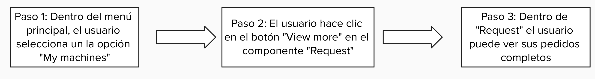

   

# 
Informe del Trabajo Final

    

   
Universidad Peruana de Ciencias Aplicadas

    

   

    

   
<b>Ingeniería de software</b>

    

   
<b>2025-20</b>

    

   
<b>1ASI0732 Diseño de Experimentos de Ingeniería de Software</b>

    

   
<b>Sección:</b> 7503

    

   
<b>Profesor:</b> Tinoco Licas, Juan Carlos

    

<b>""Informe de Trabajo Final"</b>

    

   
<b>Nombre del StartUp:</b> PrimeFixers

    

   
<b>Nombre del Producto:</b> FrostLink

   

    

   

   <table style="margin-left: auto; margin-right: auto;">
   <tr>
   <th>Nombre</th>
   <th>Código</th>
   </tr>
   <tr>
   <td>León Vivas, Fabrizio Amir</td>
   <td>U20211B994</td>
   </tr>
   <tr>
   <td>Medina Cruzado, Raúl Adrian</td>
   <td>U202210938</td>
   </tr>
   <tr>
   <td>Integrante 3</td>
   <td>U</td>
   </tr>
   <tr>
   <td>Varela Bustinza, Marcelo Alessandro</td>
   <td>U202319668</td>
   </tr>
   </table>
   

    

   
<b>Setiembre, 2025</b>

    

# Registro de Versiones del Informe

<table style="border-collapse: collapse; width: 100%; text-align: left;">
    <thead>
        <tr>
            <th style="border: 1px solid black; padding: 8px; font-weight: bold; text-align: center;">Versión</th>
            <th style="border: 1px solid black; padding: 8px; font-weight: bold; text-align: center;">Fecha</th>
            <th style="border: 1px solid black; padding: 8px; font-weight: bold; text-align: center;">Autor</th>
            <th style="border: 1px solid black; padding: 8px; font-weight: bold;">Descripción de modificación</th>
        </tr>
    </thead>
    <tbody>
        <tr>
            <td>1.0</td>
            <td>19/09/2025</td>
            <td>
                <ul>   
                    <li>León Vivas, Fabrizio Amir</li>
                    <li>Medina Cruzado, Raúl Adrian</li>
                    <li></li>
                    <li>Varela Bustinza, Marcelo Alessandro</li>
                </ul>
            </td>
            <td>
                <strong>Adición de secciones:</strong> 
                
Registro de Versiones del Informe

                
Project Report Collaboration Insights

                
Student Outcome

                
Part I: As-Is Software Project

                
1.1. Startup Profile

                
1.1.1. Descripción de la Startup

                
1.1.2. Perfiles de integrantes del equipo

                
1.2. Solution Profile

                
1.2.1. Antecedentes y problemática

                
1.2.2. Lean UX Process

                
1.2.2.1. Lean UX Problem Statements

                
1.2.2.2. Lean UX Assumptions

                
1.2.2.3. Lean UX Hypothesis Statements

                
1.2.2.4. Lean UX Canvas

                
1.3. Segmentos objetivo

                
2.1. Competidores

                
2.1.1. Análisis competitivo

                
2.1.2. Estrategias y tácticas frente a competidores

                
2.2. Entrevistas

                
2.2.1. Diseño de entrevistas

                
2.2.2. Registro de entrevistas

                
2.2.3. Análisis de entrevistas

                
2.3. Needfinding

                
2.3.1. User Personas

                
2.3.2. User Task Matrix

                
2.3.3. User Journey Mapping

                
2.3.4. Empathy Mapping

                
2.3.5. As-is Scenario Mapping

                
2.4. Ubiquitous Language

                
3.1. To-Be Scenario Mapping

                
3.2. User Stories

                
3.3. Product Backlog

                
3.4. Impact Mapping

                
4.1. Style Guidelines

                
4.1.1. General Style Guidelines

                
4.1.2. Web Style Guidelines

                
4.1.3. Mobile Style Guidelines

                
4.1.3.1. iOS Mobile Style Guidelines

                
4.1.3.2. Android Mobile Style Guidelines

                
4.2. Information Architecture

                
4.2.1. Organization Systems

                
4.2.2. Labeling Systems

                
4.2.3. SEO Tags and Meta Tags

                
4.2.4. Searching Systems

                
4.2.5. Navigation Systems

                
4.3. Landing Page UI Design

                
4.3.1. Landing Page Wireframe

                
4.3.2. Landing Page Mock-up

                
4.4. Mobile Applications UX/UI Design

                
4.4.1. Mobile Applications Wireframes

                
4.4.2. Mobile Applications Wireflow Diagrams

                
4.4.3. Mobile Applications Mock-ups

                
4.4.4. Mobile Applications User Flow Diagrams

                
4.5. Mobile Applications Prototyping

                
4.5.1. Android Mobile Applications Prototyping

                
4.5.2. iOS Mobile Applications Prototyping

                
4.6. Web Applications UX/UI Design

                
4.6.1. Web Applications Wireframes

                
4.6.2. Web Applications Wireflow Diagrams

                
4.6.3. Web Applications Mock-ups

                
4.6.4. Web Applications User Flow Diagrams

                
4.7. Web Applications Prototyping

                
4.8. Domain-Driven Software Architecture

                
4.8.1. Software Architecture Context Diagram

                
4.8.2. Software Architecture Container Diagrams

                
4.8.3. Software Architecture Components Diagrams

                
4.9. Software Object-Oriented Design

                
4.9.1. Class Diagrams

                
4.9.2. Class Dictionary

                
4.10. Database Design

                
4.10.1. Relational/Non-Relational Database Diagram

                
5.1. Software Configuration Management

                
5.1.1. Software Development Environment Configuration

                
5.1.2. Source Code Management

                
5.1.3. Source Code Style Guide & Conventions

                
5.1.4. Software Deployment Configuration

                
5.2. Product Implementation & Deployment

                
5.2.1. Sprint Backlogs

                
5.2.2. Implemented Landing Page Evidence

                
5.2.3. Implemented Frontend-Web Application Evidence

                
5.2.4. Acuerdo de Servicio - SaaS

                
5.2.5. Implemented Native-Mobile Application Evidence

                
5.2.6. Implemented RESTful API and/or Serverless Backend Evidence

                
5.2.7. RESTful API documentation

                
5.2.8. Team Collaboration Insights

                
5.3. Video About-the-Product

                
Conclusiones

            </td>
        </tr>
    </tbody>
</table>

# Project Report Collaboration Insights

Link URL del repositorio para el proyecto: [https://github.com/Prime-Fixers](https://github.com/Prime-Fixers)

Se presenta una tabla que especifica qué miembro del equipo se corresponde con qué usuario de GitHub.

<table cellpadding="6" cellspacing="0" style="border-collapse: collapse; width: 100%;">
  <tr>
    <th>Team Member  (Last Name, First Name)</th>
    <th>GitHub Username</th>
  </tr>
  <tr>
    <td>León Vivas, Fabrizio Amir</td>
    <td>CodyLionVivo</td>
  </tr>
  <tr>
    <td>Medina Cruzado, Raúl Adrian</td>
    <td></td>
  </tr>
  <tr>
    <td></td>
    <td></td>
  </tr>
  <tr>
    <td>Varela Bustinza, Marcelo Alessandro</td>
    <td>VarBus</td>
  </tr>
</table>

**TB1**

Para la elaboración del informe correspondiente a la entrega del TB1, se realizó una división del trabajo, asignando a cada integrante del equipo la implementación de secciones específicas desde el capítulo I hasta el capitulo V.

| Integrantes     | Tareas Asignadas                                                                                                                                                              |
|-----------------|-----------------------------------------------------------------------------------------------------------------------------------------------------------------------------------|
|  León Vivas, Fabrizio Amir  |                       |
|      | |
| Marcelo Varela  |  |
|      |        |

# Contenido

# Part I: As-Is Software Project
1. [Capítulo I: Introducción](#capítulo-i-introducción) 
   1.1. [Startup Profile](#11-startup-profile) 
   1.1.1. [Descripción de la Startup](#111-descripción-de-la-startup) 
   1.1.2. [Perfiles de integrantes del equipo](#112-perfiles-de-integrantes-del-equipo) 
   1.2. [Solution Profile](#12-solution-profile) 
   1.2.1. [Antecedentes y problemática](#121-antecedentes-y-problemática) 
   1.2.2. [Lean UX Process](#122-lean-ux-process) 
   1.2.2.1. [Lean UX Problem Statements](#1221-lean-ux-problem-statements) 
   1.2.2.2. [Lean UX Assumptions](#1222-lean-ux-assumptions) 
   1.2.2.3. [Lean UX Hypothesis Statements](#1223-lean-ux-hypothesis-statements) 
   1.2.2.4. [Lean UX Canvas](#1224-lean-ux-canvas) 
   1.3. [Segmentos objetivo](#13-segmentos-objetivo) 

2. [Capítulo II: Requirements Elicitation & Analysis](#capítulo-ii-requirements-elicitation--analysis) 
   2.1. [Competidores](#21-competidores) 
   2.1.1. [Análisis competitivo](#211-análisis-competitivo) 
   2.1.2. [Estrategias y tácticas frente a competidores](#212-estrategias-y-tácticas-frente-a-competidores) 
   2.2. [Entrevistas](#22-entrevistas) 
   2.2.1. [Diseño de entrevistas](#221-diseño-de-entrevistas) 
   2.2.2. [Registro de entrevistas](#222-registro-de-entrevistas) 
   2.2.3. [Análisis de entrevistas](#223-análisis-de-entrevistas) 
   2.3. [Needfinding](#23-needfinding) 
   2.3.1. [User Personas](#231-user-personas) 
   2.3.2. [User Task Matrix](#232-user-task-matrix) 
   2.3.3. [User Journey Mapping](#233-user-journey-mapping) 
   2.3.4. [Empathy Mapping](#234-empathy-mapping) 
   2.3.5. [As-is Scenario Mapping](#235-as-is-scenario-mapping) 
   2.4. [Ubiquitous Language](#24-ubiquitous-language) 

3. [Capítulo III: Requirements Specification](#capítulo-iii-requirements-specification) 
   3.1. [To-Be Scenario Mapping](#31-to-be-scenario-mapping) 
   3.2. [User Stories](#32-user-stories) 
   3.3. [Product Backlog](#33-product-backlog) 
   3.4. [Impact Mapping](#34-impact-mapping) 

# Part II: Verification, Validation & Pipeline

4. [Capítulo IV: Product Design](#capítulo-iv-product-design) 
   4.1. [Style Guidelines](#41-style-guidelines) 
   4.1.1. [General Style Guidelines](#411-general-style-guidelines) 
   4.1.2. [Web Style Guidelines](#412-web-style-guidelines) 
   4.1.3. [Mobile Style Guidelines](#413-mobile-style-guidelines) 
   4.1.3.1. [iOS Mobile Style Guidelines](#4131-ios-mobile-style-guidelines) 
   4.1.3.2. [Android Mobile Style Guidelines](#4132-android-mobile-style-guidelines) 
   4.2. [Information Architecture](#42-information-architecture) 
   4.2.1. [Organization Systems](#421-organization-systems) 
   4.2.2. [Labeling Systems](#422-labeling-systems) 
   4.2.3. [SEO Tags and Meta Tags](#423-seo-tags-and-meta-tags) 
   4.2.4. [Searching Systems](#424-searching-systems) 
   4.2.5. [Navigation Systems](#425-navigation-systems) 
   4.3. [Landing Page UI Design](#43-landing-page-ui-design) 
   4.3.1. [Landing Page Wireframe](#431-landing-page-wireframe) 
   4.3.2. [Landing Page Mock-up](#432-landing-page-mock-up) 
   4.4. [Mobile Applications UX/UI Design](#44-mobile-applications-uxui-design) 
   4.4.1. [Mobile Applications Wireframes](#441-mobile-applications-wireframes) 
   4.4.2. [Mobile Applications Wireflow Diagrams](#442-mobile-applications-wireflow-diagrams) 
   4.4.3. [Mobile Applications Mock-ups](#443-mobile-applications-mock-ups) 
   4.4.4. [Mobile Applications User Flow Diagrams](#444-mobile-applications-user-flow-diagrams) 
   4.5. [Mobile Applications Prototyping](#45-mobile-applications-prototyping) 
   4.5.1. [Android Mobile Applications Prototyping](#451-android-mobile-applications-prototyping) 
   4.5.2. [iOS Mobile Applications Prototyping](#452-ios-mobile-applications-prototyping) 
   4.6. [Web Applications UX/UI Design](#46-web-applications-uxui-design) 
   4.6.1. [Web Applications Wireframes](#461-web-applications-wireframes) 
   4.6.2. [Web Applications Wireflow Diagrams](#462-web-applications-wireflow-diagrams) 
   4.6.3. [Web Applications Mock-ups](#463-web-applications-mock-ups) 
   4.6.4. [Web Applications User Flow Diagrams](#464-web-applications-user-flow-diagrams) 
   4.7. [Web Applications Prototyping](#47-web-applications-prototyping) 
   4.8. [Domain-Driven Software Architecture](#48-domain-driven-software-architecture) 
   4.8.1. [Software Architecture Context Diagram](#481-software-architecture-context-diagram) 
   4.8.2. [Software Architecture Container Diagrams](#482-software-architecture-container-diagrams) 
   4.8.3. [Software Architecture Components Diagrams](#483-software-architecture-components-diagrams) 
   4.9. [Software Object-Oriented Design](#49-software-object-oriented-design) 
   4.9.1. [Class Diagrams](#491-class-diagrams) 
   4.9.2. [Class Dictionary](#492-class-dictionary) 
   4.10. [Database Design](#410-database-design) 
   4.10.1. [Relational/Non-Relational Database Diagram](#4101-relationalnon-relational-database-diagram) 

5. [Capítulo V: Product Implementation](#capítulo-v-product-implementation) 
   5.1. [Software Configuration Management](#51-software-configuration-management) 
   5.1.1. [Software Development Environment Configuration](#511-software-development-environment-configuration) 
   5.1.2. [Source Code Management](#512-source-code-management) 
   5.1.3. [Source Code Style Guide & Conventions](#513-source-code-style-guide--conventions) 
   5.1.4. [Software Deployment Configuration](#514-software-deployment-configuration) 
   5.2. [Product Implementation & Deployment](#52-product-implementation--deployment) 
   5.2.1. [Sprint Backlogs](#521-sprint-backlogs) 
   5.2.2. [Implemented Landing Page Evidence](#522-implemented-landing-page-evidence) 
   5.2.3. [Implemented Frontend-Web Application Evidence](#523-implemented-frontend-web-application-evidence) 
   5.2.4. [Acuerdo de Servicio - SaaS](#524-acuerdo-de-servicio---saas) 
   5.2.5. [Implemented Native-Mobile Application Evidence](#525-implemented-native-mobile-application-evidence) 
   5.2.6. [Implemented RESTful API and/or Serverless Backend Evidence](#526-implemented-restful-api-andor-serverless-backend-evidence) 
   5.2.7. [RESTful API documentation](#527-restful-api-documentation) 
   5.2.8. [Team Collaboration Insights](#528-team-collaboration-insights) 
   5.3. [Video About-the-Product](#53-video-about-the-product) 

6. [Capítulo VI: Product Verification & Validation](#capítulo-vi-product-verification--validation) 
   6.1. [Testing Suites & Validation](#61-testing-suites--validation) 
   6.1.1. [Core Entities Unit Tests](#611-core-entities-unit-tests) 
   6.1.2. [Core Integration Tests](#612-core-integration-tests) 
   6.1.3. [Core Behavior-Driven Development](#613-core-behavior-driven-development) 
   6.1.4. [Core System Tests](#614-core-system-tests) 
   6.2. [Static testing & Verification](#62-static-testing--verification) 
   6.2.1. [Static Code Analysis](#621-static-code-analysis) 
   6.2.1.1. [Coding standard & Code conventions](#6211-coding-standard--code-conventions) 
   6.2.1.2. [Code Quality & Code Security](#6212-code-quality--code-security) 
   6.2.2. [Reviews](#622-reviews) 
   6.3. [Validation Interviews](#63-validation-interviews) 
   6.3.1. [Diseño de Entrevistas](#631-diseño-de-entrevistas) 
   6.3.2. [Registro de Entrevistas](#632-registro-de-entrevistas) 
   6.3.3. [Evaluaciones según heurísticas](#633-evaluaciones-según-heurísticas) 
   6.4. [Auditoría de Experiencias de Usuario](#64-auditoría-de-experiencias-de-usuario) 
   6.4.1. [Auditoría realizada](#641-auditoría-realizada) 
   6.4.1.1. [Información del grupo auditado](#6411-información-del-grupo-auditado) 
   6.4.1.2. [Cronograma de auditoría realizada](#6412-cronograma-de-auditoría-realizada) 
   6.4.1.3. [Contenido de auditoría realizada](#6413-contenido-de-auditoría-realizada) 
   6.4.2. [Auditoría recibida](#642-auditoría-recibida) 
   6.4.2.1. [Información del grupo auditor](#6421-información-del-grupo-auditor) 
   6.4.2.2. [Cronograma de auditoría recibida](#6422-cronograma-de-auditoría-recibida) 
   6.4.2.3. [Contenido de auditoría recibida](#6423-contenido-de-auditoría-recibida) 
   6.4.2.4. [Resumen de modificaciones para subsanar hallazgos](#6424-resumen-de-modificaciones-para-subsanar-hallazgos) 

7. [Capítulo VII: DevOps Practices](#capítulo-vii-devops-practices) 
   7.1. [Continuous Integration](#71-continuous-integration) 
   7.1.1. [Tools and Practices](#711-tools-and-practices) 
   7.1.2. [Build & Test Suite Pipeline Components](#712-build--test-suite-pipeline-components) 
   7.2. [Continuous Delivery](#72-continuous-delivery) 
   7.2.1. [Tools and Practices](#721-tools-and-practices) 
   7.2.2. [Stages Deployment Pipeline Components](#722-stages-deployment-pipeline-components) 
   7.3. [Continuous deployment](#73-continuous-deployment) 
   7.3.1. [Tools and Practices](#731-tools-and-practices) 
   7.3.2. [Production Deployment Pipeline Components](#732-production-deployment-pipeline-components) 
   7.4. [Continuous Monitoring](#74-continuous-monitoring) 
   7.4.1. [Tools and Practices](#741-tools-and-practices) 
   7.4.2. [Monitoring Pipeline Components](#742-monitoring-pipeline-components) 
   7.4.3. [Alerting Pipeline Components](#743-alerting-pipeline-components) 
   7.4.4. [Notification Pipeline Components](#744-notification-pipeline-components) 

# Part III: Experiment-Driven Lifecycle

8. [Capítulo VIII: Experiment-Driven Development](#capítulo-viii-experiment-driven-development) 
   8.1. [Experiment Planning](#81-experiment-planning) 
   8.1.1. [As-Is Summary](#811-as-is-summary) 
   8.1.2. [Raw Material: Assumptions, Knowledge Gaps, Ideas, Claims](#812-raw-material-assumptions-knowledge-gaps-ideas-claims) 
   8.1.3. [Experiment-Ready Questions](#813-experiment-ready-questions) 
   8.1.4. [Question Backlog](#814-question-backlog) 
   8.1.5. [Experiment Cards](#815-experiment-cards) 
   8.2. [Experiment Design](#82-experiment-design) 
   8.2.1. [Hypotheses](#821-hypotheses) 
   8.2.2. [Domain Business Metrics](#822-domain-business-metrics) 
   8.2.3. [Measures](#823-measures) 
   8.2.4. [Conditions](#824-conditions) 
   8.2.5. [Scale Calculations and Decisions](#825-scale-calculations-and-decisions) 
   8.2.6. [Methods Selection](#826-methods-selection) 
   8.2.7. [Data Analytics: Goals, KPIs and Metrics Selection](#827-data-analytics-goals-kpis-and-metrics-selection) 
   8.2.8. [Web and Mobile Tracking Plan](#828-web-and-mobile-tracking-plan) 
   8.3. [Experimentation](#83-experimentation) 
   8.3.1. [To-Be User Stories](#831-to-be-user-stories) 
   8.3.2. [To-Be Product Backlog](#832-to-be-product-backlog) 
   8.3.3. [Pipeline-supported, Experiment-Driven To-Be Software Platform Lifecycle](#833-pipeline-supported-experiment-driven-to-be-software-platform-lifecycle) 
   8.3.3.1. [To-Be Sprint Backlogs](#8331-to-be-sprint-backlogs) 
   8.3.3.2. [Implemented To-Be Landing Page Evidence](#8332-implemented-to-be-landing-page-evidence) 
   8.3.3.3. [Implemented To-Be Frontend-Web Application Evidence](#8333-implemented-to-be-frontend-web-application-evidence) 
   8.3.3.4. [Implemented To-Be Native-Mobile Application Evidence](#8334-implemented-to-be-native-mobile-application-evidence) 
   8.3.3.5. [Implemented To-Be RESTful API and/or Serverless Backend Evidence](#8335-implemented-to-be-restful-api-andor-serverless-backend-evidence) 
   8.3.3.6. [Team Collaboration Insights](#8336-team-collaboration-insights) 
   8.3.4. [To-Be Validation Interviews](#834-to-be-validation-interviews) 
   8.3.4.1. [Diseño de Entrevistas](#8341-diseño-de-entrevistas) 
   8.3.4.2. [Registro de Entrevistas](#8342-registro-de-entrevistas) 
   8.4. [Experiment Aftermath & Analysis](#84-experiment-aftermath--analysis) 
   8.4.1. [Analysis and Interpretation of Results](#841-analysis-and-interpretation-of-results) 
   8.4.2. [Re-scored and Re-prioritized Question Backlog](#842-re-scored-and-re-prioritized-question-backlog) 
   8.5. [Continuous Learning](#85-continuous-learning) 
   8.5.1. [Shareback Session Artifacts: Learning Workflow](#851-shareback-session-artifacts-learning-workflow) 
   8.6. [To-Be Software Platform Pre-launch](#86-to-be-software-platform-pre-launch) 
   8.6.1. [About-the-Product Intro Video](#861-about-the-product-intro-video) 

9. [Conclusiones](#conclusiones) 
   9.1. [Conclusiones y recomendaciones](#91-conclusiones-y-recomendaciones) 

10. [Video App Validation](#video-app-validation) 
11. [Video About-the-Team](#video-about-the-team) 
12. [Bibliografía](#bibliografía) 
13. [Anexos](#anexos) 

# Student Outcome

ABET – EAC - Student Outcome 4 Criterio: La capacidad de reconocer responsabilidades éticas y profesionales en situaciones de ingeniería y hacer juicios informados, que deben considerar el impacto de las soluciones de ingeniería en contextos globales, económicos, ambientales y sociales.

<table style="border-collapse: collapse; width: 100%; text-align: left;">
    <thead>
        <tr>
            <th style="border: 1px solid black; padding: 8px; font-weight: bold; width: 25%;">Criterio Específico</th>
            <th style="border: 1px solid black; padding: 8px; font-weight: bold; width: 45%;">Acciones realizadas</th>
            <th style="border: 1px solid black; padding: 8px; font-weight: bold; width: 30%;">Conclusiones</th>
        </tr>
    </thead>
    <tbody>
        <tr>
            <td>
                4.c.1 Reconoce responsabilidad ética y profesional en situaciones de ingeniería de software 
            </td>
            <td>
                <strong>TB1:</strong> 
                <ul>
                    <li><strong>Fabrizio Amir León Vivas:</strong> </li>
                    <li><strong>Raúl Adrian Medina Cruzado:</strong>  </li>
                    <li><strong></strong> </li>
                    <li><strong>Marcelo Alessandro Varela Bustinza:</strong> </li>
                </ul>
            </td>
            <td>
                <strong>TB1:</strong>  
            </td>
        </tr>
        <tr>
            <td>
                4.c.2 Emite juicios informados considerando el impacto de las soluciones de ingeniería de software en contextos globales económicos, ambientales y sociales 
            </td>
            <td>
                <strong>TB1:</strong> 
                <ul>
                    <li><strong>Fabrizio Amir León Vivas:</strong>  </li>
                    <li><strong>Raúl Adrian Medina Cruzado:</strong> </li>
                    <li><strong></strong> </li>
                    <li><strong>Marcelo Alessandro Varela Bustinza:</strong></li>
                </ul>
            </td>
            <td>
                <strong>TB1:</strong>  
            </td>
        </tr>
    </tobdy>
</table>

# Capítulo I: Introducción

## 1. Startup Profile

### 1.1.1 Descripción de la Startup

FrostLink es una plataforma web diseñada para optimizar la gestión y el mantenimiento de equipos de refrigeración en negocios que dependen de la cadena de frío, como supermercados, minimarkets, laboratorios, restaurantes y empresas del sector alimentario o farmacéutico. La solución conecta a estos negocios con técnicos y proveedores especializados, permitiendo una administración integral, preventiva y automatizada de sus sistemas de refrigeración.

La plataforma incorpora funcionalidades clave como monitoreo en tiempo real de temperatura, consumo energético y tiempo de operación; generación de reportes técnicos; alertas automáticas ante fallas; historial de rendimiento; y programación inteligente de mantenimientos. Estas herramientas están pensadas para que negocios, técnicos y proveedores optimicen sus operaciones, reduzcan riesgos de pérdidas económicas por fallas inesperadas y mantengan un registro completo del estado y uso de sus equipos.

Misión: En FrostLink, nuestra misión es ofrecer una solución tecnológica avanzada que ayude a las empresas a proteger su inventario y gestionar de forma eficiente sus equipos de refrigeración, brindando a técnicos y proveedores herramientas inteligentes que mejoren su productividad y la continuidad operativa.

Visión: Aspiramos a convertirnos en la empresa líder en gestión y mantenimiento de sistemas de refrigeración, iniciando en Lima y expandiéndonos progresivamente a más regiones del Perú.

### 1.1.2 Perfiles de integrantes del equipo

| **Perfil**                                                                                                                                                                                                                                                                                                                                                                                                                                                                                                   | **Foto**                                                                       |
|--------------------------------------------------------------------------------------------------------------------------------------------------------------------------------------------------------------------------------------------------------------------------------------------------------------------------------------------------------------------------------------------------------------------------------------------------------------------------------------------------------------|--------------------------------------------------------------------------------|
| ****                                                                                                                                                                 |   |
|****   |   |
| **a**                                                      |   | 
| **Marcelo Varela** Mi nombre es Marcelo Varela. Soy un estudiante de la carrera de Ingeniería De Software, tengo 21 años y actualmente me encuentro cursando el séptimo ciclo de la carrera. Me caracterizo por ser una persona responsable, resiliente y proactiva, al cual le gusta aprender sobre tecnología y el desarrollo de software. Mi compromiso como miembro de este equipo es brindar mi apoyo y participación para enfrentar lo desafíos así como dar lo mejor de mí para el éxito de este proyecto. |  |

# Capítulo IV: Product Design

## 4.1. Style Guidelines

### 4.1.1. General Style guidelines

Nuestro estilo de comunicación mantiene un equilibrio entre lo profesional y lo accesible, utilizando un lenguaje claro, empático y respetuoso para atraer a nuevos usuarios y fortalecer la relación con los actuales. Esta identidad se refuerza con una paleta de colores fríos pero amigables y una tipografía moderna que transmite confianza, profesionalismo y cercanía.

*Branding*

La identidad visual de FrostLink busca transmitir seguridad, innovación y cercanía.

*Logo:* Representa la esencia de FrostLink a través de un diseño moderno que integra conceptos de tecnología y refrigeración. Su estilo equilibra lo técnico con lo accesible, transmitiendo innovación y cercanía. Está disponible en versiones para fondos claros y oscuros, así como en formatos monocromático, horizontal y vertical.

*Tipografía*

Para mantener la formalidad y accesibilidad de la interfaz de usuario de FrostLink, se establecen las tipografías Helvetica y Open Sans por sus cualidades funcionales, estéticas y su excelente compatibilidad con entornos digitales, siendo Helvetica la tipografía principal.

*Figura 1:* Tipografía Helvica

*Figura 2:* Tipografía Open Sans

*Colores*
La paleta cromática fue diseñada para evocar entornos fríos y tecnológicos, transmitiendo sensación de confianza y orden visual.

El color principal es el celeste, ya que refleja de manera óptima las características de la marca. Como colores neutros, se emplean negro, blanco y gris, ideales para fondos y textos por su versatilidad. Además, se incorporan variantes de verde, rojo, azul y amarillo para resaltar estados específicos, como alertas, servicios o calificaciones.

*Figura 3:* Guías Generales de Estilo – Colores

*Espaciado*

Para garantizar consistencia en la interfaz, se define un espaciado base de 8 px y un margen mínimo de 16 px. En el diseño modular, se implementan grillas flexibles que se adaptan tanto a entornos web como móviles, utilizando configuraciones de 12 columnas para web y 4 columnas para dispositivos móviles.

### 4.1.2. Web Style Guidelines

Esta sección establece los estándares visuales y de interacción para la versión web de FrostLink, asegurando una experiencia de usuario uniforme, profesional y accesible en todos los dispositivos. La interfaz es responsiva, lo que ofrece beneficios como compatibilidad en cualquier dispositivo, optimización de tiempo y costos de desarrollo, y mayor satisfacción para el usuario final.

Bajo un enfoque mobile-first, se utiliza un sistema de grilla de 12 columnas que permite que la interfaz se ajuste correctamente a distintos tamaños de pantalla.

*Tipografía*

Siguiendo la guía de estilos, se emplea Helvetica como tipografía principal en la mayoría de los textos, ya que proyecta claridad y profesionalismo. Para garantizar una óptima legibilidad, el tamaño de la fuente se ajusta de forma automática según el dispositivo en uso.

*Colores*

Dado que FrostLink está orientado al sector tecnológico, su paleta de colores busca transmitir frescura, innovación y confianza. Los colores seleccionados son:

- Celeste (#0884C4): para encabezados y botones principales.

- Blanco (#FFFFFF): para fondos neutros y áreas de descanso visual.

- Negro (#000000): para botones secundarios y bordes.

- Gris Claro (#808080): para divisores, bordes y botones deshabilitados.

- Blanco Azul Mar (#F4FCFC): para algunos fondos.

- Verde Medio Primavera (#00CC66): para notificaciones y estados positivos.

- Rojo Claro (#FF4B4B): para alertas, errores y fallas críticas.

- Amarillo Mandarina (#FFCC00): para notificaciones especiales y calificaciones.

Dado que los botones y fondos pueden variar según el contexto, la plataforma emplea diferentes tonalidades de celeste para mantener coherencia visual.

*Figura 1:* Guías de Estilo Web – Color Sky Blue

De manera complementaria, se utiliza una paleta de rojo claro para resaltar ventanas, fondos o íconos que indiquen errores del sistema, alertas o estados críticos, facilitando su identificación por parte del usuario.

*Figura 2:* Guías de Estilo Web - Color Rojo.

## 4.2. Arquitectura de la Información
### 4.2.1. Sistemas de Organización

Para estructurar la información en FrostLink, se emplean diversos sistemas de organización que facilitan la navegación del usuario:

Jerarquía Visual: Se priorizan los elementos más relevantes, ayudando a que el usuario identifique rápidamente la información clave.

Organización Secuencial (Paso a Paso): Ideal para procesos guiados como la compra de equipos o contratación de servicios, asegurando un flujo ordenado y sencillo de seguir.

Organización Matricial: Utilizada para comparar o analizar datos relacionados, ofreciendo al usuario una visión clara y estructurada de las alternativas disponibles.

### 4.2.2. Sistemas de Etiquetado

En FrostLink, estos sistemas se aplican de la siguiente forma:

Jerarquía Visual: Se destacan indicadores importantes, como el estado de los equipos y alertas críticas, para facilitar su identificación inmediata.

Organización Secuencial: El proceso de agendar mantenimiento o visitas técnicas se presenta paso a paso para guiar al usuario de forma clara.

Organización Matricial: Se emplean tablas comparativas para mostrar diferencias entre planes de servicio y suscripción, apoyando la toma de decisiones.

### 4.2.3. SEO y Meta Tags

Para garantizar visibilidad en buscadores y mejorar la experiencia de los usuarios, se definen títulos y descripciones optimizadas:

*Landing Page*

Title: FrostLink – Monitorea y Gestiona tus Equipos de Refrigeración en Tiempo Real

Meta Description: FrostLink te permite supervisar y gestionar el estado de tus equipos de refrigeración, optimizando su rendimiento y reduciendo fallas. Protege tu inventario con alertas y mantenimiento predictivo.

Meta Keywords: monitoreo de equipos de frío, gestión de refrigeración, mantenimiento preventivo, FrostLink, alertas de fallas, eficiencia energética

Meta Author: FrostLink

*Aplicación Web*

Title: FrostLink – Plataforma de Gestión de Refrigeración

Meta Description: FrostLink facilita el monitoreo, mantenimiento y eficiencia de tus equipos de refrigeración en tiempo real, mejorando su rendimiento y reduciendo riesgos.

Meta Keywords: gestión de refrigeración, monitoreo en tiempo real, mantenimiento predictivo, FrostLink, alertas de fallas, reportes de eficiencia

Meta Author: FrostLink

### 4.2.4. Sistemas de Búsqueda

El diseño de búsqueda está pensado para que los usuarios encuentren información de forma rápida y sin sentirse abrumados:

Barra de Búsqueda: Permite ingresar términos específicos (nombre de equipo, tipo de servicio o estado) con resultados que se muestran de forma instantánea.

Categorías: Filtros como “Congeladoras”, “Refrigeradores”, “Mantenimiento Preventivo” o “Alertas de Falla” permiten enfocar la búsqueda.

Etiquetas Populares: Etiquetas como “Mantenimiento Programado” o “Alertas Críticas” facilitan el acceso a opciones frecuentes.

Filtros Avanzados:

Por Tipo de Equipo: Congeladoras, refrigeradores y equipos industriales.

Por Estado: En funcionamiento, en reparación o pendiente de mantenimiento.

Por Fecha de Revisión: Últimos 7 días, 30 días, etc.

Por Consumo Energético: Permite encontrar equipos según su rango de eficiencia.

Resultados de Búsqueda:
Los resultados se presentan en listas ordenadas con información clave (nombre del equipo, estado actual, próximas revisiones, consumo energético). Cada elemento incluye un resumen y opciones para ver detalles o agendar mantenimiento.
Los usuarios pueden ordenar por relevancia, estado o consumo, y visualizar filtros aplicados. También se muestran reseñas y comentarios de técnicos o clientes, ayudando en la toma de decisiones.

### 4.2.5. Sistemas de Navegación

La navegación de FrostLink está diseñada para ser clara y eficiente:

1. Páginas Principales

Inicio: Página principal de la plataforma.

Funcionalidades: Descripción de herramientas y servicios.

Beneficios: Ventajas para clientes y proveedores.

Nosotros: Información sobre la empresa y su propósito.

Contacto: Formulario y datos de contacto.

2. Opciones de Usuario

Login / Sign-up: Acceso y registro de cuentas.

Iniciar Sesión / Registrarse: Alternativa directa para gestión de cuenta.

3. Búsqueda y Navegación

Barra de Búsqueda: Acceso rápido a equipos, servicios o reportes.

Categorías: Filtros por tipo de equipo.

Explorar: Navegación por secciones destacadas.

4. Branding e Identidad

FrostLink: Logo y nombre de la marca se presentan de forma consistente en las diferentes secciones para reforzar la identidad visual de la plataforma.

## 4.3. Landing Page UI Design
### 4.3.1. Landing Page Wireframe

El wireframe de la landing page de FrostLink está diseñado para organizar los elementos clave y garantizar una navegación clara e intuitiva. En la parte superior se ubica un encabezado con el logo y el menú principal de navegación. Justo debajo, se presenta una propuesta de valor destacada acompañada de botones de acción visibles como “Solicitar Demo” y “¿Cómo Funciona?” para incentivar la interacción del usuario.

La página incluye secciones que presentan a los usuarios objetivo, las funcionalidades principales de la plataforma y los beneficios que FrostLink ofrece. Finalmente, en la parte inferior se dispone un formulario de contacto para solicitar una demo y un pie de página con enlaces legales y de referencia.

*Figura 1:* Wireframe de la Landing Page.

### 4.3.2. Landing Page Mockup

El mockup de la landing page de FrostLink presenta un diseño limpio y bien estructurado que guía de manera intuitiva a los usuarios a través de la plataforma. En la parte superior se destaca la propuesta de valor, acompañada de un call to action principal que invita a interactuar con la página.

A continuación, se despliegan secciones clave que describen las funcionalidades del sistema, los beneficios para empresas y proveedores, y una explicación clara sobre cómo funciona el servicio. También se incluyen testimonios de clientes, información corporativa sobre FrostLink y un formulario de contacto para solicitar una demo, todo orientado a maximizar la conversión de visitantes en usuarios activos.

- Esta corresponde a la primera sección llamada "Inicio", donde se muestra de forma clara la propuesta de valor de la plataforma y el espacio para el Call to Action, que será implementado en etapas posteriores.

Figura 1: Mockup 1 – Inicio – Landing Page

En esta segunda sección se presenta una breve descripción del público objetivo al que está dirigida la plataforma.

Figura 2: Mockup 2 – ¿Para quién es? – Landing Page
La sección "Funcionalidades Clave" muestra de forma resumida las principales características y herramientas que la plataforma pone a disposición de los usuarios.

Figura 3: Mockup 3 – Funcionalidades – Landing Page
La sección "Beneficios" expone las ventajas que la plataforma ofrece tanto a empresas como a proveedores.

Figura 4: Mockup 4 – Beneficios para negocios – Landing Page
En esta parte se detallan los beneficios específicos que la plataforma brinda a las empresas.

Figura 5: Mockup 5 – Beneficios para proveedores – Landing Page
La sección "Cómo funciona" explica de manera clara el flujo de operación de la plataforma.

Figura 6: Mockup 6 – ¿Cómo funciona? – Landing Page
Aquí se comparte la información sobre la Misión y Visión de nuestra startup.

Figura 7: Mockup 7 – Sobre Nosotros – Landing Page
En esta sección se muestran los testimonios y opiniones de los usuarios que han utilizado la plataforma.

Figura 8: Mockup 8 – Lo que dicen nuestros clientes – Landing Page
Se presentan reseñas de clientes que destacan su experiencia con la plataforma.

Figura 9: Mockup 9 – Lo que dicen nuestros clientes – Landing Page
Continúan mostrándose las opiniones de los usuarios que recomiendan el servicio.

Figura 10: Mockup 10 – Lo que dicen nuestros clientes – Landing Page
Se concluye la visualización de testimonios de clientes satisfechos.

Figura 11: Mockup 11 – Contacto – Landing Page
En esta sección se incluye un formulario para que los usuarios puedan comunicarse y solicitar una demostración de la plataforma.

## 4.4. Web Applications UX/UI Design

### 4.4.1. Web Applications Wireframes

Los wireframes de las aplicaciones web de Frostlink establecen la estructura general y la organización de las pantallas principales, detallando la ubicación de los componentes de la interfaz y los recorridos de navegación. Actúan como una referencia visual para el diseño final, garantizando una experiencia de usuario coherente y fácil de seguir. Estos diagramas priorizan la usabilidad y la claridad, permitiendo que diseñadores y desarrolladores anticipen cómo interactuarán los usuarios con la aplicación y optimicen la distribución de los elementos para ofrecer una experiencia ágil y atractiva.

<strong>Figura 1: Wireframe – Alquiler de Equipos (Clientes)</strong> 
Representa la pantalla destinada a que los clientes puedan solicitar el alquiler de equipos.

<strong>Figura 2: Wireframe – Contacto (Clientes)</strong> 
Muestra la interfaz donde los clientes pueden comunicarse con la empresa.

<strong>Figura 3: Wireframe – Contacto (Empresa)</strong> 
Presenta el panel de control diseñado para la empresa.

<strong>Figura 4: Wireframe – Control (Clientes)</strong> 
Visualiza la sección donde los clientes pueden gestionar y supervisar su información de cuenta.

<strong>Figura 5: Wireframe – Estado de Cuenta (Clientes)</strong> 
Muestra el estado de cuenta detallado de los clientes.

<strong>Figura 6: Wireframe – Estado de Cuenta (Empresa)</strong> 
Despliega la vista de estado de cuenta desde la perspectiva de la empresa.

<strong>Figura 7: Wireframe – Analíticas Completas (Clientes)</strong> 
Presenta la pantalla de métricas y estadísticas para clientes.

<strong>Figura 8: Wireframe – Inicio (Clientes)</strong> 
Muestra la pantalla principal que ven los clientes al ingresar.

<strong>Figura 9: Wireframe – Inicio (Empresa)</strong> 
Representa la vista inicial para los usuarios de la empresa.

<strong>Figura 10: Wireframe – Inicio de la Aplicación</strong> 
Corresponde a la pantalla principal de bienvenida de la aplicación.

<strong>Figura 11: Wireframe – Inicio de Sesión (Clientes)</strong> 
Pantalla donde los clientes ingresan sus credenciales para acceder a la plataforma.

<strong>Figura 12: Wireframe – Inicio de Sesión (Empresa)</strong> 
Pantalla donde el personal de la empresa inicia sesión.

<strong>Figura 13: Wireframe – Mi Cuenta (Clientes)</strong> 
Vista en la que los clientes administran la información de su cuenta personal.

<strong>Figura 14: Wireframe – Mi Cuenta (Empresa)</strong> 
Pantalla donde la empresa gestiona su información y configuración.

<strong>Figura 15: Wireframe – Mis Clientes y Técnicos (Empresa)</strong> 
Muestra la sección para que la empresa gestione tanto a sus clientes como a sus técnicos.

<strong>Figura 16: Wireframe – Mis Equipos (Clientes)</strong> 
Pantalla que lista los equipos que el cliente tiene registrados o alquilados.

<strong>Figura 17: Wireframe – Mis Equipos (Clientes, Detalle 1)</strong> 
Presenta información detallada del primer equipo seleccionado por el cliente.

<strong>Figura 18: Wireframe – Mis Equipos (Clientes, Detalle 2)</strong> 
Muestra la vista de detalle de un segundo equipo registrado por el cliente.

<strong>Figura 19: Wireframe – Mis Equipos (Empresa)</strong> 
Pantalla de la empresa para administrar el inventario de equipos.

<strong>Figura 20: Wireframe – Notificaciones (Clientes)</strong> 
Interfaz donde los clientes visualizan las notificaciones recibidas.

<strong>Figura 21: Wireframe – Notificaciones (Empresa)</strong> 
Pantalla en la que la empresa revisa las notificaciones del sistema.

<strong>Figura 22: Wireframe – Registro (Clientes)</strong> 
Muestra el formulario de registro para nuevos clientes.

<strong>Figura 23: Wireframe – Registro (Empresa)</strong> 
Formulario de alta de usuarios internos o nuevos registros empresariales.

<strong>Figura 24: Wireframe – Solicitudes (Empresa)</strong> 
Pantalla donde la empresa gestiona las solicitudes enviadas por los clientes.

<strong>Figura 25: Wireframe – Órdenes de Trabajo (Empresa)</strong> 
Presenta la vista de control de órdenes de trabajo generadas por la empresa.

### 4.4.2. Web Applications Wireflow Diagrams

En esta sección se muestran los <strong>wireflows</strong> de cada objetivo del usuario, tomando en cuenta los <strong>User Personas</strong> pertinentes. Cada diagrama describe el recorrido de interacción y cómo dichas acciones impactan en las pantallas de la aplicación.

<strong>User Goal 1</strong> 
Como propietario de un negocio que opera equipos de refrigeración, deseo <strong>monitorear el estado</strong> de cada equipo registrado en tiempo real.

<strong>Task Flow 1</strong> 
Secuencia de pasos para completar la acción principal del usuario (consulta y verificación del estado de equipos).

<strong>Wireflow 1</strong> 
Mapa que combina wireframes con el flujo de interacción, mostrando transiciones entre pantallas y puntos de decisión.

<strong>User Goal 2</strong> 
Como dueño de un negocio con equipos de refrigeración, quiero <strong>gestionar el alta y administración</strong> de los nuevos equipos que registre.

<strong>Task Flow 2</strong> 
Proceso de tareas que guía el registro, edición y organización de nuevos equipos.

<strong>Wireflow 2</strong> 
Representación visual del flujo entre pantallas para dar de alta equipos y configurar sus atributos.

<strong>User Goal 3</strong> 
Como dueño de un negocio que usa equipos de refrigeración, quiero <strong>consultar estadísticas completas</strong> sobre el rendimiento de mis equipos.

<strong>Task Flow 3</strong> 
Secuencia de tareas para explorar métricas, filtrar periodos y comparar resultados.

<strong>Wireflow 3</strong> 
Detalle de pantallas y transiciones que soportan la visualización de KPIs, gráficos y reportes.

<strong>User Goal 4</strong> 
Como dueño de un negocio con equipos de refrigeración, quiero <strong>solicitar nuevos equipos</strong> a un proveedor de forma simple.

<strong>Task Flow 4</strong> 
Flujo de tareas para seleccionar productos, confirmar cantidades y generar una solicitud.

<strong>Wireflow 4</strong> 
Visión general del camino de compra: búsqueda, detalle de equipo, carrito/solicitud y confirmación.

<strong>User Goal 5</strong> 
Como proveedor de equipos de refrigeración, deseo <strong>seguir y gestionar</strong> las <strong>órdenes de pedido</strong> de mis clientes.

<strong>Task Flow 5</strong> 
Flujo de tareas para revisar pedidos, actualizar estados y coordinar despachos.

<strong>Wireflow 5</strong> 
Resumen del movimiento entre pantallas para administrar órdenes: listado, detalle, acciones y notificaciones.

<h2>4.4.3. Web Applications Mock-ups</h2>

En esta sección se presentan y describen los mock-ups de las aplicaciones de <strong>Frostlink</strong>. Se evidencian los principios de diseño, la arquitectura de información, el diseño inclusivo y el uso del Design System en los productos digitales. Cada maqueta muestra cómo estos conceptos se integran en la interfaz de usuario. A continuación, se exhiben las maquetas de la aplicación web, que representan de forma visual el aspecto y funcionamiento de la plataforma, facilitando la comunicación del diseño a desarrolladores y clientes para alinear la experiencia de usuario con la visión del proyecto.

<strong>Figura 1: Mockup – Inicio General de la App</strong> 
Pantalla de bienvenida y acceso principal de la aplicación web.

<strong>Figura 2: Mockup – Registro (Clientes)</strong> 
Formulario de alta para nuevos clientes.

<strong>Figura 3: Mockup – Inicio de Sesión (Clientes)</strong> 
Interfaz de autenticación para clientes.

<strong>Figura 4: Mockup – Inicio (Clientes)</strong> 
Panel principal o dashboard de los clientes.

<strong>Figura 5: Mockup – Mis Equipos (Clientes)</strong> 
Listado de equipos registrados o alquilados por el cliente.

<strong>Figura 6: Mockup – Mis Equipos (Clientes, Detalle 1)</strong> 
Primera vista de detalle de un equipo del cliente.

<strong>Figura 7: Mockup – Mis Equipos (Clientes, Detalle 2)</strong> 
Segunda vista de detalle de un equipo del cliente.

<strong>Figura 8: Mockup – Alquilar Equipos (Clientes)</strong> 
Proceso guiado para solicitar el alquiler de equipos.

<strong>Figura 9: Mockup – Contacto (Clientes)</strong> 
Canales de contacto y soporte para clientes.

<strong>Figura 10: Mockup – Notificaciones (Clientes)</strong> 
Centro de notificaciones y avisos para clientes.

<strong>Figura 11: Mockup – Control (Clientes)</strong> 
Panel de control y actividad del cliente.

<strong>Figura 12: Mockup – Estado de Cuenta (Clientes)</strong> 
Resumen de facturación, saldos y movimientos.

<strong>Figura 13: Mockup – Mi Cuenta (Clientes)</strong> 
Gestión de perfil, preferencias y seguridad del cliente.

<strong>Figura 14: Mockup – Analíticas Completas (Clientes)</strong> 
Panel de métricas, gráficos y KPI para clientes.

<strong>Mockups Empresa</strong>

<strong>Figura 15: Mockup – Inicio de Sesión (Empresa)</strong> 
Interfaz de autenticación para el personal de la empresa.

<strong>Figura 16: Mockup – Registro (Empresa)</strong> 
Alta de la empresa y creación de credenciales.

<strong>Figura 17: Mockup – Inicio (Empresa)</strong> 
Dashboard principal para la gestión empresarial.

<strong>Figura 18: Mockup – Contacto (Empresa)</strong> 
Soporte y comunicación para cuentas empresariales.

<strong>Figura 19: Mockup – Estado de Cuenta (Empresa)</strong> 
Facturación, saldos y movimientos para la empresa.

<strong>Figura 20: Mockup – Mi Cuenta (Empresa)</strong> 
Configuración de cuenta, permisos y seguridad.

<strong>Figura 21: Mockup – Mis Clientes y Técnicos (Empresa)</strong> 
Administración de clientes, técnicos y roles.

<strong>Figura 22: Mockup – Mis Equipos (Empresa)</strong> 
Inventario y control de equipos bajo responsabilidad de la empresa.

<strong>Figura 23: Mockup – Notificaciones (Empresa)</strong> 
Centro de avisos, eventos del sistema y comunicaciones.

<strong>Figura 24: Mockup – Solicitudes (Empresa)</strong> 
Bandeja de solicitudes entrantes y su procesamiento.

<strong>Figura 25: Mockup – Órdenes de Trabajo (Empresa)</strong> 
Gestión y seguimiento de órdenes de trabajo.

### 4.4.4. Web Applications User Flow Diagrams</h2>

En esta sección se presentan los diagramas de <strong>user flow</strong> asociados a los objetivos clave, mostrando cómo las acciones del usuario se traducen en transiciones entre pantallas dentro de la aplicación.

<strong>User Goal 1</strong> 
Como propietario de un negocio que utiliza equipos de refrigeración, deseo <strong>monitorear el estado</strong> de cada equipo registrado.

<strong>User Goal 2</strong> 
Como propietario de un negocio que utiliza equipos de refrigeración, deseo <strong>consultar las estadísticas completas</strong> del rendimiento de mis equipos.

<strong>User Goal 3</strong> 
Como propietario de un negocio que utiliza equipos de refrigeración, deseo <strong>dar de alta y administrar</strong> los nuevos equipos que registro.

## 4.5. Web Applications Prototyping
Se presenta el prototipo interactivo de la aplicación web de Frostlink, que permite a los usuarios explorar la interfaz y navegar por las distintas secciones de la plataforma. Este prototipo incorpora las funcionalidades esenciales y ofrece una vista preliminar de la experiencia de uso. Además, facilita la evaluación y validación de la interfaz antes de su implementación definitiva, garantizando un diseño intuitivo y eficiente.

## 4.6. Domain Driven Software Architecture
Se expone la arquitectura de software orientada al dominio para Frostlink. A través de diversos diagramas se describe la estructura del sistema y sus componentes principales, destacando cómo se relacionan e integran entre sí para ofrecer una solución eficiente, escalable y mantenible.

### 4.6.1. Software Architecture Context Diagram

El diagrama de contexto muestra cómo <strong>Clientes</strong> y <strong>Empresas Proveedoras</strong> interactúan con <strong>Frostlink</strong> para gestionar y monitorear equipos de refrigeración. La plataforma se integra con servicios de correo para el envío de notificaciones y con un servicio de pagos para procesar transacciones de forma segura.

### 4.6.2. Software Architecture Container Diagrams

El diagrama de contenedores describe las principales piezas de <strong>Frostlink</strong> y sus relaciones: la <em>web app</em> (interfaz de usuario), la <em>API</em> que expone capacidades del dominio y la <em>base de datos</em> que persiste la información, junto con otros servicios que soportan la operación.

### 4.6.3. Software Architecture Components Diagrams

<h3>Mi Equipo — Bounded Context</h3>

Este diagrama detalla los componentes responsables de la gestión de equipos: alta de nuevos dispositivos, monitoreo en tiempo real y visualización del estado e historial.

### Notificaciones y Órdenes de Trabajo — Bounded Contexts

El diagrama agrupa los componentes que administran las notificaciones —para informar eventos y estados relevantes— y los que gestionan las órdenes de trabajo, desde su creación hasta su seguimiento y cierre.

