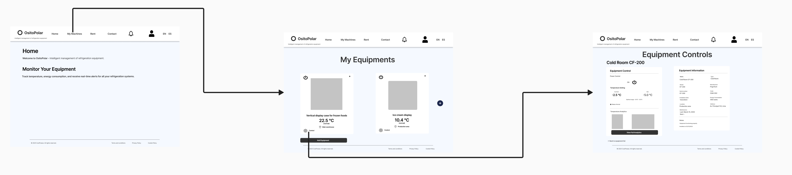

   

# 
Informe del Trabajo Final

    

   
Universidad Peruana de Ciencias Aplicadas

    

   

    

   
<b>Ingeniería de software</b>

    

   
<b>2025-20</b>

    

   
<b>1ASI0732 Diseño de Experimentos de Ingeniería de Software</b>

    

   
<b>Sección:</b> 7503

    

   
<b>Profesor:</b> Tinoco Licas, Juan Carlos

    

<b>"Informe de Trabajo Final"</b>

    

   
<b>Nombre del StartUp:</b> PrimeFixers

    

   
<b>Nombre del Producto:</b> FrostLink

   

    

<table style="margin-left: auto; margin-right: auto;">
  <tr>
    <th>Nombre</th>
    <th>Código</th>
  </tr>
  <tr>
    <td>León Vivas, Fabrizio Amir</td>
    <td>U20211B994</td>
  </tr>
  <tr>
    <td>Medina Cruzado, Raúl Adrian</td>
    <td>U202210938</td>
  </tr>
  <tr>
    <td>Mondoñedo Rodriguez, Juan Diego Javier</td>
    <td>U202110373</td>
  </tr>
  <tr>
    <td>Pereira Vasquez, Fabrizzio</td>
    <td>U202417468</td>
  </tr>
  <tr>
    <td>Varela Bustinza, Marcelo Alessandro</td>
    <td>U202319668</td>
  </tr>
     <tr>
    <td>Ramos Calagua, Sebastian Alexander</td>
    <td>U202222846</td>
  </tr>
</table>

   
<b>Noviembre, 2025</b>

# Registro de Versiones del Informe

<table style="border-collapse: collapse; width: 100%; text-align: left;">
    <thead>
        <tr>
            <th style="border: 1px solid black; padding: 8px; font-weight: bold; text-align: center;">Versión</th>
            <th style="border: 1px solid black; padding: 8px; font-weight: bold; text-align: center;">Fecha</th>
            <th style="border: 1px solid black; padding: 8px; font-weight: bold; text-align: center;">Autor</th>
            <th style="border: 1px solid black; padding: 8px; font-weight: bold;">Descripción de modificación</th>
        </tr>
    </thead>
    <tbody>
        <tr>
            <td>TB1</td>
            <td>19/09/2025</td>
            <td>Equipo FrostLink</td>
            <td>
                <strong>Adición de secciones:</strong> 
                
Capítulos I, II, III, IV y estructura inicial.

            </td>
        </tr>
      <tr>
            <td>TP1</td>
            <td>11/09/2025</td>
            <td>Equipo FrostLink</td>
            <td>
                
Adición de Capítulos V, VI, VII y correcciones de TB1.

            </td>
      </tr>
      <tr>
            <td>TB2 / TF1</td>
            <td>Noviembre 2025</td>
            <td>Equipo FrostLink</td>
            <td>
               
Inclusión del Capítulo VIII (Experimentos), Conclusiones finales y Anexos.

            </td>
      </tr>
    </tbody>
</table>

# Project Report Collaboration Insights

Link URL del repositorio para el proyecto: [https://github.com/Prime-Fixers](https://github.com/Prime-Fixers)

Se presenta una tabla que especifica qué miembro del equipo se corresponde con qué usuario de GitHub.

<table cellpadding="6" cellspacing="0" style="border-collapse: collapse; width: 100%;">
  <tr>
    <th>Team Member  (Last Name, First Name)</th>
    <th>GitHub Username</th>
  </tr>
  <tr>
    <td>León Vivas, Fabrizio Amir</td>
    <td>CodyLionVivo</td>
  </tr>
  <tr>
    <td>Medina Cruzado, Raúl Adrian</td>
    <td>Necxuz18</td>
  </tr>
  <tr>
    <td>Mondoñedo Rodriguez, Juan Diego Javier</td>
    <td>Jmondonedor</td>
  </tr>
  <tr>
    <td>Pereira Vasquez, Fabrizzio</td>
    <td>fabrizzioper</td>
  </tr>
  <tr>
    <td>Varela Bustinza, Marcelo Alessandro</td>
    <td>VarBus</td>
  </tr>
  <tr>
    <td>Ramos Calagua, Sebastian Alexander</td>
    <td>Dazzliboy</td>
  </tr>
</table>

**Capturas de la participación en el informe:**

**TB1:**
 

**TP1:**
 

# Contenido

1. [Student Outcome](#student-outcome)
2. [Part I: As-Is Software Project](#part-i-as-is-software-project)
   - [Capítulo I: Introducción](#capítulo-i-introducción)
     - [1.1. Startup Profile](#11-startup-profile)
     - [1.2. Solution Profile](#12-solution-profile)
     - [1.3. Segmentos objetivo](#13-segmentos-objetivo)
   - [Capítulo II: Requirements Elicitation & Analysis](#capítulo-ii-requirements-elicitation--analysis)
     - [2.1. Competidores](#21-competidores)
     - [2.2. Entrevistas](#22-entrevistas)
     - [2.3. Needfinding](#23-needfinding)
     - [2.4. Ubiquitous Language](#24-ubiquitous-language)
   - [Capítulo III: Requirements Specification](#capítulo-iii-requirements-specification)
     - [3.1. To-Be Scenario Mapping](#31-to-be-scenario-mapping)
     - [3.2. User Stories](#32-user-stories)
     - [3.3. Product Backlog](#33-product-backlog)
     - [3.4. Impact Mapping](#34-impact-mapping)
3. [Part II: Verification, Validation & Pipeline](#part-ii-verification-validation--pipeline)
   - [Capítulo IV: Product Design](#capítulo-iv-product-design)
     - [4.1. Style Guidelines](#41-style-guidelines)
     - [4.2. Information Architecture](#42-information-architecture)
     - [4.3. Landing Page UI Design](#43-landing-page-ui-design)
     - [4.4. Mobile Applications UX/UI Design](#44-mobile-applications-uxui-design)
     - [4.5. Mobile Applications Prototyping](#45-mobile-applications-prototyping)
     - [4.6. Web Applications UX/UI Design](#46-web-applications-uxui-design)
     - [4.7. Web Applications Prototyping](#47-web-applications-prototyping)
     - [4.8. Domain-Driven Software Architecture](#48-domain-driven-software-architecture)
     - [4.9. Software Object-Oriented Design](#49-software-object-oriented-design)
     - [4.10. Database Design](#410-database-design)
   - [Capítulo V: Product Implementation](#capítulo-v-product-implementation)
     - [5.1. Software Configuration Management](#51-software-configuration-management)
     - [5.2. Product Implementation & Deployment](#52-product-implementation--deployment)
     - [5.3. Video About-the-Product](#53-video-about-the-product)
   - [Capítulo VI: Product Verification & Validation](#capítulo-vi-product-verification--validation)
     - [6.1. Testing Suites & Validation](#61-testing-suites--validation)
     - [6.2. Static testing & Verification](#62-static-testing--verification)
     - [6.3. Validation Interviews](#63-validation-interviews)
     - [6.4. Auditoría de Experiencias de Usuario](#64-auditoría-de-experiencias-de-usuario)
   - [Capítulo VII: DevOps Practices](#capítulo-vii-devops-practices)
     - [7.1. Continuous Integration](#71-continuous-integration)
     - [7.2. Continuous Delivery](#72-continuous-delivery)
     - [7.3. Continuous deployment](#73-continuous-deployment)
     - [7.4. Continuous Monitoring](#74-continuous-monitoring)
4. [Part III: Experiment-Driven Lifecycle](#part-iii-experiment-driven-lifecycle)
   - [Capítulo VIII: Experiment-Driven Development](#capítulo-viii-experiment-driven-development)
     - [8.1. Experiment Planning](#81-experiment-planning)
     - [8.2. Experiment Design](#82-experiment-design)
     - [8.3. Experimentation](#83-experimentation)
     - [8.4. Experiment Aftermath & Analysis](#84-experiment-aftermath--analysis)
     - [8.5. Continuous Learning](#85-continuous-learning)
     - [8.6. To-Be Software Platform Pre-launch](#86-to-be-software-platform-pre-launch)
5. [Conclusiones](#conclusiones)
6. [Video App Validation](#video-app-validation)
7. [Video About-the-Team](#video-about-the-team)
8. [Bibliografía](#bibliografía)
9. [Anexos](#anexos)

# Student Outcome

ABET – EAC - Student Outcome 4 Criterio: La capacidad de reconocer responsabilidades éticas y profesionales en situaciones de ingeniería y hacer juicios informados, que deben considerar el impacto de las soluciones de ingeniería en contextos globales, económicos, ambientales y sociales.

<table style="border-collapse: collapse; width: 100%; text-align: left;">
    <thead>
        <tr>
            <th style="border: 1px solid black; padding: 8px; font-weight: bold; width: 25%;">Criterio Específico</th>
            <th style="border: 1px solid black; padding: 8px; font-weight: bold; width: 45%;">Acciones realizadas</th>
            <th style="border: 1px solid black; padding: 8px; font-weight: bold; width: 30%;">Conclusiones</th>
        </tr>
    </thead>
    <tbody>
        <tr>
            <td style="border: 1px solid black; padding: 8px;">
                4.c.1 Reconoce responsabilidad ética y profesional en situaciones de ingeniería de software 
            </td>
            <td style="border: 1px solid black; padding: 8px;">
                <strong>TB1:</strong> 
                <ul>
                    <li><strong>Fabrizio Amir León Vivas:</strong> Contribuí en la definición de la propuesta de valor de FrostLink, el análisis 5W+2H y el desarrollo del Lean UX Canvas, asegurando un enfoque ético y responsable. También participé en la elaboración de los As-is Scenario Mapping, User Journey Mapping y en el análisis competitivo frente a otras soluciones del mercado.</li>
                    <li><strong>Raúl Adrian Medina Cruzado:</strong>  </li>
                    <li><strong>Juan Diego Mondoñedo:</strong> Definí las configuraciones de las plataformas y environments de programación que empleamos para el desarrollo de nuestros productos y establecí pautas para el despliegue de estos.</li>
                    <li><strong>Marcelo Alessandro Varela Bustinza:</strong>Durante el desarrollo del Capítulo IV: Product Design reconocí mi responsabilidad ética y profesional al diseñar las guías de estilo, la arquitectura de información y las interfaces UX/UI, asegurando que cumplan con principios de accesibilidad, usabilidad y buenas prácticas de ingeniería de software orientadas al bienestar del usuario. </li>
                </ul>
                <strong>TP1:</strong> 
                <ul>
                    <li><strong>Fabrizio Amir León Vivas:</strong> Implementé suites de pruebas (unitarias/integración/BDDs) usando datos anonimizados y criterios de aceptación trazables a requisitos, evitando exposición de información sensible y promoviendo revisiones pares.</li>
                    <li><strong>Raúl Adrian Medina Cruzado:</strong> Configuré análisis estático (linters/Sonar) y políticas de ramas; apliqué listas de verificación éticas en code reviews (seguridad, privacidad, licencias) y gestioné vulnerabilidades reportadas.</li>
                    <li><strong>Mondoñedo Rodriguez, Juan Diego Javier:</strong> Conduje entrevistas con consentimiento informado, protegí la identidad de participantes y registré sesgos potenciales; apliqué heurísticas priorizando bienestar y accesibilidad.</li>
                    <li><strong>Marcelo Alessandro Varela Bustinza:</strong> Definí gates éticos en el pipeline (quality gate, escaneo SCA/secretos) y estrategias de rollback/feature flags para despliegues seguros y responsables.</li>
                    <li><strong>Pereira Vasquez, Fabrizzio:</strong> Organicé la auditoría UX cuidando la confidencialidad de evidencias, documenté hallazgos sin datos personales y prioricé criterios WCAG en las correcciones.</li>
                </ul>
                <strong>TB2:</strong> 
                <ul>
                    <li><strong>Fabrizio Amir León Vivas:</strong> Implementó suites de pruebas completas (unitarias, integración y BDD) empleando datos anonimizados y criterios de aceptación alineados a requisitos. Aseguró que las pruebas no expusieran información sensible y fomentó revisiones por pares para fortalecer la calidad y confiabilidad del código.</li>
                    <li><strong>Raúl Adrian Medina Cruzado:</strong> Configuró análisis estático mediante linters y Sonar, además de políticas de ramas que fortalecen la gobernanza del código. Aplicó checklists éticas en code reviews para validar seguridad, privacidad y licenciamiento, gestionando también vulnerabilidades detectadas durante el desarrollo.</li>
                    <li><strong>Marcelo Alessandro Varela Bustinza:</strong> Definió gates éticos dentro del pipeline (quality gate, escaneo SCA y detección de secretos), asegurando despliegues responsables. Implementó estrategias de rollback y feature flags para habilitar lanzamientos seguros y controlados, minimizando riesgos operativos.</li>
                    <li><strong>Pereira Vasquez, Fabrizzio:</strong> Lideró la auditoría UX garantizando la confidencialidad de las evidencias revisadas. Documentó hallazgos sin incluir datos personales y priorizó criterios WCAG para asegurar accesibilidad y mejoras en la experiencia de usuario.</li>
                    <li><strong>Ramos Calagua, Sebastian Alexander:</strong> Participó en la auditoría UX, velando por la privacidad de la información y la correcta anonimización de evidencias. Registró problemas y propuestas siguiendo estándares WCAG, contribuyendo a una interfaz accesible y ética.</li>
                    <li><strong>Tello Murga, Javier Oswaldo :</strong> Realizó la auditoría UX con enfoque en resguardar datos sensibles. Elaboró documentación libre de información personal e impulsó correcciones basadas en WCAG, apoyando un diseño accesible y responsable.</li>
                </ul>
            </td>
            <td style="border: 1px solid black; padding: 8px;">
                <strong>TB1:</strong> Se demostró un compromiso ético y profesional al diseñar FrostLink, alineando la propuesta tecnológica con las necesidades reales de los usuarios y consolidando una solución responsable e innovadora. 
                <strong>TP1:</strong> El equipo evidenció responsabilidad ética al anonimizar datos, establecer controles en el pipeline y documentar revisiones y entrevistas con consentimiento, reduciendo riesgos de seguridad y sesgos en decisiones. 
                <strong>TB2:</strong> En el TB2, el equipo consolidó un enfoque ético y responsable en el desarrollo de FrostLink, reforzando las prácticas implementadas en etapas previas. Se garantizó la anonimización de datos, la aplicación de controles de calidad y seguridad en el pipeline, y la documentación rigurosa de revisiones, entrevistas y evidencias con el debido consentimiento. Estas acciones no solo redujeron riesgos de seguridad y sesgos en la toma de decisiones, sino que también fortalecieron la trazabilidad, la transparencia y la confiabilidad del sistema. Con ello, FrostLink avanza como una solución técnicamente sólida y alineada con principios éticos que priorizan la protección de usuarios y la integridad del proceso de desarrollo.
            </td>
        </tr>
        <tr>
            <td style="border: 1px solid black; padding: 8px;">
                4.c.2 Emite juicios informados considerando el impacto de las soluciones de ingeniería de software en contextos globales económicos, ambientales y sociales 
            </td>
            <td style="border: 1px solid black; padding: 8px;">
                <strong>TB1:</strong> 
                <ul>
                    <li><strong>Fabrizio Amir León Vivas:</strong> Analicé el impacto de FrostLink en negocios que dependen de la cadena de frío, resaltando beneficios económicos al reducir pérdidas, sociales al garantizar calidad de productos y ambientales al optimizar el consumo energético.</li>
                    <li><strong>Raúl Adrian Medina Cruzado:</strong>Para el TB1, asumí el rol de verificación técnica y buenas prácticas: configuré el análisis estático (linters y Sonar), definí convenciones de código y listas de chequeo para code reviews, y atendí observaciones de seguridad y licencias. Documenté las evidencias de cada revisión y prioricé correcciones que reducen deuda técnica y riesgos (OWASP), emitiendo juicios informados sobre dependencias y costos operativos para asegurar una solución ética, mantenible y con menor impacto en fallas y retrabajo. </li>
                    <li><strong>Mondoñedo Rodriguez, Juan Diego Javier</strong>Analicé las implicaciones y los contextos en los que se utilizarían nuestros productos para definir correctamente plataformas para el despliegue de nuestras aplicaciones que sean compatibles con el uso. </li>
                    <li><strong>Marcelo Alessandro Varela Bustinza:</strong>Asimismo, emití juicios informados considerando el impacto que las soluciones de software pueden tener en distintos contextos globales, económicos, sociales y ambientales, buscando que las propuestas de diseño y arquitectura no solo sean técnicamente viables, sino también sostenibles, inclusivas y generadoras de valor en la sociedad.</li>
               </ul>
               <strong>TP1:</strong> 
                <ul>
                    <li><strong>Fabrizio Amir León Vivas:</strong> Priorizó pruebas que disminuyen costo de fallas en operación (reducción de rechazos/mermas), y midió cobertura/casos críticos para asegurar continuidad de servicio en la cadena de frío.</li>
                    <li><strong>Raúl Adrian Medina Cruzado:</strong> Evaluó deuda técnica y riesgos OWASP, proponiendo remediaciones que reducen costos de infraestructura y exposición legal; recomendó dependencias con mejor soporte y mantenimiento.</li>
                    <li><strong>Mondoñedo Rodriguez, Juan Diego Javier:</strong> De las entrevistas derivó requerimientos con mayor impacto social (alertas claras, flujos accesibles), y recomendó simplificaciones que disminuyen errores y tiempos de capacitación.</li>
                    <li><strong>Marcelo Alessandro Varela Bustinza:</strong> Diseñó CI/CD con entornos escalables y apagado automático en staging para optimizar costos; definió monitoreo de métricas de uso/errores para decisiones basadas en evidencia.</li>
                    <li><strong>Pereira Vasquez, Fabrizzio:</strong> La auditoría UX identificó barreras de accesibilidad; priorizó mejoras que amplían inclusión y reducen fricción en onboarding, con impacto directo en productividad y satisfacción.</li>
                </ul>
                <strong>TB2:</strong> 
                <ul>
                    <li><strong>Fabrizio Amir León Vivas:</strong> Emitió juicios informados al diseñar y ejecutar suites de pruebas que reducen riesgos operativos y previenen fallas que podrían generar pérdidas económicas y desperdicio energético. Su enfoque en datos anonimizados y trazabilidad contribuyó a una solución más segura y responsable, considerando impactos sociales y de privacidad..</li>
                    <li><strong>Raúl Adrian Medina Cruzado:</strong> Aplicó análisis estático y políticas de ramas con criterios que priorizan seguridad, licenciamiento y sostenibilidad del software. Sus decisiones reducen vulnerabilidades que pueden afectar la continuidad operativa y los costos asociados, demostrando conciencia del impacto social y económico de la calidad del código.</li>
                    <li><strong>Marcelo Alessandro Varela Bustinza:</strong> Diseñó gates éticos y estrategias de despliegue seguro que minimizan fallas en producción, reduciendo potenciales afectaciones económicas y la huella operativa del sistema. Su enfoque en feature flags y rollback evidencia un juicio informado sobre la necesidad de sistemas resilientes y responsables en contextos reales.</li>
                    <li><strong>Pereira Vasquez, Fabrizzio:</strong> En la auditoría UX, tomó decisiones que priorizan accesibilidad, evitando excluir a grupos de usuarios y reduciendo brechas digitales. Su énfasis en WCAG y confidencialidad muestra un juicio informado sobre el impacto social del diseño y la responsabilidad de crear interfaces equitativas y respetuosas.</li>
                    <li><strong>Ramos Calagua, Sebastian Alexander:</strong> Evaluó la experiencia de usuario considerando accesibilidad, privacidad y claridad de la interacción, lo cual contribuye a una plataforma más inclusiva y socialmente responsable. Sus acciones reflejan conciencia del efecto que un diseño deficiente podría tener en la operación comercial y en la experiencia de usuarios diversos.</li>
                </ul>
                <li><strong>Tello Murga, Javier Oswaldo:</strong> Emitió juicios informados al analizar la UX desde una perspectiva de accesibilidad y protección de datos, asegurando que las mejoras propuestas impacten positivamente en usuarios de distintos contextos. Su trabajo reduce fricciones sociales y mejora la adopción, fortaleciendo el valor económico y social de la solución.</li>
                </ul>
            </td>
            <td style="border: 1px solid black; padding: 8px;">
                <strong>TB1:</strong> El proyecto demuestra que una solución tecnológica puede generar valor económico, social y ambiental, siempre que se diseñe con responsabilidad y pensando en su impacto global. 
                <strong>TP1:</strong> Los juicios informados guiaron la priorización de requisitos, controles de calidad y pipeline, logrando menor retrabajo, consumo controlado de recursos y mayor accesibilidad para usuarios finales. 
                <strong>TB2:</strong> El equipo demostró la capacidad de emitir juicios informados al evaluar constantemente el impacto de FrostLink en dimensiones económicas, ambientales y sociales. Cada integrante actuó con responsabilidad al considerar cómo la calidad del software, la accesibilidad, la seguridad y la eficiencia energética influyen en la operación real de los negocios y en la experiencia de los usuarios. Las decisiones tomadas —desde pruebas robustas y control de vulnerabilidades hasta auditorías de accesibilidad y despliegues seguros— reflejan un entendimiento maduro del rol del ingeniero de software en contextos globales. Gracias a este enfoque, FrostLink avanza como una solución confiable, inclusiva y sostenible, capaz de aportar valor no solo técnico, sino también social y económico en entornos reales.
            </td>
        </tr>
    </tbody>
</table>

# Part I: As-Is Software Project

# Capítulo I: Introducción

## 1.1. Startup Profile

### 1.1.1. Descripción de la Startup

**FrostLink:** es una plataforma web diseñada para optimizar la gestión y el mantenimiento de equipos de refrigeración en negocios que dependen de la cadena de frío, como supermercados, minimarkets, laboratorios, restaurantes y empresas del sector alimentario o farmacéutico. La solución conecta a estos negocios con técnicos y proveedores especializados, permitiendo una administración integral, preventiva y automatizada de sus sistemas de refrigeración.

La plataforma incorpora funcionalidades clave como monitoreo en tiempo real de temperatura, consumo energético y tiempo de operación; generación de reportes técnicos; alertas automáticas ante fallas; historial de rendimiento; y programación inteligente de mantenimientos. Estas herramientas están pensadas para que negocios, técnicos y proveedores optimicen sus operaciones, reduzcan riesgos de pérdidas económicas por fallas inesperadas y mantengan un registro completo del estado y uso de sus equipos.

**Misión:** En FrostLink, nuestra misión es ofrecer una solución tecnológica avanzada que ayude a las empresas a proteger su inventario y gestionar de forma eficiente sus equipos de refrigeración, brindando a técnicos y proveedores herramientas inteligentes que mejoren su productividad y la continuidad operativa.

**Visión:** Aspiramos a convertirnos en la empresa líder en gestión y mantenimiento de sistemas de refrigeración, iniciando en Lima y expandiéndonos progresivamente a más regiones del Perú.

**Valores:**
- Innovación
- Compromiso
- Sostenibilidad
- Colaboración
- Responsabilidad

### 1.1.2. Perfiles de integrantes del equipo

| **Perfil** | **Foto** |
|------------|----------|
| **Fabrizio León** Soy estudiante de Ingeniería de Software en la UPC con enfoque en desarrollo front-end y sólida base en sistemas UNIX/Linux. Manejo C++, JavaScript y Python, y he trabajado con metodologías ágiles para entregar soluciones claras y mantenibles. Me apasiona la ciberseguridad y la tecnología aplicada a problemas reales. Destaco por el trabajo en equipo, pensamiento crítico y comunicación efectiva. |  |
| **Raúl Medina** Como estudiante de la carrera de Ingeniería de Software, soy apasionado por la ciencia de datos. Me motiva descubrir cómo el análisis y la interpretación de grandes volúmenes de información pueden generar soluciones innovadoras dentro del desarrollo de software. Me interesa explorar cómo los datos pueden optimizar procesos, anticipar errores y mejorar la toma de decisiones. Confío en que, junto a mi equipo, podré seguir fortaleciendo mis habilidades y contribuir de manera significativa en cada etapa del proyecto. |  |
| **Juan Diego Mondoñedo** Estudiante de Ingeniería de Software con experiencia previa con metodología ágil y frameworks como Angular y Vue, además de conocimientos en programación en Javascript, C++ y Python. Como miembro del equipo de FrostLink, emplearé mis habilidades al máximo para el desarrollo de nuestra startup. |  |
| **Fabrizzio Pereira**  Mi nombre es Nelson Fabrizzio Pereira Vásquez (U202417468), estudiante de Ingeniería de Software con dominio en desarrollo web, especializado en React y su ecosistema. Cuenta con experiencia en la creación de proyectos prácticos como método de aprendizaje, aplicando principios de ingeniería de software y buenas prácticas de desarrollo. Destaca por su capacidad de trabajo en equipo, su disposición para colaborar activamente y su habilidad para apoyar en la resolución de problemas técnicos.|  |
| **Marcelo Varela** Mi nombre es Marcelo Varela. Soy un estudiante de la carrera de Ingeniería De Software, tengo 21 años y actualmente me encuentro cursando el séptimo ciclo de la carrera. Me caracterizo por ser una persona responsable, resiliente y proactiva, al cual le gusta aprender sobre tecnología y el desarrollo de software. Mi compromiso como miembro de este equipo es brindar mi apoyo y participación para enfrentar lo desafíos así como dar lo mejor de mí para el éxito de este proyecto. |  |
| **Sebastian Ramos** Mi nombre es Sebastian Ramos. Soy un estudiante de la carrera de Ingeniería De Software, tengo 22 años y actualmente me encuentro cursando el séptimo ciclo de la carrera. Me gusta todo lo relacionado a la tecnología y al desarrollo web. Espero ansioso poder aprender más del curso a medida que se desarrolle este proyecto. |  |

## 1.2. Solution Profile

### 1.2.1. Antecedentes y problemática

**Análisis 5W + 2H**

***What?***
En la actualidad, los negocios que dependen de equipos de congelación afrontan serios retos operativos debido a fallas imprevistas y a la falta de un mantenimiento adecuado. Problemas como interrupciones térmicas, consumos energéticos elevados no identificados oportunamente y la ausencia de un monitoreo continuo pueden ocasionar pérdidas de productos, disminución en la calidad del servicio y considerables perjuicios económicos.

***Why?***
La raíz del problema radica en la ausencia de soluciones tecnológicas accesibles que integren en una sola plataforma funciones de monitoreo, alertas, historial y programación automática. En consecuencia, muchas empresas continúan dependiendo de métodos manuales o carecen de visibilidad sobre el estado de sus equipos hasta que enfrentan una falla crítica.

***Who?***
Los principales actores involucrados son los administradores y propietarios de negocios que utilizan equipos de congelación, así como los técnicos y empresas proveedoras de servicios de refrigeración.

***When?***
Estas problemáticas suelen presentarse durante los periodos de operación continua, en especial cuando no se cuenta con personal técnico disponible de inmediato o cuando no se ha realizado un seguimiento constante del estado de los equipos a lo largo del tiempo.

***Where?***
El problema impacta a negocios de todo el país, con mayor énfasis en Lima, donde la cadena de frío resulta crítica para sectores como alimentación, salud y distribución. Asimismo, afecta a las empresas proveedoras de servicios de refrigeración que atienden a múltiples clientes sin contar con una plataforma centralizada de monitoreo y control.

***How?***
Los negocios y técnicos han llegado a esta situación debido a la acumulación de imprevistos y a la limitada digitalización en los procesos de mantenimiento preventivo. Esto ha generado una fuerte dependencia de intervenciones reactivas en lugar de planificadas, lo que se traduce en mayores costos, tiempos de respuesta más largos y un aumento en el desgaste operativo.

***How much?***
Si bien el impacto económico depende del tipo de negocio, una sola falla en un equipo de refrigeración puede generar pérdidas que van desde cientos hasta miles de soles en productos dañados. A ello se suman el tiempo operativo interrumpido, la pérdida de clientes y los costos adicionales asociados a reparaciones o reemplazo de equipos.

### 1.2.2. Lean UX Process

#### 1.2.2.1. Lean UX Problem Statements

La industria de la refrigeración comercial y técnica enfrenta grandes desafíos en la gestión, el mantenimiento y la trazabilidad de los equipos. Negocios que dependen de la cadena de frío, como supermercados, minimarkets, laboratorios, restaurantes y empresas del sector alimentario y farmacéutico, todavía operan sin un monitoreo en tiempo real ni procesos preventivos eficaces. Esto provoca fallas inesperadas, pérdidas económicas, ineficiencia en el consumo energético y riesgo para el inventario.

Las soluciones existentes en el mercado suelen ser parciales o poco integradas, ya que no ofrecen una plataforma que centralice la información, permita la predicción de fallas y brinde reportes claros y accesibles. La falta de historiales técnicos detallados, alertas preventivas y trazabilidad reduce la capacidad de respuesta de los técnicos y limita la toma de decisiones estratégicas para evitar pérdidas y optimizar recursos.

FrostLink surge como una respuesta a esta brecha, proporcionando una plataforma que conecta a negocios con técnicos especializados, ofreciendo monitoreo en tiempo real de temperatura y consumo energético, alertas automáticas, reportes técnicos, programación de mantenimientos y trazabilidad de cada equipo. Esto permite a los negocios reducir riesgos y a los técnicos mejorar su eficiencia y calidad de servicio.

**¿Hasta qué punto podría evolucionar la industria de la refrigeración si los negocios y técnicos adoptaran una solución que predijera las fallas y optimizara la gestión de sus equipos?**

#### 1.2.2.2. Lean UX Assumptions

**Business Outcomes**
* Incrementar en al menos un 15% la cantidad de usuarios activos en la plataforma.
* Mejorar la presencia y visibilidad de FrostLink en redes sociales, enfocándose en negocios de alimentos y técnicos de refrigeración.
* Construir confianza y seguridad en los usuarios sobre el valor del monitoreo automatizado y el mantenimiento inteligente de sus sistemas.
* Garantizar que los usuarios reciban notificaciones oportunas sobre incidentes relevantes, como fallas térmicas, cortes de energía o uso inusual de los equipos.
* Consolidar una base de usuarios premium dispuestos a pagar por funcionalidades avanzadas, como mantenimiento predictivo, reportes personalizados y soporte técnico prioritario.
* Desarrollar alianzas estratégicas con servicios de geolocalización para ampliar la cobertura y optimizar la programación de visitas técnicas.
* Promover la participación activa de los usuarios a través de encuestas, evaluaciones de técnicos y retroalimentación.
* Diseñar una interfaz limpia, intuitiva y fácil de usar.
* Incorporar inteligencia artificial para habilitar mantenimiento inteligente y optimización de rutas.

**User Outcomes**
* **¿Quién será nuestro usuario?** Negocios que dependen de sistemas de refrigeración y técnicos especializados.
* **¿Dónde encaja nuestro producto en su vida?** En la operación diaria para garantizar continuidad operativa y en la gestión de técnicos.
* **¿Qué problemas resuelve?** Confiabilidad de datos, adopción tecnológica, gestión reactiva vs preventiva.
* **¿Qué beneficios obtiene el cliente?** Visibilidad completa, soporte técnico ágil, reducción de costos y reportes personalizados.

#### 1.2.2.3. Lean UX Hypothesis Statements

**Hipótesis 1: Eficiencia operativa y reducción de fallas inesperadas** Creemos que al disponer de una plataforma integral que unifique monitoreo, mantenimiento y gestión técnica, los negocios y proveedores del sector podrán optimizar su eficiencia operativa...

**Hipótesis 2: Control de pérdidas y optimización energética** Creemos que el control de pérdidas operativas y del consumo energético es esencial para los usuarios, por lo que al ofrecer herramientas de análisis...

**Hipótesis 3: Servicio técnico predictivo y personalizado** Creemos que al brindar reportes automáticos e historiales detallados de uso y rendimiento de los equipos...

**Hipótesis 4: Confianza mediante trazabilidad y seguridad de la información** Creemos que al garantizar trazabilidad completa de cada acción realizada sobre los equipos...

**Hipótesis 5: Adopción de una gestión moderna de refrigeración** Creemos que al ofrecer una solución digital intuitiva y especializada como **FrostLink**...

#### 1.2.2.4. Lean UX Canvas

## 1.3. Segmentos objetivo

**Segmento Objetivo #1: Negocios que utilizan equipos de refrigeración**
* **Aspectos demográficos:** Pequeñas, medianas y grandes empresas (alimentario, farmacéutico, gastronómico).
* **Aspectos geográficos:** Nacionalidad peruana, zona urbana (Lima con proyección nacional).
* **Aspectos psicográficos:** Interesados en minimizar pérdidas económicas y control eficiente de consumo energético.

**Segmento Objetivo #2: Empresas proveedoras de servicios y equipos de refrigeración**
* **Aspectos demográficos:** Técnicos independientes, PYMES y proveedores especializados.
* **Aspectos geográficos:** Nacionalidad peruana, zona urbana (Lima con proyección nacional).
* **Aspectos psicográficos:** Buscan mejorar trazabilidad, organizar visitas y ofrecer servicio predictivo.

# Capítulo II: Requirements Elicitation & Analysis

## 2.1. Competidores

### 2.1.1. Análisis competitivo

Se presenta el cuadro comparativo con **ServiceTitan**, **Facilio** y **TempGenius**.

*(Tabla completa de Competitive Analysis Landscape disponible en el documento original)*

### 2.1.2. Estrategias y tácticas frente a competidores

1. **Destacar la Especialización en Refrigeración y la Gestión Integral:** Enfoque específico vs soluciones generalistas.
2. **Accesibilidad y Adaptación a PYMEs:** Planes modulares y precios accesibles para el mercado LATAM.
3. **Experiencia de Usuario Simple con Soporte Local:** Interfaz amigable en español y soporte cercano.
4. **Innovación mediante Mantenimiento Predictivo:** Uso de IA para detectar patrones de fallas.
5. **Alianzas Estratégicas para Expansión:** Convenios con proveedores locales.
6. **Confianza y Cumplimiento Normativo:** Trazabilidad completa y certificaciones locales.

## 2.2. Entrevistas

### 2.2.1. Diseño de entrevistas
Se detallan preguntas específicas para **Segmento 1 (Negocios)** y **Segmento 2 (Proveedores)** enfocadas en monitoreo actual, pérdidas, herramientas usadas, interés en alertas y disposición a pagar.

### 2.2.2. Registro de entrevistas
Se incluyen fichas de:
* **Mario Joaquin Lopez Acuña** (Administrador Minimarket).
* **Jorge Rolando Garcia Roca** (Supermarket).
* **Richard Francisco Flores Gonzalez** (Técnico Independiente).

### 2.2.3. Análisis de entrevistas
* **Problemas recurrentes:** Pérdidas económicas significativas, monitoreo manual, mantenimiento reactivo.
* **Necesidades:** Alertas en tiempo real, historial técnico, herramientas simples.
* **Valor esperado:** Disposición a pagar suscripción si evita pérdidas.
* **Riesgos:** Abandono si no envía alertas oportunas o es muy compleja.

## 2.3. Needfinding

### 2.3.1. User Personas

**Ernesto Mendoza (Negocios)**

**Luis Rojas (Proveedores)**

### 2.3.2. User Task Matrix

| Task | Ernesto Mendoza | Luis Rojas |
|---|---|---|
| Detectar o identificar fallas en los equipos | Baja / Alta | Alta / Alta |
| Coordinar servicios de mantenimiento | Media / Alta | Alta / Alta |
| Planificar rutas de llegada | Alta / Media | Baja / Alta |
| ... | ... | ... |

### 2.3.3. User Journey Mapping

**Ernesto Mendoza**

**Luis Rojas**

### 2.3.4. Empathy Mapping

**Ernesto Mendoza**

**Luis Rojas**

### 2.3.5. As-is Scenario Mapping

**Segmento 1**

**Segmento 2**

## 2.4. Ubiquitous Language

Glosario de términos clave: User Profile, Smart Dashboard, Performance Report, Maintenance Schedule, Failure Alert, Equipment Inventory, Service Provider, Technical History, Work Order, Service Coordination, etc.

# Capítulo III: Requirements Specification

## 3.1. To-Be Scenario Mapping

**Segmento 1**

**Segmento 2**

## 3.2. User Stories

Se presentan las **User Stories** (US-01 a US-32) organizadas en Epics, con criterios de aceptación en formato Gherkin. También se incluyen **Technical Stories** (TS-33 a TS-49) para endpoints de API y **Spike Stories** (SP-01 a SP-05) para investigación.

*(Tablas completas de User Stories, Technical Stories y Spikes disponibles en el contenido original)*

## 3.3. Product Backlog

Lista priorizada de requisitos usando la escala Fibonacci.

## 3.4. Impact Mapping

# Part II: Verification, Validation & Pipeline

# Capítulo IV: Product Design

## 4.1. Style Guidelines

### 4.1.1. General Style Guidelines
* **Branding:** Logo moderno que integra tecnología y refrigeración.
* **Tipografía:** Helvetica (principal) y Open Sans.
* **Colores:** Celeste (#0884C4) como principal, neutros (blanco, negro, gris), y semánticos (verde, rojo, amarillo).
* **Espaciado:** Base de 8px, margen mínimo 16px.

### 4.1.2. Web Style Guidelines
Diseño responsivo, grid de 12 columnas, paleta de colores web (Sky Blue, Red).

### 4.1.3. Mobile Style Guidelines

#### 4.1.3.1. iOS Mobile Style Guidelines
Diseño adaptativo (Auto Layout), tipografía SF Pro, paleta modo claro/oscuro, componentes nativos iOS (Tab Bar, SF Symbols).

#### 4.1.3.2. Android Mobile Style Guidelines
Contenedores flexibles, tipografía Roboto, Material Design, navegación inferior, cards expandibles.

## 4.2. Information Architecture

### 4.2.1. Organization Systems
Jerarquía visual, organización secuencial (paso a paso) y matricial (comparativas).

### 4.2.2. Labeling Systems
Etiquetas claras para estados, procesos y tablas.

### 4.2.3. SEO Tags and Meta Tags
Definición de Title, Meta Description y Keywords para Landing y Web App.

### 4.2.4. Searching Systems
Barra de búsqueda, categorías, filtros avanzados (tipo, estado, fecha, consumo).

### 4.2.5. Navigation Systems
Menú principal (Inicio, Funcionalidades, etc.), opciones de usuario (Login), y navegación contextual.

## 4.3. Landing Page UI Design

### 4.3.1. Landing Page Wireframe

### 4.3.2. Landing Page Mock-up
Se presentan mockups de alta fidelidad: Inicio, ¿Para quién es?, Funcionalidades, Beneficios, Cómo funciona, Misión/Visión, Testimonios y Contacto.

*(Resto de imágenes de mockups incluidas en el documento original)*

## 4.4. Mobile Applications UX/UI Design

### 4.4.1. Mobile Applications Wireframes
Wireframes para iOS y Android: Alquiler, Agregar Equipos, Máquinas, Inicio, Registro, Login, Cuenta.

*(Resto de imágenes de wireframes móviles incluidas en el documento original)*

### 4.4.2. Mobile Applications Wireflow Diagrams
Flujos de interacción visual para: Autenticación Company/Customer, Profile Access, Machines Management, Add Equipment.

### 4.4.3. Mobile Applications Mock-ups
Propuesta visual final para pantallas principales.

*(Resto de imágenes de mockups móviles incluidas en el documento original)*

### 4.4.4. Mobile Applications User Flow Diagrams
Diagramas de flujo para Gestión de máquinas y Añadir máquina.

## 4.5. Mobile Applications Prototyping

### 4.5.1. Android Mobile Applications Prototyping
Pantallas de prototipo: Login, Register, Home, My Equipment, Manage Equipments, Add Equipment, Account.

### 4.5.2. iOS Mobile Applications Prototyping
*(Se asume consistencia con Android o se incluye si existen recursos específicos)*

## 4.6. Web Applications UX/UI Design

### 4.6.1. Web Applications Wireframes
Wireframes para: Alquiler, Contacto, Control, Estado de Cuenta, Analíticas, Inicio, Login, Mi Cuenta, Mis Equipos, Notificaciones, Registro, Solicitudes, Órdenes de Trabajo.

### 4.6.2. Web Applications Wireflow Diagrams
Wireflows para objetivos: Monitorear estado, Gestionar alta, Consultar estadísticas, Solicitar equipos, Seguir órdenes.

### 4.6.3. Web Applications Mock-ups
Maquetas de alta fidelidad de la aplicación web.

### 4.6.4. Web Applications User Flow Diagrams
User flows para: Monitorear estado, Consultar estadísticas, Dar de alta equipos.

## 4.7. Web Applications Prototyping
Prototipo interactivo: Hero Section, Usuarios Objetivo, Funcionalidades, Outcomes, Guía de Uso, Planes, Testimonios, Formulario.

## 4.8. Domain-Driven Software Architecture

### 4.8.1. Software Architecture Context Diagram

### 4.8.2. Software Architecture Container Diagrams

### 4.8.3. Software Architecture Components Diagrams
Bounded Contexts: Mi Equipo, Notificaciones y Órdenes de Trabajo.

## 4.9. Software Object-Oriented Design

### 4.9.1. Class Diagrams

### 4.9.2. Class Dictionary
Descripción de clases: Solicitud, Equipo, Cliente, Company, Cuenta, Mantenimiento, Notificación.

## 4.10. Database Design

### 4.10.1. Relational/Non-Relational Database Diagram

# Capítulo V: Product Implementation

## 5.1. Software Configuration Management

### 5.1.1. Software Development Environment Configuration
Herramientas: UXPressia, Miro, Figma, LucidChart, Vertabelo, PlantUML, VSCode, WebStorm, Rider, C#, Node.js, npm, Vue.js, .NET.

### 5.1.2. Source Code Management
Flujo **GitFlow** (Main, Develop, Release, Feature, Hotfix). Uso de **Conventional Commits**.

### 5.1.3. Source Code Style Guide & Conventions
Estándares para HTML, CSS, JavaScript y Gherkin.

### 5.1.4. Software Deployment Configuration
Despliegue de API RESTful/Serverless en **Azure App Service**.

## 5.2. Product Implementation & Deployment

### 5.2.1. Sprint Backlogs
Detalle del **Sprint Backlog 1** con tareas de Product Design e Implementation.

### 5.2.2. Implemented Landing Page Evidence
Capturas de la Landing Page implementada.

### 5.2.3. Implemented Frontend-Web Application Evidence
Capturas de la aplicación web frontend.

### 5.2.4. Acuerdo de Servicio - SaaS
Términos y condiciones del servicio FrostLink (Suscripciones, Propiedad de datos, Confidencialidad, Disponibilidad, Responsabilidad).

### 5.2.5. Implemented Native-Mobile Application Evidence
Guía de distribución en **Firebase App Distribution** y capturas de la app móvil.
%2000.59.37.png)

### 5.2.6. Implemented RESTful API and/or Serverless Backend Evidence
Evidencia de configuración de VM en Azure, PM2, inicialización y verificación de estado.
%2001.41.36.png)

### 5.2.7. RESTful API documentation
Capturas de Swagger UI mostrando endpoints de Autenticación, Usuarios, Perfiles, Técnicos, Equipos, Solicitudes, Órdenes, Suscripciones, Analíticas.

### 5.2.8. Team Collaboration Insights
Resumen de asignación de actividades por alumno para cada capítulo.

## 5.3. Video About-the-Product
Enlace y captura del video promocional.

# Capítulo VI: Product Verification & Validation

## 6.1. Testing Suites & Validation

### 6.1.1. Core Entities Unit Tests
Para asegurar la robustez y el correcto funcionamiento de los componentes centrales del sistema, se implementó una rigurosa estrategia de pruebas unitarias con **xUnit** y **Moq**.

**Entidades Probadas:**
1. **Equipment:** Validación de creación con comandos válidos.
2. **ServiceRequest:** Asignación de técnicos, feedback de clientes y cambios de estado.
3. **User:** Actualización de username, password hash y suscripciones.
4. **Profile:** Validación de Value Objects (FullName, EmailAddress).
5. **WorkOrder:** Sincronización de estados y registro de resolución.

**Resumen de Cobertura:** 18 métodos de negocio probados con éxito.

### 6.1.2. Core Integration Tests
Se validó que los bounded contexts colaboren correctamente mediante pruebas de integración sobre la API RESTful.

**Escenarios Probados:**
1. **Orquestación Service Request → Work Order:** Asignación de técnico crea automáticamente la orden de trabajo.
2. **Propagación de Feedback:** Calificación del cliente se replica en la orden de trabajo.
3. **Telemetría Equipment → Analytics:** Lecturas de sensores consultables en el módulo de analítica.
4. **Autenticación:** Acceso protegido mediante tokens JWT.
5. **Sincronización de Estados:** Cambios en WorkOrder actualizan la ServiceRequest.

### 6.1.3. Core Behavior-Driven Development
Se implementaron 8 escenarios BDD utilizando **SpecFlow** y **Gherkin** para validar el comportamiento desde la perspectiva del usuario.

**Features cubiertos:**
* Service Request Lifecycle
* User Authentication
* Equipment Telemetry Analytics
* Profile Management
* Work Order Status Synchronization

**Resultados:** 100% de éxito en la ejecución de los escenarios.

%2000.57.59.png)

### 6.1.4. Core System Tests
Pruebas de sistema completas que validan los flujos de usuario extremo a extremo, incluyendo la interacción entre frontend y backend desplegados.

## 6.2. Static testing & Verification

### 6.2.1. Static Code Analysis
#### 6.2.1.1. Coding standard & Code conventions
Se aplican estándares estrictos para JS/Vue (ESLint + Prettier), Kotlin (ktlint) y C# (Roslyn Analyzers). Se utiliza GitFlow y Conventional Commits.

#### 6.2.1.2. Code Quality & Code Security
Umbrales definidos: Cobertura mínima (70-75%), complejidad ciclomática baja y cero vulnerabilidades de seguridad (escaneo con Trivy).

### 6.2.2. Reviews
Política de Pull Requests: Requiere al menos 1 aprobación, CI/CD en verde (tests y linter) y revisión de checklist de seguridad.

## 6.3. Validation Interviews

### 6.3.1. Diseño de Entrevistas
Guion estructurado para validar hipótesis de eficiencia, ahorro energético y adopción con usuarios reales de los segmentos objetivo (H1-H5).

### 6.3.2. Registro de Entrevistas
Resumen de entrevistas de validación realizadas con usuarios (ej. Jorge Rolando Garcia, Mario Joaquin Lopez) mostrando el uso del prototipo.

### 6.3.3. Evaluaciones según heurísticas
Evaluación de usabilidad de 24 tareas críticas. Se identificaron problemas de severidad alta (ej. falta de feedback en login, rangos inválidos) y se propusieron correcciones.

## 6.4. Auditoría de Experiencias de Usuario

### 6.4.1. Auditoría realizada
El equipo FrostLink preparó y entregó los artefactos de diseño (Mockups, Wireflows) para ser auditados, enfocándose en flujos críticos como autenticación y gestión de equipos.

### 6.4.2. Auditoría recibida
Informe del auditor externo "TecnoUX" que identificó hallazgos de severidad 3 (Crítica).
* **Hallazgos:** Error de login silencioso, validación de rangos de temperatura, falta de confirmación en alquiler.
* **Subsanación (6.4.2.4):** Se implementaron Toast de error, validaciones sincrónicas en frontend/backend y modales de confirmación.

# Capítulo VII: DevOps Practices

## 7.1. Continuous Integration
### 7.1.1. Tools and Practices
Uso de **GitHub Actions** para orquestar el pipeline. Herramientas: .NET SDK, NuGet, xUnit, SonarQube y Docker. Enfoque en seguridad temprana (escaneo de dependencias) y artefactos inmutables.

### 7.1.2. Build & Test Suite Pipeline Components
Etapas del pipeline de CI: Checkout -> Build (Frontend/Backend) -> QA & Linting (Tests, Sonar) -> Report -> Artifact Storage (Docker Registry).

## 7.2. Continuous Delivery
### 7.2.1. Tools and Practices
Infraestructura como código, contenedores Docker y despliegue automatizado a entornos de Staging.
### 7.2.2. Stages Deployment Pipeline Components
Definición de etapas progresivas: Build, Testing, Package, Staging Deployment y Approval Gate manual para producción.

## 7.3. Continuous deployment
### 7.3.1. Tools and Practices
Despliegue continuo a producción para componentes web (Firebase) y backend (Azure App Service) tras pasar todas las pruebas. Mobile utiliza distribución a testers (Firebase App Distribution).
### 7.3.2. Production Deployment Pipeline Components
Pipeline específico que se activa con tags de versión. Incluye pasos de descarga de artefactos, etiquetado de imágenes, despliegue Blue-Green en Azure y Smoke Tests automáticos.

## 7.4. Continuous Monitoring
### 7.4.1. Tools and Practices
Monitoreo de ejecución de pruebas (xUnit TRX, LivingDoc) y salud del sistema en producción.
### 7.4.2. Monitoring Pipeline Components
Dashboard centralizado que visualiza métricas de pruebas unitarias (cobertura), integración (tiempos de respuesta) y BDD (tasa de éxito).
### 7.4.3. Alerting Pipeline Components
Reglas de alerta en Azure Monitor y Firebase Crashlytics para detectar anomalías (CPU alta, tasa de errores HTTP, crasheos de app).
### 7.4.4. Notification Pipeline Components
Canales de notificación configurados (Email, Slack/Teams, PagerDuty) para alertar al equipo según la severidad del incidente.

# Part III: Experiment-Driven Lifecycle

# Capítulo VIII: Experiment-Driven Development

## 8.1. Experiment Planning

### 8.1.1. As-Is Summary
El estado "As-Is" (actual) de FrostLink es un Producto Mínimo Viable (MVP) funcional. La plataforma resuelve el problema central de la gestión de mantenimiento, que era reactiva, manual y desconectada, conectando negocios (clientes) con proveedores (técnicos) a través de API, Web y Mobile Apps, soportado por un pipeline CI/CD.

### 8.1.2. Raw Material: Assumptions, Knowledge Gaps, Ideas, Claims
Inventario de supuestos (valor del dashboard, adopción móvil), brechas (precio óptimo, alerta más crítica), ideas (mantenimiento predictivo) y afirmaciones (pérdidas de S/ 10,000) para basar los experimentos.

### 8.1.3. Experiment-Ready Questions
Preguntas formuladas para experimentación:
* Q1: ¿Qué precio convierte mejor (50 vs 99 soles)?
* Q2: ¿Pueden los técnicos usar la app en <3 min?
* Q3: ¿Las alertas de energía aumentan la retención?
* Q4: ¿El indicador de riesgo aumenta el engagement?
* Q5: ¿Disminuyen las pérdidas reportadas tras 3 meses de uso?

### 8.1.4. Question Backlog
Lista priorizada de preguntas (QB-01 a QB-07) basada en riesgo e impacto.

### 8.1.5. Experiment Cards
Definición de las tarjetas de experimento (EXP-01 a EXP-07) vinculadas a las preguntas del backlog.

## 8.2. Experiment Design

### 8.2.1. Hypotheses
Hipótesis de Valor (confianza en alertas), Crecimiento (monitoreo como driver de compra) y Usabilidad (eficiencia de técnicos).

### 8.2.2. Domain Business Metrics
CAC, MRR, LTV, Churn, Reducción de pérdidas y Eficiencia operativa.

### 8.2.3. Measures
Métricas cuantitativas (tasa de conversión, activación, retención) y cualitativas (NPS, CSAT).

### 8.2.4. Conditions
Criterios claros de éxito (ej. >80% respuesta a alertas) y fracaso para cada experimento. Condiciones de terminación basadas en muestra mínima y confianza estadística.

### 8.2.5. Scale Calculations and Decisions
Cálculo de tamaños de muestra para experimentos A/B (ej. 9,701 impresiones para CTR, 2,400 para retención) con un nivel de significancia del 5% y poder estadístico del 80%.

### 8.2.6. Methods Selection
Selección de métodos (A/B testing, Cohortes) priorizando "Simplest Useful Thing". Asignación determinística por hash de usuario.

### 8.2.7. Data Analytics: Goals, KPIs and Metrics Selection
Tabla de objetivos y KPIs primarios para Adquisición (CTR), Retención (D1) y Monetización (Tasa de compra).

<table>
  <thead>
    <tr>
      <th>Objetivo</th>
      <th>KPI primario</th>
      <th>Definición</th>
      <th>MDE de referencia</th>
      <th>Muestra por variante (ref.)</th>
      <th>Guardrails clave</th>
    </tr>
  </thead>
  <tbody>
    <tr>
      <td>Adquisición</td>
      <td>CTR</td>
      <td>clics / impresiones</td>
      <td>+0.4 puntos porcentuales</td>
      <td>≈ 9,701 impresiones</td>
      <td>Crash estable; sin alza de reportes</td>
    </tr>
    <tr>
      <td>Retención temprana</td>
      <td>D1</td>
      <td>regresan en D1 / nuevas personas en D0</td>
      <td>+3 puntos porcentuales</td>
      <td>≈ 2,400 personas</td>
      <td>Tiempo de juego sin caídas materiales</td>
    </tr>
    <tr>
      <td>Monetización</td>
      <td>Tasa de compra</td>
      <td>compradores / DAU</td>
      <td>+0.5 puntos porcentuales</td>
      <td>≈ 7,741 personas</td>
      <td>ARPPU estable; quejas contenidas</td>
    </tr>
  </tbody>
</table>

### 8.2.8. Web and Mobile Tracking Plan
Plan de instrumentación: Identidad unificada (anon_id -> user_id), eventos troncales (signup, purchase, error), propiedades mínimas, ventanas de atribución y gobierno de datos.

## 8.3. Experimentation

### 8.3.1. To-Be User Stories
Nuevas historias de usuario para soportar la experimentación (US1 a US8): Asignación de variantes, contratos de eventos mínimos, medición de activación, conversión y tableros de decisión.

### 8.3.2. To-Be Product Backlog
Backlog priorizado (PB1 a PB11) para implementar las capacidades de experimentación: Identidad unificada, SDK de eventos, Pipeline de calidad de datos y tableros por experimento.

### 8.3.3. Pipeline-supported, Experiment-Driven To-Be Software Platform Lifecycle

#### 8.3.3.1. To-Be Sprint Backlogs
*[Espacio para evidenciar los Sprints del ciclo de experimentación]*

#### 8.3.3.2. Implemented To-Be Landing Page Evidence
*[Espacio para evidencias de la Landing Page versión To-Be]*

#### 8.3.3.3. Implemented To-Be Frontend-Web Application Evidence
*[Espacio para evidencias del Frontend versión To-Be]*

#### 8.3.3.4. Implemented To-Be Native-Mobile Application Evidence
*[Espacio para evidencias Mobile versión To-Be]*

#### 8.3.3.5. Implemented To-Be RESTful API and/or Serverless Backend Evidence
*[Espacio para evidencias Backend versión To-Be]*

#### 8.3.3.6. Team Collaboration Insights
*[Espacio para insights de colaboración en la fase To-Be]*

### 8.3.4. To-Be Validation Interviews

#### 8.3.4.1. Diseño de Entrevistas
*[Espacio para diseño de entrevistas de validación To-Be]*

#### 8.3.4.2. Registro de Entrevistas
*[Espacio para registro de entrevistas To-Be]*

## 8.4. Experiment Aftermath & Analysis

### 8.4.1. Analysis and Interpretation of Results
*[Espacio para análisis de resultados de experimentos]*

### 8.4.2. Re-scored and Re-prioritized Question Backlog
*[Espacio para el backlog de preguntas repriorizado tras experimentos]*

## 8.5. Continuous Learning

### 8.5.1. Shareback Session Artifacts: Learning Workflow
*[Espacio para artefactos de sesiones de aprendizaje]*

## 8.6. To-Be Software Platform Pre-launch

### 8.6.1. About-the-Product Intro Video
*[Espacio para video de introducción al producto To-Be]*

# Conclusiones

## Conclusiones y recomendaciones

El proyecto FrostLink permitió el desarrollo de una plataforma integral de gestión y monitoreo de equipos de refrigeración, diseñada para satisfacer las necesidades tanto de clientes como de empresas proveedoras. A lo largo del trabajo se logró conceptualizar, diseñar y prototipar la aplicación web y móvil, aplicando metodologías de diseño centradas en el usuario y principios de arquitectura de software moderna.

Se inició con el análisis de necesidades y definición de objetivos, identificando los principales requerimientos de los usuarios y estableciendo los flujos de interacción. A partir de esto, se elaboraron mockups y prototipos interactivos que permitieron validar la experiencia de usuario y la navegación, garantizando claridad y usabilidad.

La arquitectura de software se basó en Domain Driven Design (DDD), definiendo bounded contexts claros para la gestión de equipos y órdenes de trabajo. La implementación incluyó una API RESTful en Azure, Frontend en Vue.js y aplicaciones móviles nativas, todo soportado por prácticas de DevOps y CI/CD que aseguran la calidad y el despliegue continuo.

Como recomendación futura, se sugiere profundizar en la implementación de las funcionalidades de mantenimiento predictivo utilizando los datos recolectados en la fase de experimentación, así como expandir las integraciones con hardware de sensores IoT de terceros.

# Video App Validation
*(Espacio para enlace e información del video de validación de la aplicación)*

# Video About-the-Team
*(Espacio para enlace e información del video sobre el equipo)*

# Bibliografía

* Axios. (s.f.). Axios: Promise based HTTP client for the browser and node.js. Recuperado el 10 de julio de 2025, de https://axios-http.com/docs/intro
* Cohn, M. (s.f.). User stories articles. Mountain Goat Software. Recuperado el 10 de julio de 2025, de https://www.mountaingoatsoftware.com/blog/tag/user-stories
* Conventional Commits. (s.f.). Conventional commits. Recuperado el 10 de julio de 2025, de https://www.conventionalcommits.org/
* Figma. (s.f.). Guide to prototyping in Figma. Help Center. Recuperado el 22 de septiembre de 2025, de https://help.figma.com/hc/en-us/articles/360040314193
* Google. (s.f.). Google HTML/CSS style guide. Recuperado el 10 de julio de 2025, de https://google.github.io/styleguide/htmlcssguide.html
* Miro. (2025, 18 de junio). Miro for mapping & diagramming. Help Center. Recuperado el 22 de septiembre de 2025, de https://help.miro.com/hc/en-us/articles/4403634496402-Miro-for-mapping-diagramming
* Nielsen Norman Group. (s.f.). Front-end style-guides: Definition, requirements, component checklist. Recuperado el 10 de julio de 2025, de https://www.nngroup.com/articles/front-end-style-guides/
* Nvie. (s.f.). A successful Git branching model. Recuperado el 10 de julio de 2025, de https://nvie.com/posts/a-successful-git-branching-model/
* Preston-Werner, T. (s.f.). Semantic versioning 2.0.0. Recuperado el 10 de julio de 2025, de https://semver.org/
* PrimeVue. (s.f.). PrimeVue: The most complete UI component library for Vue.js. Recuperado el 10 de julio de 2025, de https://primevue.org
* Render. (s.f.). Deployments. Recuperado el 10 de julio de 2025, de https://render.com/docs/deploys
* REST API Tutorial. (s.f.). What is REST? Recuperado el 10 de julio de 2025, de https://www.restapitutorial.com/introduction/whatisrest
* RESTfulAPI.net. (s.f.). REST API tutorial. Recuperado el 10 de julio de 2025, de https://restfulapi.net
* Stripe. (s.f.). Payments overview. Recuperado el 10 de julio de 2025, de https://docs.stripe.com/payments?payments=popular
* Structurizr. (s.f.). Structurizr DSL. Recuperado el 22 de septiembre de 2025, de https://docs.structurizr.com/dsl
* UXPressia. (2024, 23 de marzo). How to create a customer journey map — a step-by-step guide with examples. Recuperado el 22 de septiembre de 2025, de https://uxpressia.com/blog/customer-journey-map-guide-examples
* W3Schools. (s.f.). HTML style guide and coding conventions. Recuperado el 10 de julio de 2025, de https://www.w3schools.com/html/html5_syntax.asp

# Anexos

* Repositorio del Report: [Enlace](https://github.com/Prime-Fixers/Project-Report)
* Repositorio Landing Page: [Enlace](https://github.com/Prime-Fixers/Landing-Page)
* Repositorio del Front-End: [Enlace](https://github.com/Prime-Fixers/Frontend)
* Repositorio del Back-End: [Enlace](https://github.com/Prime-Fixers/Platform)
* Repositorio del mobile application: [Enlace](https://github.com/Prime-Fixers/Mobile)
