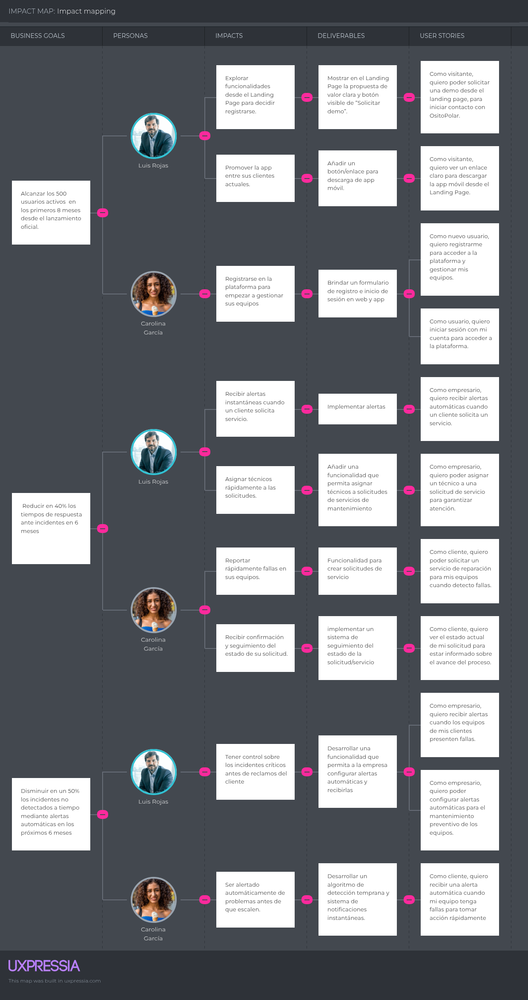
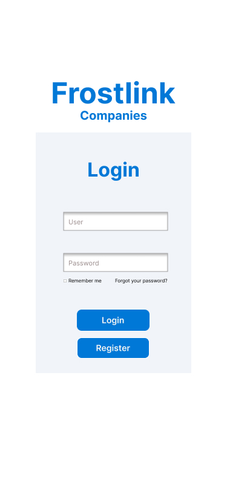
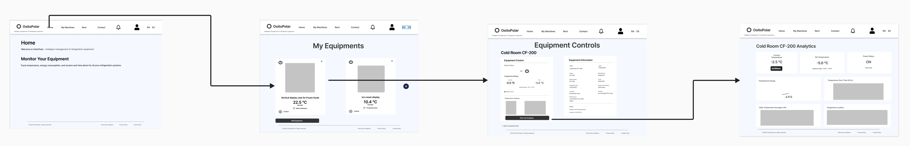

<div align="center">
   <div>

# <center>Informe del Trabajo Final</center>

   <br>

   <center>Universidad Peruana de Ciencias Aplicadas</center>

   <br>

   <center></center>

   <br>

   <center><b>Ingeniería de software</b></center>

   <br>

   <center><b>2025-20</b></center>

   <br>


   <center><b>1ASI0732 Diseño de Experimentos de Ingeniería de Software</b></center>

   <br>

   <center><b>Sección:</b> 7503</center>

   <br>

   <center><b>Profesor:</b> Tinoco Licas, Juan Carlos</center>

   <br>

<center><b>""Informe de Trabajo Final"</b></center>

   <br>

   <center><b>Nombre del StartUp:</b> PrimeFixers</center>

   <br>


   <center><b>Nombre del Producto:</b> FrostLink</center>

   </div>

   <br>

   <div align="center">

   <table style="margin-left: auto; margin-right: auto;">
   <tr>
   <th>Nombre</th>
   <th>Código</th>
   </tr>
   <tr>
   <td>León Vivas, Fabrizio Amir</td>
   <td>U20211B994</td>
   </tr>
   <tr>
   <td>Medina Cruzado, Raúl Adrian</td>
   <td>U202210938</td>
   </tr>
   <tr>
   <td>Mondoñedo Rodriguez, Juan Diego Javier</td>
   <td>U202110373</td>
   </tr>
   <tr>
   <td>Varela Bustinza, Marcelo Alessandro</td>
   <td>U202319668</td>
   </tr>
   </table>
   </div>

   <br>

   <center><b>Setiembre, 2025</b></center>

   <br>

</div>

# Registro de Versiones del Informe

<table style="border-collapse: collapse; width: 100%; text-align: left;">
    <thead>
        <tr>
            <th style="border: 1px solid black; padding: 8px; font-weight: bold; text-align: center;">Versión</th>
            <th style="border: 1px solid black; padding: 8px; font-weight: bold; text-align: center;">Fecha</th>
            <th style="border: 1px solid black; padding: 8px; font-weight: bold; text-align: center;">Autor</th>
            <th style="border: 1px solid black; padding: 8px; font-weight: bold;">Descripción de modificación</th>
        </tr>
    </thead>
    <tbody>
        <tr>
            <td>1.0</td>
            <td>19/09/2025</td>
            <td>
                <ul>   
                    <li>León Vivas, Fabrizio Amir</li>
                    <li>Medina Cruzado, Raúl Adrian</li>
                    <li>Mondoñedo Rodriguez, Juan Diego Javier</li>
                    <li>Varela Bustinza, Marcelo Alessandro</li>
                </ul>
            </td>
            <td>
                <strong>Adición de secciones:</strong><br>
                <p style="display: block; margin: 2px 0; text-indent: 0px; font-weight: bold;">Registro de Versiones del Informe</p>
                <p style="display: block; margin: 2px 0; text-indent: 0px; font-weight: bold;">Project Report Collaboration Insights</p>
                <p style="display: block; margin: 2px 0; text-indent: 0px; font-weight: bold;">Student Outcome</p>
                <p style="display: block; margin: 2px 0; text-indent: 0px; font-weight: bold;">Part I: As-Is Software Project</p>
                <p style="display: block; margin: 2px 0; text-indent: 0px; font-weight: bold;">1.1. Startup Profile</p>
                <p style="display: block; margin: 2px 0; text-indent: 10px;">1.1.1. Descripción de la Startup</p>
                <p style="display: block; margin: 2px 0; text-indent: 10px;">1.1.2. Perfiles de integrantes del equipo</p>
                <p style="display: block; margin: 2px 0; text-indent: 0px; font-weight: bold;">1.2. Solution Profile</p>
                <p style="display: block; margin: 2px 0; text-indent: 10px;">1.2.1. Antecedentes y problemática</p>
                <p style="display: block; margin: 2px 0; text-indent: 10px;">1.2.2. Lean UX Process</p>
                <p style="display: block; margin: 2px 0; text-indent: 20px;">1.2.2.1. Lean UX Problem Statements</p>
                <p style="display: block; margin: 2px 0; text-indent: 20px;">1.2.2.2. Lean UX Assumptions</p>
                <p style="display: block; margin: 2px 0; text-indent: 20px;">1.2.2.3. Lean UX Hypothesis Statements</p>
                <p style="display: block; margin: 2px 0; text-indent: 20px;">1.2.2.4. Lean UX Canvas</p>
                <p style="display: block; margin: 2px 0; text-indent: 0px; font-weight: bold;">1.3. Segmentos objetivo</p>
                <p style="display: block; margin: 2px 0; text-indent: 0px; font-weight: bold;">2.1. Competidores</p>
                <p style="display: block; margin: 2px 0; text-indent: 10px;">2.1.1. Análisis competitivo</p>
                <p style="display: block; margin: 2px 0; text-indent: 10px;">2.1.2. Estrategias y tácticas frente a competidores</p>
                <p style="display: block; margin: 2px 0; text-indent: 0px; font-weight: bold;">2.2. Entrevistas</p>
                <p style="display: block; margin: 2px 0; text-indent: 10px;">2.2.1. Diseño de entrevistas</p>
                <p style="display: block; margin: 2px 0; text-indent: 10px;">2.2.2. Registro de entrevistas</p>
                <p style="display: block; margin: 2px 0; text-indent: 10px;">2.2.3. Análisis de entrevistas</p>
                <p style="display: block; margin: 2px 0; text-indent: 0px; font-weight: bold;">2.3. Needfinding</p>
                <p style="display: block; margin: 2px 0; text-indent: 10px;">2.3.1. User Personas</p>
                <p style="display: block; margin: 2px 0; text-indent: 10px;">2.3.2. User Task Matrix</p>
                <p style="display: block; margin: 2px 0; text-indent: 10px;">2.3.3. User Journey Mapping</p>
                <p style="display: block; margin: 2px 0; text-indent: 10px;">2.3.4. Empathy Mapping</p>
                <p style="display: block; margin: 2px 0; text-indent: 10px;">2.3.5. As-is Scenario Mapping</p>
                <p style="display: block; margin: 2px 0; text-indent: 0px; font-weight: bold;">2.4. Ubiquitous Language</p>
                <p style="display: block; margin: 2px 0; text-indent: 0px; font-weight: bold;">3.1. To-Be Scenario Mapping</p>
                <p style="display: block; margin: 2px 0; text-indent: 0px; font-weight: bold;">3.2. User Stories</p>
                <p style="display: block; margin: 2px 0; text-indent: 0px; font-weight: bold;">3.3. Product Backlog</p>
                <p style="display: block; margin: 2px 0; text-indent: 0px; font-weight: bold;">3.4. Impact Mapping</p>
                <p style="display: block; margin: 2px 0; text-indent: 0px; font-weight: bold;">4.1. Style Guidelines</p>
                <p style="display: block; margin: 2px 0; text-indent: 10px;">4.1.1. General Style Guidelines</p>
                <p style="display: block; margin: 2px 0; text-indent: 10px;">4.1.2. Web Style Guidelines</p>
                <p style="display: block; margin: 2px 0; text-indent: 10px;">4.1.3. Mobile Style Guidelines</p>
                <p style="display: block; margin: 2px 0; text-indent: 20px;">4.1.3.1. iOS Mobile Style Guidelines</p>
                <p style="display: block; margin: 2px 0; text-indent: 20px;">4.1.3.2. Android Mobile Style Guidelines</p>
                <p style="display: block; margin: 2px 0; text-indent: 0px; font-weight: bold;">4.2. Information Architecture</p>
                <p style="display: block; margin: 2px 0; text-indent: 10px;">4.2.1. Organization Systems</p>
                <p style="display: block; margin: 2px 0; text-indent: 10px;">4.2.2. Labeling Systems</p>
                <p style="display: block; margin: 2px 0; text-indent: 10px;">4.2.3. SEO Tags and Meta Tags</p>
                <p style="display: block; margin: 2px 0; text-indent: 10px;">4.2.4. Searching Systems</p>
                <p style="display: block; margin: 2px 0; text-indent: 10px;">4.2.5. Navigation Systems</p>
                <p style="display: block; margin: 2px 0; text-indent: 0px; font-weight: bold;">4.3. Landing Page UI Design</p>
                <p style="display: block; margin: 2px 0; text-indent: 10px;">4.3.1. Landing Page Wireframe</p>
                <p style="display: block; margin: 2px 0; text-indent: 10px;">4.3.2. Landing Page Mock-up</p>
                <p style="display: block; margin: 2px 0; text-indent: 0px; font-weight: bold;">4.4. Mobile Applications UX/UI Design</p>
                <p style="display: block; margin: 2px 0; text-indent: 10px;">4.4.1. Mobile Applications Wireframes</p>
                <p style="display: block; margin: 2px 0; text-indent: 10px;">4.4.2. Mobile Applications Wireflow Diagrams</p>
                <p style="display: block; margin: 2px 0; text-indent: 10px;">4.4.3. Mobile Applications Mock-ups</p>
                <p style="display: block; margin: 2px 0; text-indent: 10px;">4.4.4. Mobile Applications User Flow Diagrams</p>
                <p style="display: block; margin: 2px 0; text-indent: 0px; font-weight: bold;">4.5. Mobile Applications Prototyping</p>
                <p style="display: block; margin: 2px 0; text-indent: 10px;">4.5.1. Android Mobile Applications Prototyping</p>
                <p style="display: block; margin: 2px 0; text-indent: 10px;">4.5.2. iOS Mobile Applications Prototyping</p>
                <p style="display: block; margin: 2px 0; text-indent: 0px; font-weight: bold;">4.6. Web Applications UX/UI Design</p>
                <p style="display: block; margin: 2px 0; text-indent: 10px;">4.6.1. Web Applications Wireframes</p>
                <p style="display: block; margin: 2px 0; text-indent: 10px;">4.6.2. Web Applications Wireflow Diagrams</p>
                <p style="display: block; margin: 2px 0; text-indent: 10px;">4.6.3. Web Applications Mock-ups</p>
                <p style="display: block; margin: 2px 0; text-indent: 10px;">4.6.4. Web Applications User Flow Diagrams</p>
                <p style="display: block; margin: 2px 0; text-indent: 0px; font-weight: bold;">4.7. Web Applications Prototyping</p>
                <p style="display: block; margin: 2px 0; text-indent: 0px; font-weight: bold;">4.8. Domain-Driven Software Architecture</p>
                <p style="display: block; margin: 2px 0; text-indent: 10px;">4.8.1. Software Architecture Context Diagram</p>
                <p style="display: block; margin: 2px 0; text-indent: 10px;">4.8.2. Software Architecture Container Diagrams</p>
                <p style="display: block; margin: 2px 0; text-indent: 10px;">4.8.3. Software Architecture Components Diagrams</p>
                <p style="display: block; margin: 2px 0; text-indent: 0px; font-weight: bold;">4.9. Software Object-Oriented Design</p>
                <p style="display: block; margin: 2px 0; text-indent: 10px;">4.9.1. Class Diagrams</p>
                <p style="display: block; margin: 2px 0; text-indent: 10px;">4.9.2. Class Dictionary</p>
                <p style="display: block; margin: 2px 0; text-indent: 0px; font-weight: bold;">4.10. Database Design</p>
                <p style="display: block; margin: 2px 0; text-indent: 10px;">4.10.1. Relational/Non-Relational Database Diagram</p>
                <p style="display: block; margin: 2px 0; text-indent: 0px; font-weight: bold;">5.1. Software Configuration Management</p>
                <p style="display: block; margin: 2px 0; text-indent: 10px;">5.1.1. Software Development Environment Configuration</p>
                <p style="display: block; margin: 2px 0; text-indent: 10px;">5.1.2. Source Code Management</p>
                <p style="display: block; margin: 2px 0; text-indent: 10px;">5.1.3. Source Code Style Guide & Conventions</p>
                <p style="display: block; margin: 2px 0; text-indent: 10px;">5.1.4. Software Deployment Configuration</p>
                <p style="display: block; margin: 2px 0; text-indent: 0px; font-weight: bold;">5.2. Product Implementation & Deployment</p>
                <p style="display: block; margin: 2px 0; text-indent: 10px;">5.2.1. Sprint Backlogs</p>
                <p style="display: block; margin: 2px 0; text-indent: 10px;">5.2.2. Implemented Landing Page Evidence</p>
                <p style="display: block; margin: 2px 0; text-indent: 10px;">5.2.3. Implemented Frontend-Web Application Evidence</p>
                <p style="display: block; margin: 2px 0; text-indent: 10px;">5.2.4. Acuerdo de Servicio - SaaS</p>
                <p style="display: block; margin: 2px 0; text-indent: 10px;">5.2.5. Implemented Native-Mobile Application Evidence</p>
                <p style="display: block; margin: 2px 0; text-indent: 10px;">5.2.6. Implemented RESTful API and/or Serverless Backend Evidence</p>
                <p style="display: block; margin: 2px 0; text-indent: 10px;">5.2.7. RESTful API documentation</p>
                <p style="display: block; margin: 2px 0; text-indent: 10px;">5.2.8. Team Collaboration Insights</p>
                <p style="display: block; margin: 2px 0; text-indent: 0px; font-weight: bold;">5.3. Video About-the-Product</p>
                <p style="display: block; margin: 2px 0; text-indent: 0px; font-weight: bold;">Conclusiones</p>
            </td>
        </tr>
    </tbody>
</table>


# Project Report Collaboration Insights

Link URL del repositorio para el proyecto: [https://github.com/Prime-Fixers](https://github.com/Prime-Fixers)

Se presenta una tabla que especifica qué miembro del equipo se corresponde con qué usuario de GitHub.

<table cellpadding="6" cellspacing="0" style="border-collapse: collapse; width: 100%;">
  <tr>
    <th>Team Member <br>(Last Name, First Name)</th>
    <th>GitHub Username</th>
  </tr>
  <tr>
    <td>León Vivas, Fabrizio Amir</td>
    <td>CodyLionVivo</td>
  </tr>
  <tr>
    <td>Medina Cruzado, Raúl Adrian</td>
    <td>Necxuz18</td>
  </tr>
  <tr>
    <td>Mondoñedo Rodriguez, Juan Diego Javier</td>
    <td>Jmondonedor</td>
  </tr>
  <tr>
    <td>Varela Bustinza, Marcelo Alessandro</td>
    <td>VarBus</td>
  </tr>
</table>

**TB1**

Para la elaboración del informe correspondiente a la entrega del TB1, se realizó una división del trabajo, asignando a cada integrante del equipo la implementación de secciones específicas desde el capítulo I hasta el capitulo V.

| Integrantes     | Tareas Asignadas |
|-----------------|------------------|
|  León Vivas, Fabrizio Amir  | Chapter I & II   |
|  Mondoñedo Rodriguez, Juan Diego  Javier   |     Chapter V         |
| Marcelo Varela  | Chapter  I & IV  |
| Medina Cruzado, Raúl Adrian | Chapter III & IV |


# Contenido

# Part I: As-Is Software Project
1. [Capítulo I: Introducción](#capítulo-i-introducción)<br>
   1.1. [Startup Profile](#11-startup-profile)<br>
   1.1.1. [Descripción de la Startup](#111-descripción-de-la-startup)<br>
   1.1.2. [Perfiles de integrantes del equipo](#112-perfiles-de-integrantes-del-equipo)<br>
   1.2. [Solution Profile](#12-solution-profile)<br>
   1.2.1. [Antecedentes y problemática](#121-antecedentes-y-problemática)<br>
   1.2.2. [Lean UX Process](#122-lean-ux-process)<br>
   1.2.2.1. [Lean UX Problem Statements](#1221-lean-ux-problem-statements)<br>
   1.2.2.2. [Lean UX Assumptions](#1222-lean-ux-assumptions)<br>
   1.2.2.3. [Lean UX Hypothesis Statements](#1223-lean-ux-hypothesis-statements)<br>
   1.2.2.4. [Lean UX Canvas](#1224-lean-ux-canvas)<br>
   1.3. [Segmentos objetivo](#13-segmentos-objetivo)<br>

2. [Capítulo II: Requirements Elicitation & Analysis](#capítulo-ii-requirements-elicitation--analysis)<br>
   2.1. [Competidores](#21-competidores)<br>
   2.1.1. [Análisis competitivo](#211-análisis-competitivo)<br>
   2.1.2. [Estrategias y tácticas frente a competidores](#212-estrategias-y-tácticas-frente-a-competidores)<br>
   2.2. [Entrevistas](#22-entrevistas)<br>
   2.2.1. [Diseño de entrevistas](#221-diseño-de-entrevistas)<br>
   2.2.2. [Registro de entrevistas](#222-registro-de-entrevistas)<br>
   2.2.3. [Análisis de entrevistas](#223-análisis-de-entrevistas)<br>
   2.3. [Needfinding](#23-needfinding)<br>
   2.3.1. [User Personas](#231-user-personas)<br>
   2.3.2. [User Task Matrix](#232-user-task-matrix)<br>
   2.3.3. [User Journey Mapping](#233-user-journey-mapping)<br>
   2.3.4. [Empathy Mapping](#234-empathy-mapping)<br>
   2.3.5. [As-is Scenario Mapping](#235-as-is-scenario-mapping)<br>
   2.4. [Ubiquitous Language](#24-ubiquitous-language)<br>

3. [Capítulo III: Requirements Specification](#capítulo-iii-requirements-specification)<br>
   3.1. [To-Be Scenario Mapping](#31-to-be-scenario-mapping)<br>
   3.2. [User Stories](#32-user-stories)<br>
   3.3. [Product Backlog](#33-product-backlog)<br>
   3.4. [Impact Mapping](#34-impact-mapping)<br>

# Part II: Verification, Validation & Pipeline

4. [Capítulo IV: Product Design](#capítulo-iv-product-design)<br>
   4.1. [Style Guidelines](#41-style-guidelines)<br>
   4.1.1. [General Style Guidelines](#411-general-style-guidelines)<br>
   4.1.2. [Web Style Guidelines](#412-web-style-guidelines)<br>
   4.1.3. [Mobile Style Guidelines](#413-mobile-style-guidelines)<br>
   4.1.3.1. [iOS Mobile Style Guidelines](#4131-ios-mobile-style-guidelines)<br>
   4.1.3.2. [Android Mobile Style Guidelines](#4132-android-mobile-style-guidelines)<br>
   4.2. [Information Architecture](#42-information-architecture)<br>
   4.2.1. [Organization Systems](#421-organization-systems)<br>
   4.2.2. [Labeling Systems](#422-labeling-systems)<br>
   4.2.3. [SEO Tags and Meta Tags](#423-seo-tags-and-meta-tags)<br>
   4.2.4. [Searching Systems](#424-searching-systems)<br>
   4.2.5. [Navigation Systems](#425-navigation-systems)<br>
   4.3. [Landing Page UI Design](#43-landing-page-ui-design)<br>
   4.3.1. [Landing Page Wireframe](#431-landing-page-wireframe)<br>
   4.3.2. [Landing Page Mock-up](#432-landing-page-mock-up)<br>
   4.4. [Mobile Applications UX/UI Design](#44-mobile-applications-uxui-design)<br>
   4.4.1. [Mobile Applications Wireframes](#441-mobile-applications-wireframes)<br>
   4.4.2. [Mobile Applications Wireflow Diagrams](#442-mobile-applications-wireflow-diagrams)<br>
   4.4.3. [Mobile Applications Mock-ups](#443-mobile-applications-mock-ups)<br>
   4.4.4. [Mobile Applications User Flow Diagrams](#444-mobile-applications-user-flow-diagrams)<br>
   4.5. [Mobile Applications Prototyping](#45-mobile-applications-prototyping)<br>
   4.5.1. [Android Mobile Applications Prototyping](#451-android-mobile-applications-prototyping)<br>
   4.5.2. [iOS Mobile Applications Prototyping](#452-ios-mobile-applications-prototyping)<br>
   4.6. [Web Applications UX/UI Design](#46-web-applications-uxui-design)<br>
   4.6.1. [Web Applications Wireframes](#461-web-applications-wireframes)<br>
   4.6.2. [Web Applications Wireflow Diagrams](#462-web-applications-wireflow-diagrams)<br>
   4.6.3. [Web Applications Mock-ups](#463-web-applications-mock-ups)<br>
   4.6.4. [Web Applications User Flow Diagrams](#464-web-applications-user-flow-diagrams)<br>
   4.7. [Web Applications Prototyping](#47-web-applications-prototyping)<br>
   4.8. [Domain-Driven Software Architecture](#48-domain-driven-software-architecture)<br>
   4.8.1. [Software Architecture Context Diagram](#481-software-architecture-context-diagram)<br>
   4.8.2. [Software Architecture Container Diagrams](#482-software-architecture-container-diagrams)<br>
   4.8.3. [Software Architecture Components Diagrams](#483-software-architecture-components-diagrams)<br>
   4.9. [Software Object-Oriented Design](#49-software-object-oriented-design)<br>
   4.9.1. [Class Diagrams](#491-class-diagrams)<br>
   4.9.2. [Class Dictionary](#492-class-dictionary)<br>
   4.10. [Database Design](#410-database-design)<br>
   4.10.1. [Relational/Non-Relational Database Diagram](#4101-relationalnon-relational-database-diagram)<br>

5. [Capítulo V: Product Implementation](#capítulo-v-product-implementation)<br>
   5.1. [Software Configuration Management](#51-software-configuration-management)<br>
   5.1.1. [Software Development Environment Configuration](#511-software-development-environment-configuration)<br>
   5.1.2. [Source Code Management](#512-source-code-management)<br>
   5.1.3. [Source Code Style Guide & Conventions](#513-source-code-style-guide--conventions)<br>
   5.1.4. [Software Deployment Configuration](#514-software-deployment-configuration)<br>
   5.2. [Product Implementation & Deployment](#52-product-implementation--deployment)<br>
   5.2.1. [Sprint Backlogs](#521-sprint-backlogs)<br>
   5.2.2. [Implemented Landing Page Evidence](#522-implemented-landing-page-evidence)<br>
   5.2.3. [Implemented Frontend-Web Application Evidence](#523-implemented-frontend-web-application-evidence)<br>
   5.2.4. [Acuerdo de Servicio - SaaS](#524-acuerdo-de-servicio---saas)<br>
   5.2.5. [Implemented Native-Mobile Application Evidence](#525-implemented-native-mobile-application-evidence)<br>
   5.2.6. [Implemented RESTful API and/or Serverless Backend Evidence](#526-implemented-restful-api-andor-serverless-backend-evidence)<br>
   5.2.7. [RESTful API documentation](#527-restful-api-documentation)<br>
   5.2.8. [Team Collaboration Insights](#528-team-collaboration-insights)<br>
   5.3. [Video About-the-Product](#53-video-about-the-product)<br>

6. [Capítulo VI: Product Verification & Validation](#capítulo-vi-product-verification--validation)<br>
   6.1. [Testing Suites & Validation](#61-testing-suites--validation)<br>
   6.1.1. [Core Entities Unit Tests](#611-core-entities-unit-tests)<br>
   6.1.2. [Core Integration Tests](#612-core-integration-tests)<br>
   6.1.3. [Core Behavior-Driven Development](#613-core-behavior-driven-development)<br>
   6.1.4. [Core System Tests](#614-core-system-tests)<br>
   6.2. [Static testing & Verification](#62-static-testing--verification)<br>
   6.2.1. [Static Code Analysis](#621-static-code-analysis)<br>
   6.2.1.1. [Coding standard & Code conventions](#6211-coding-standard--code-conventions)<br>
   6.2.1.2. [Code Quality & Code Security](#6212-code-quality--code-security)<br>
   6.2.2. [Reviews](#622-reviews)<br>
   6.3. [Validation Interviews](#63-validation-interviews)<br>
   6.3.1. [Diseño de Entrevistas](#631-diseño-de-entrevistas)<br>
   6.3.2. [Registro de Entrevistas](#632-registro-de-entrevistas)<br>
   6.3.3. [Evaluaciones según heurísticas](#633-evaluaciones-según-heurísticas)<br>
   6.4. [Auditoría de Experiencias de Usuario](#64-auditoría-de-experiencias-de-usuario)<br>
   6.4.1. [Auditoría realizada](#641-auditoría-realizada)<br>
   6.4.1.1. [Información del grupo auditado](#6411-información-del-grupo-auditado)<br>
   6.4.1.2. [Cronograma de auditoría realizada](#6412-cronograma-de-auditoría-realizada)<br>
   6.4.1.3. [Contenido de auditoría realizada](#6413-contenido-de-auditoría-realizada)<br>
   6.4.2. [Auditoría recibida](#642-auditoría-recibida)<br>
   6.4.2.1. [Información del grupo auditor](#6421-información-del-grupo-auditor)<br>
   6.4.2.2. [Cronograma de auditoría recibida](#6422-cronograma-de-auditoría-recibida)<br>
   6.4.2.3. [Contenido de auditoría recibida](#6423-contenido-de-auditoría-recibida)<br>
   6.4.2.4. [Resumen de modificaciones para subsanar hallazgos](#6424-resumen-de-modificaciones-para-subsanar-hallazgos)<br>

7. [Capítulo VII: DevOps Practices](#capítulo-vii-devops-practices)<br>
   7.1. [Continuous Integration](#71-continuous-integration)<br>
   7.1.1. [Tools and Practices](#711-tools-and-practices)<br>
   7.1.2. [Build & Test Suite Pipeline Components](#712-build--test-suite-pipeline-components)<br>
   7.2. [Continuous Delivery](#72-continuous-delivery)<br>
   7.2.1. [Tools and Practices](#721-tools-and-practices)<br>
   7.2.2. [Stages Deployment Pipeline Components](#722-stages-deployment-pipeline-components)<br>
   7.3. [Continuous deployment](#73-continuous-deployment)<br>
   7.3.1. [Tools and Practices](#731-tools-and-practices)<br>
   7.3.2. [Production Deployment Pipeline Components](#732-production-deployment-pipeline-components)<br>
   7.4. [Continuous Monitoring](#74-continuous-monitoring)<br>
   7.4.1. [Tools and Practices](#741-tools-and-practices)<br>
   7.4.2. [Monitoring Pipeline Components](#742-monitoring-pipeline-components)<br>
   7.4.3. [Alerting Pipeline Components](#743-alerting-pipeline-components)<br>
   7.4.4. [Notification Pipeline Components](#744-notification-pipeline-components)<br>

# Part III: Experiment-Driven Lifecycle

8. [Capítulo VIII: Experiment-Driven Development](#capítulo-viii-experiment-driven-development)<br>
   8.1. [Experiment Planning](#81-experiment-planning)<br>
   8.1.1. [As-Is Summary](#811-as-is-summary)<br>
   8.1.2. [Raw Material: Assumptions, Knowledge Gaps, Ideas, Claims](#812-raw-material-assumptions-knowledge-gaps-ideas-claims)<br>
   8.1.3. [Experiment-Ready Questions](#813-experiment-ready-questions)<br>
   8.1.4. [Question Backlog](#814-question-backlog)<br>
   8.1.5. [Experiment Cards](#815-experiment-cards)<br>
   8.2. [Experiment Design](#82-experiment-design)<br>
   8.2.1. [Hypotheses](#821-hypotheses)<br>
   8.2.2. [Domain Business Metrics](#822-domain-business-metrics)<br>
   8.2.3. [Measures](#823-measures)<br>
   8.2.4. [Conditions](#824-conditions)<br>
   8.2.5. [Scale Calculations and Decisions](#825-scale-calculations-and-decisions)<br>
   8.2.6. [Methods Selection](#826-methods-selection)<br>
   8.2.7. [Data Analytics: Goals, KPIs and Metrics Selection](#827-data-analytics-goals-kpis-and-metrics-selection)<br>
   8.2.8. [Web and Mobile Tracking Plan](#828-web-and-mobile-tracking-plan)<br>
   8.3. [Experimentation](#83-experimentation)<br>
   8.3.1. [To-Be User Stories](#831-to-be-user-stories)<br>
   8.3.2. [To-Be Product Backlog](#832-to-be-product-backlog)<br>
   8.3.3. [Pipeline-supported, Experiment-Driven To-Be Software Platform Lifecycle](#833-pipeline-supported-experiment-driven-to-be-software-platform-lifecycle)<br>
   8.3.3.1. [To-Be Sprint Backlogs](#8331-to-be-sprint-backlogs)<br>
   8.3.3.2. [Implemented To-Be Landing Page Evidence](#8332-implemented-to-be-landing-page-evidence)<br>
   8.3.3.3. [Implemented To-Be Frontend-Web Application Evidence](#8333-implemented-to-be-frontend-web-application-evidence)<br>
   8.3.3.4. [Implemented To-Be Native-Mobile Application Evidence](#8334-implemented-to-be-native-mobile-application-evidence)<br>
   8.3.3.5. [Implemented To-Be RESTful API and/or Serverless Backend Evidence](#8335-implemented-to-be-restful-api-andor-serverless-backend-evidence)<br>
   8.3.3.6. [Team Collaboration Insights](#8336-team-collaboration-insights)<br>
   8.3.4. [To-Be Validation Interviews](#834-to-be-validation-interviews)<br>
   8.3.4.1. [Diseño de Entrevistas](#8341-diseño-de-entrevistas)<br>
   8.3.4.2. [Registro de Entrevistas](#8342-registro-de-entrevistas)<br>
   8.4. [Experiment Aftermath & Analysis](#84-experiment-aftermath--analysis)<br>
   8.4.1. [Analysis and Interpretation of Results](#841-analysis-and-interpretation-of-results)<br>
   8.4.2. [Re-scored and Re-prioritized Question Backlog](#842-re-scored-and-re-prioritized-question-backlog)<br>
   8.5. [Continuous Learning](#85-continuous-learning)<br>
   8.5.1. [Shareback Session Artifacts: Learning Workflow](#851-shareback-session-artifacts-learning-workflow)<br>
   8.6. [To-Be Software Platform Pre-launch](#86-to-be-software-platform-pre-launch)<br>
   8.6.1. [About-the-Product Intro Video](#861-about-the-product-intro-video)<br>

9. [Conclusiones](#conclusiones)<br>
   9.1. [Conclusiones y recomendaciones](#91-conclusiones-y-recomendaciones)<br>

10. [Video App Validation](#video-app-validation)<br>
11. [Video About-the-Team](#video-about-the-team)<br>
12. [Bibliografía](#bibliografía)<br>
13. [Anexos](#anexos)<br>

# Student Outcome

ABET – EAC - Student Outcome 4 Criterio: La capacidad de reconocer responsabilidades éticas y profesionales en situaciones de ingeniería y hacer juicios informados, que deben considerar el impacto de las soluciones de ingeniería en contextos globales, económicos, ambientales y sociales.

<table style="border-collapse: collapse; width: 100%; text-align: left;">
    <thead>
        <tr>
            <th style="border: 1px solid black; padding: 8px; font-weight: bold; width: 25%;">Criterio Específico</th>
            <th style="border: 1px solid black; padding: 8px; font-weight: bold; width: 45%;">Acciones realizadas</th>
            <th style="border: 1px solid black; padding: 8px; font-weight: bold; width: 30%;">Conclusiones</th>
        </tr>
    </thead>
    <tbody>
        <tr>
            <td>
                4.c.1 Reconoce responsabilidad ética y profesional en situaciones de ingeniería de software 
            </td>
            <td>
                <strong>TB1:</strong><br>
                <ul>
                    <li><strong>Fabrizio Amir León Vivas:</strong> Contribuí en la definición de la propuesta de valor de FrostLink, el análisis 5W+2H y el desarrollo del Lean UX Canvas, asegurando un enfoque ético y responsable. También participé en la elaboración de los As-is Scenario Mapping, User Journey Mapping y en el análisis competitivo frente a otras soluciones del mercado.</li>
                    <li><strong>Raúl Adrian Medina Cruzado:</strong>  </li>
                    <li><strong>Juan Diego Mondoñedo:</strong> Definí las configuraciones de las plataformas y environments de programación que empleamos para el desarrollo de nuestros productos y establecí pautas para el despliegue de estos.</li>
                    <li><strong>Marcelo Alessandro Varela Bustinza:</strong>Durante el desarrollo del Capítulo IV: Product Design reconocí mi responsabilidad ética y profesional al diseñar las guías de estilo, la arquitectura de información y las interfaces UX/UI, asegurando que cumplan con principios de accesibilidad, usabilidad y buenas prácticas de ingeniería de software orientadas al bienestar del usuario. </li>
                </ul>
            </td>
            <td>
                <strong>TB1:</strong> Se demostró un compromiso ético y profesional al diseñar FrostLink, alineando la propuesta tecnológica con las necesidades reales de los usuarios y consolidando una solución responsable e innovadora.<br>
            </td>
        </tr>
        <tr>
            <td>
                4.c.2 Emite juicios informados considerando el impacto de las soluciones de ingeniería de software en contextos globales económicos, ambientales y sociales 
            </td>
            <td>
                <strong>TB1:</strong><br>
                <ul>
                    <li><strong>Fabrizio Amir León Vivas:</strong> Analicé el impacto de FrostLink en negocios que dependen de la cadena de frío, resaltando beneficios económicos al reducir pérdidas, sociales al garantizar calidad de productos y ambientales al optimizar el consumo energético.</li>
                    <li><strong>Raúl Adrian Medina Cruzado:</strong> </li>
                    <li><strong>Mondoñedo Rodriguez, Juan Diego Javier</strong>Analicé las implicaciones y los contextos en los que se utilizarían nuestros productos para definir correctamente plataformas para el despliegue de nuestras aplicaciones que sean compatibles con el uso. </li>
                    <li><strong>Marcelo Alessandro Varela Bustinza:</strong>Asimismo, emití juicios informados considerando el impacto que las soluciones de software pueden tener en distintos contextos globales, económicos, sociales y ambientales, buscando que las propuestas de diseño y arquitectura no solo sean técnicamente viables, sino también sostenibles, inclusivas y generadoras de valor en la sociedad.</li>
                </ul>
            </td>
            <td>
                <strong>TB1:</strong> El proyecto demuestra que una solución tecnológica puede generar valor económico, social y ambiental, siempre que se diseñe con responsabilidad y pensando en su impacto global.<br>
            </td>
        </tr>
    </tobdy>
</table>

# Capítulo I: Introducción

## 1. Startup Profile

### 1.1.1 Descripción de la Startup

FrostLink es una plataforma web diseñada para optimizar la gestión y el mantenimiento de equipos de refrigeración en negocios que dependen de la cadena de frío, como supermercados, minimarkets, laboratorios, restaurantes y empresas del sector alimentario o farmacéutico. La solución conecta a estos negocios con técnicos y proveedores especializados, permitiendo una administración integral, preventiva y automatizada de sus sistemas de refrigeración.

La plataforma incorpora funcionalidades clave como monitoreo en tiempo real de temperatura, consumo energético y tiempo de operación; generación de reportes técnicos; alertas automáticas ante fallas; historial de rendimiento; y programación inteligente de mantenimientos. Estas herramientas están pensadas para que negocios, técnicos y proveedores optimicen sus operaciones, reduzcan riesgos de pérdidas económicas por fallas inesperadas y mantengan un registro completo del estado y uso de sus equipos.

Misión: En FrostLink, nuestra misión es ofrecer una solución tecnológica avanzada que ayude a las empresas a proteger su inventario y gestionar de forma eficiente sus equipos de refrigeración, brindando a técnicos y proveedores herramientas inteligentes que mejoren su productividad y la continuidad operativa.

Visión: Aspiramos a convertirnos en la empresa líder en gestión y mantenimiento de sistemas de refrigeración, iniciando en Lima y expandiéndonos progresivamente a más regiones del Perú.

### 1.1.2 Perfiles de integrantes del equipo

| **Perfil**                                                                                                                                                                                                                                                                                                                                                                                                                                                                                                   | **Foto**                                                                       |
|--------------------------------------------------------------------------------------------------------------------------------------------------------------------------------------------------------------------------------------------------------------------------------------------------------------------------------------------------------------------------------------------------------------------------------------------------------------------------------------------------------------|--------------------------------------------------------------------------------|
|**Juan Diego Mondoñedo**<br>                                                         Estudiante de Ingeniería de Software con experiencia previa con metodología ágil y frameworks como Angular y Vue, además de conocimientos en programación en Javascript, C++ y Python. Como miembro del equipo de FrostLink, emplearé mis habilidades al máximo para el desarrollo de nuestra startup.                                                                                                      |   |
| **Fabrizio León**<br> Soy estudiante de Ingeniería de Software en la UPC con enfoque en desarrollo front-end y sólida base en sistemas UNIX/Linux. Manejo C++, JavaScript y Python, y he trabajado con metodologías ágiles para entregar soluciones claras y mantenibles. Me apasiona la ciberseguridad y la tecnología aplicada a problemas reales. Destaco por el trabajo en equipo, pensamiento crítico y comunicación efectiva.                                                     |   | 
| **Marcelo Varela**<br>Mi nombre es Marcelo Varela. Soy un estudiante de la carrera de Ingeniería De Software, tengo 21 años y actualmente me encuentro cursando el séptimo ciclo de la carrera. Me caracterizo por ser una persona responsable, resiliente y proactiva, al cual le gusta aprender sobre tecnología y el desarrollo de software. Mi compromiso como miembro de este equipo es brindar mi apoyo y participación para enfrentar lo desafíos así como dar lo mejor de mí para el éxito de este proyecto. |  |
| **Raúl Meidna**<br>Como estudiante de la carrera de Ingeniería de Software, soy apasionado por la ciencia de datos. Me motiva descubrir cómo el análisis y la interpretación de grandes volúmenes de información pueden generar soluciones innovadoras dentro del desarrollo de software. Me interesa explorar cómo los datos pueden optimizar procesos, anticipar errores y mejorar la toma de decisiones. Confío en que, junto a mi equipo, podré seguir fortaleciendo mis habilidades y contribuir de manera significativa en cada etapa del proyecto. |  |

## 1.2. Solution Profile

### 1.2.1. Antecedentes y Problemática

**Análisis 5W + 2H**

***What?***

En la actualidad, los negocios que dependen de equipos de congelación afrontan serios retos operativos debido a fallas imprevistas y a la falta de un mantenimiento adecuado. Problemas como interrupciones térmicas, consumos energéticos elevados no identificados oportunamente y la ausencia de un monitoreo continuo pueden ocasionar pérdidas de productos, disminución en la calidad del servicio y considerables perjuicios económicos.

***Why?***

La raíz del problema radica en la ausencia de soluciones tecnológicas accesibles que integren en una sola plataforma funciones de monitoreo, alertas, historial y programación automática. En consecuencia, muchas empresas continúan dependiendo de métodos manuales o carecen de visibilidad sobre el estado de sus equipos hasta que enfrentan una falla crítica.

***Who?***

Los principales actores involucrados son los administradores y propietarios de negocios que utilizan equipos de congelación, así como los técnicos y empresas proveedoras de servicios de refrigeración.

***When?***

Estas problemáticas suelen presentarse durante los periodos de operación continua, en especial cuando no se cuenta con personal técnico disponible de inmediato o cuando no se ha realizado un seguimiento constante del estado de los equipos a lo largo del tiempo.

***Where?***

El problema impacta a negocios de todo el país, con mayor énfasis en Lima, donde la cadena de frío resulta crítica para sectores como alimentación, salud y distribución. Asimismo, afecta a las empresas proveedoras de servicios de refrigeración que atienden a múltiples clientes sin contar con una plataforma centralizada de monitoreo y control.

***How?***

Los negocios y técnicos han llegado a esta situación debido a la acumulación de imprevistos y a la limitada digitalización en los procesos de mantenimiento preventivo. Esto ha generado una fuerte dependencia de intervenciones reactivas en lugar de planificadas, lo que se traduce en mayores costos, tiempos de respuesta más largos y un aumento en el desgaste operativo.

***How much?***

Si bien el impacto económico depende del tipo de negocio, una sola falla en un equipo de refrigeración puede generar pérdidas que van desde cientos hasta miles de soles en productos dañados. A ello se suman el tiempo operativo interrumpido, la pérdida de clientes y los costos adicionales asociados a reparaciones o reemplazo de equipos.

<div style="page-break-before: always;"></div>

### 1.2.2. Lean UX Process.

#### 1.2.2.1. Lean UX Problem Statements.

La industria de la refrigeración comercial y técnica enfrenta retos significativos en la gestión, el mantenimiento y la trazabilidad de los equipos de congelación. Negocios que dependen de la cadena de frío —como supermercados, minimarkets, laboratorios, restaurantes y empresas de los sectores alimentario y farmacéutico— aún operan sin un monitoreo en tiempo real ni procesos preventivos sólidos, lo que deriva en pérdidas económicas, ineficiencias energéticas y riesgos para el inventario.

Las soluciones disponibles en el mercado no cubren la necesidad de una plataforma confiable y automatizada que permita una gestión centralizada, predictiva y transparente para negocios, técnicos y proveedores de refrigeración. La ausencia de historiales técnicos accesibles, reportes detallados y alertas preventivas limita la capacidad de anticiparse a fallas y reduce la calidad del servicio técnico.

FrostLink busca cerrar esta brecha con una solución tecnológica integral que conecta a negocios con técnicos especializados, ofreciendo funciones clave como monitoreo en tiempo real de temperatura y consumo energético, programación inteligente de mantenimientos, alertas automáticas, reportes técnicos y trazabilidad completa de cada equipo. Asimismo, brinda a los proveedores de servicios un módulo de gestión que les permite organizar sus visitas, acceder al historial técnico de los equipos atendidos y optimizar la atención a múltiples clientes.

Nuestro enfoque inicial está en los negocios de Lima que requieren garantizar la continuidad y eficiencia de sus sistemas de congelación, así como en los proveedores de refrigeración que buscan digitalizar, profesionalizar y escalar sus servicios mediante herramientas modernas.

Consideraremos exitoso nuestro trabajo cuando logremos reducir las fallas imprevistas, optimizar el consumo energético, mejorar la eficiencia operativa de los técnicos y aumentar la satisfacción de los clientes finales, reflejada en la continuidad del servicio y en su fidelización dentro de la plataforma.

#### 1.2.2.2. Lean UX Assumptions.

**Business Outcomes**
* Incrementar en al menos un 15% la cantidad de usuarios activos en la plataforma.
* Mejorar la presencia y visibilidad de FrostLink en redes sociales, enfocándose en negocios de alimentos y técnicos de refrigeración.
* Construir confianza y seguridad en los usuarios sobre el valor del monitoreo automatizado y el mantenimiento inteligente de sus sistemas.
* Garantizar que los usuarios reciban notificaciones oportunas sobre incidentes relevantes, como fallas térmicas, cortes de energía o uso inusual de los equipos.
* Consolidar una base de usuarios premium dispuestos a pagar por funcionalidades avanzadas, como mantenimiento predictivo, reportes personalizados y soporte técnico prioritario.
* Desarrollar alianzas estratégicas con servicios de geolocalización (por ejemplo, Google Maps) para ampliar la cobertura y optimizar la programación de visitas técnicas.
* Promover la participación activa de los usuarios a través de encuestas, evaluaciones de técnicos y retroalimentación sobre el rendimiento de los equipos.
* Diseñar una interfaz limpia, intuitiva y fácil de usar, que asegure una experiencia agradable sin sobrecargar al usuario con elementos innecesarios.
* Incorporar inteligencia artificial para habilitar mantenimiento inteligente, optimización de rutas para técnicos y recomendaciones proactivas frente a posibles fallos.

**User Outcomes**

**¿Quién será nuestro usuario?**
- Negocios que dependen críticamente de sistemas de refrigeración, como supermercados, minimarkets, restaurantes, laboratorios y empresas de los sectores alimentario y farmacéutico.  
- Técnicos especializados en refrigeración que brindan mantenimiento preventivo y correctivo.  
- Proveedores de equipos de refrigeración que buscan ofrecer un servicio posventa más eficiente. 

**¿Dónde encaja nuestro producto en su vida?**
- En los negocios que necesitan garantizar la continuidad operativa de sus equipos de frío y evitar pérdidas económicas por fallas imprevistas.  
- En la gestión diaria de técnicos de refrigeración que atienden múltiples clientes, visitas y mantenimientos.  
- En la operación de empresas que requieren registros precisos y reportes claros sobre el desempeño de sus sistemas de refrigeración.

**¿Qué problemas tiene nuestro producto y cómo se pueden resolver?**
- **Desafío:** Garantizar que los datos de monitoreo (temperatura, consumo energético, fallas) sean confiables y actualizados.  
  **Solución:** Integración de sensores calibrados y sistemas de verificación automática de lecturas.  

- **Desafío:** Dificultad en la adopción por parte de usuarios con poca experiencia tecnológica.  
  **Solución:** Interfaz sencilla, guías paso a paso y soporte técnico accesible.

**¿Cómo y cuándo es usado nuestro producto?**
- Acceso desde la aplicación web, disponible en computadoras y dispositivos móviles.  
- Uso diario para monitoreo de equipos de frío, recepción de alertas, programación de mantenimientos y revisión de historial técnico.  
- Integración con sensores que transmiten datos en segundo plano, incluso sin intervención del usuario.  

**¿Qué problemas adicionales puede enfrentar nuestro producto?**  
- Limitada integración inicial con hardware de terceros.  
- Algunos usuarios requerirán capacitación para aprovechar funciones avanzadas.  
- Posible resistencia de técnicos acostumbrados a métodos tradicionales.

**¿Qué características son importantes para la app?**
- Monitoreo en tiempo real de temperatura, consumo energético y horas de uso.  
- Alertas automáticas ante fallas detectadas.  
- Historial técnico detallado con reportes exportables en PDF.  
- Calendario de mantenimiento preventivo con notificaciones programadas.  
- Módulo para técnicos con gestión de clientes y visitas.  
- Recomendaciones predictivas y soporte inteligente mediante IA.  
- Registro multiusuario y multisitio con roles diferenciados.  
- Interfaz intuitiva, minimalista y de rápida adopción.

**¿Cómo debe verse y comportarse nuestro producto?**
- **Interfaz amigable y confiable:** clara, ordenada, segura y fácil de navegar, con gráficos intuitivos.  
- **Diseño centrado en tareas críticas:** información inmediata sobre fallas, próximas visitas y reportes técnicos.  
- **Accesibilidad multiplataforma:** disponible en web y móvil, con notificaciones en tiempo real.  
- **Simplicidad operativa:** panel centralizado que muestre clientes, equipos en riesgo, visitas programadas y reportes generados en segundos.

**¿Qué valor busca el cliente?**
- **Gestión técnica simplificada:** pasar de un modelo reactivo a uno predictivo con historiales claros.  
- **Seguridad operativa:** minimizar pérdidas gracias a monitoreo constante, alertas automáticas y control total.  
- **Eficiencia energética y trazabilidad:** identificar consumos elevados, bajo rendimiento o piezas próximas a falla.

**¿Qué beneficios adicionales obtiene el cliente?**
- Visibilidad completa del estado de los equipos desde cualquier lugar.  
- Soporte técnico más ágil gracias al historial y alertas automáticas.  
- Reducción de costos por mantenimientos oportunos y eficiencia energética.  
- Reportes personalizados y exportables.  
- Automatización de visitas técnicas ante patrones de falla detectados.

**¿Cómo atraeremos usuarios?**
- **Marketing dirigido** a supermercados, restaurantes y empresas de frío mediante LinkedIn, correos y llamadas estratégicas.  
- **Alianzas con proveedores de equipos** para incluir FrostLink como parte de sus paquetes posventa.  
- **Prueba gratuita** de 14 días para mostrar el valor del monitoreo en tiempo real.

**¿Cómo generaremos ingresos?**
- **Modelo de suscripción mensual** según número de equipos y funcionalidades activadas.  
- **Modelo freemium** con funciones limitadas y anuncios integrados.  
- **Publicidad dirigida (opcional)** para marcas de refrigeración dentro de la plataforma. 

**¿Cuál es nuestra competencia y cómo la superamos?**
- **Competencia:** aplicaciones genéricas de gestión de mantenimiento.  
- **Nuestra ventaja:** FrostLink está diseñado específicamente para negocios dependientes de la cadena de frío. Detecta anomalías en tiempo real, genera alertas y automatiza acciones más allá de un simple registro de mantenimientos.

**¿Cuál es nuestro mayor riesgo?**
- **Resistencia al cambio:** técnicos y proveedores que aún usan métodos tradicionales (agendas o Excel).  
- **Baja adopción inicial:** dificultad para convencer a los primeros usuarios del valor de la plataforma.  
- **Desconfianza en sensores:** dudas sobre la precisión de los datos recolectados.

**¿Cómo lo resolveremos?**
- **Algoritmos de validación con IA** para asegurar la confiabilidad de los datos.  
- **Capacitación y soporte continuo** con tutoriales, videos y asistencia en línea.  
- **Integraciones progresivas** iniciando con equipos más comunes y expandiendo compatibilidad vía APIs y alianzas.  
- **Sensores certificados** que garanticen precisión y confiabilidad de la información.

<div style="page-break-before: always;"></div>

#### 1.2.2.3. Lean UX Hypothesis Statements.

**Hipótesis 1: Eficiencia operativa y reducción de fallas inesperadas**  
Creemos que al disponer de una plataforma integral que unifique monitoreo, mantenimiento y gestión técnica, los negocios y proveedores del sector podrán optimizar su eficiencia operativa, reduciendo la complejidad de la gestión y el riesgo de fallas inesperadas. Sabremos que estamos en lo correcto cuando los usuarios reporten una menor cantidad de incidencias térmicas y una mejora en la planificación de mantenimientos preventivos.  

**Hipótesis 2: Control de pérdidas y optimización energética**  
Creemos que el control de pérdidas operativas y del consumo energético es esencial para los usuarios, por lo que al ofrecer herramientas de análisis de rendimiento junto con alertas automatizadas, aumentaremos su capacidad de respuesta preventiva y su eficiencia en costos. Validaremos esta hipótesis cuando observemos un mayor uso de las funciones de monitoreo en tiempo real y reportes técnicos, acompañado de una disminución en pérdidas económicas por fallas de refrigeración.  

**Hipótesis 3: Servicio técnico predictivo y personalizado** 
Creemos que al brindar reportes automáticos e historiales detallados de uso y rendimiento de los equipos, los técnicos y proveedores podrán ofrecer un servicio más personalizado y predictivo, elevando la calidad de la atención. Confirmaremos esta hipótesis cuando los técnicos valoren positivamente estas funciones y los clientes finales expresen mayor satisfacción con la rapidez y efectividad del servicio recibido.  

**Hipótesis 4: Confianza mediante trazabilidad y seguridad de la información**  
Creemos que al garantizar trazabilidad completa de cada acción realizada sobre los equipos y proteger adecuadamente la información técnica dentro de la plataforma, fortaleceremos la confianza entre negocios y proveedores. Estaremos en lo correcto cuando observemos mayor fidelización de usuarios y menos incidencias relacionadas con pérdida de datos o errores administrativos.  

**Hipótesis 5: Adopción de una gestión moderna de refrigeración**  
Creemos que al ofrecer una solución digital intuitiva y especializada como **FrostLink**, facilitaremos la adopción de prácticas modernas de gestión de refrigeración y reduciremos la curva de aprendizaje. Validaremos esta hipótesis cuando identifiquemos una rápida adopción, baja tasa de abandono y un uso constante de las funcionalidades clave por parte de usuarios nuevos y recurrentes.

<div style="page-break-before: always;"></div>

#### 1.2.2.4. Lean UX Canvas.

El Lean UX Canvas de **FrostLink** se ha elaborado como una herramienta estratégica que conecta de forma clara los objetivos del negocio con las necesidades reales de los usuarios y las hipótesis que guiarán el desarrollo de la solución. Este marco nos permite descomponer el problema central que enfrentan los negocios dependientes de sistemas de refrigeración, definir la propuesta de valor de manera concisa y proyectar los resultados esperados.  

A través de este lienzo, identificamos a nuestros usuarios clave, sus beneficios directos, los resultados de negocio que buscamos, así como los supuestos que validaremos mediante hipótesis claras y medibles. De esta manera, aseguramos que cada iteración se enfoque en generar valor tangible con el menor riesgo y la máxima eficiencia de recursos.


<div style="page-break-before: always;"></div>

## 1.3. Segmentos Objetivo
**Segmento Objetivo #1: Negocios que utilizan equipos de refrigeración**

**Aspectos demográficos:**  
- Tipo de negocio: pequeñas, medianas y grandes empresas.  
- Sectores: alimentario, farmacéutico, gastronómico y comercio minorista.  
- Nivel de necesidad: alta dependencia de sistemas de refrigeración.  

**Aspectos geográficos:**  
- Nacionalidad: peruana.  
- Zona geográfica: urbana.  
- Departamento: Lima, con proyección de expansión nacional.  

**Aspectos psicográficos:**  
- Empresas interesadas en minimizar pérdidas económicas ocasionadas por fallas en refrigeración.  
- Negocios que requieren un control eficiente del consumo energético.  
- Administradores que buscan implementar tecnología para optimizar operaciones y preservar la calidad del inventario.  

---

**Segmento Objetivo #2: Empresas proveedoras de servicios y equipos de refrigeración**

**Aspectos demográficos:**  
- Tipo de empresa: técnicos independientes, PYMES y proveedores especializados en refrigeración.  
- Roles: técnicos de mantenimiento, instaladores y empresas de soporte técnico.  

**Aspectos geográficos:**  
- Nacionalidad: peruana.  
- Zona geográfica: urbana.  
- Departamento: Lima, con visión de expansión a nivel nacional.  

**Aspectos psicográficos:**  
- Técnicos que desean organizar sus visitas de manera centralizada y eficiente.  
- Empresas que buscan mejorar la trazabilidad de sus servicios y ofrecer reportes automáticos.  
- Profesionales interesados en brindar un servicio más personalizado, preventivo y predictivo a sus clientes mediante **FrostLink**.  

<div style="page-break-before: always;"></div>

# Capítulo II: Requirements Elicitation & Analysis

## 2.1. Competidores
### 2.1.1. Análisis Competitivo
El análisis competitivo resulta esencial para definir una estrategia efectiva en el mercado, ya que permite identificar las soluciones disponibles, comprender su funcionamiento y evaluar el valor que aportan a los clientes. Mediante este proceso es posible reconocer oportunidades, detectar brechas existentes y determinar cuáles necesidades de los usuarios aún no han sido atendidas. Con este propósito, se presentará a continuación el cuadro con el análisis competitivo correspondiente.

<table style="width: 100%; border-collapse: collapse; text-align: left; page-break-inside: auto;">
    <thead>
        <tr>
            <th style="border: 1px solid #000; padding: 10px; font-weight: bold;" colspan="6">Competitive Analysis Landscape</th>
        </tr>
        <tr>
            <th style="border: 1px solid #000; padding: 10px;font-weight: bold;" colspan="2" rowspan="2">¿Por qué llevar a cabo este análisis?</th>
            <th style="border: 1px solid #000; padding: 10px;font-weight: bold;" colspan="4">¿Cuáles son las principales ventajas competitivas frente a nuestros competidores?</th>
        </tr>
        <tr>
            <td style="border: 1px solid #000; padding: 10px;" colspan="4">El resultado de analizar el mercado y a los competidores directos e indirectos proporciona datos que serán utilizados para delimitar estrategias con el fin de posicionar nuestro producto en el mercado competitivo.</td>
        </tr>
        <tr>
            <th style="border: 1px solid #000; padding: 10px;font-weight: bold;" colspan="2">(En la cabecera colocar por cada competidor nombre y logo)</th>
            <th style="border: 1px solid #000; padding: 10px;font-weight: bold; width: 20%; text-align: center;">PrimeFixers
            
            </th>
            <th style="border: 1px solid #000; padding: 10px;font-weight: bold; width: 20%; text-align: center;">
                ServiceTitan
                
            </th>
            <th style="border: 1px solid #000; padding: 10px;font-weight: bold; width: 20%; text-align: center;">
                Facilio
                
            </th>
            <th style="border: 1px solid #000; padding: 10px;font-weight: bold; width: 20%; text-align: center;">
                TempGenius
                
            </th>
        </tr>
    </thead>
    <tbody>
        <tr>
            <th style="border: 1px solid #000; padding: 10px; font-weight: normal; width: 12%; writing-mode: tb-rl; text-align: center; vertical-align: middle; white-space: nowrap; font-weight: bold; width: 8%;" rowspan="2">Perfil</th>
            <th style="border: 1px solid #000; padding: 10px; font-weight: normal; width: 12%;">Overview</th>
            <td style="border: 1px solid #000; padding: 10px;" style="text-align:center;">
                Solución de monitoreo de equipos de refrigeración para negocios que dependen críticamente del frío (supermercados, minimarkets, laboratorios, restaurantes, sector alimentario/farmacéutico), técnicos y proveedores de refrigeración.
            </td>
            <td style="border: 1px solid #000; padding: 10px;" style="text-align:center;">
                Software de gestión de servicios de campo (Field Service Management) con enfoque en HVAC, fontanería, eléctricas, etc. Ofrece también para refrigeración. Funcionalidades: despacho, programación, estimaciones en sitio, facturación, historial de clientes, optimización de rutas, aplicación móvil para técnicos.
            </td>
            <td style="border: 1px solid #000; padding: 10px;" style="text-align:center;">
                Plataforma de gestión de instalaciones / facility management IoT / CMMS orientada a empresas medianas a grandes con muchos activos, múltiples ubicaciones. Ofrece gestión de mantenimiento, alertas, integración IoT, reportes, dashboards, etc.
            </td>
            <td style="border: 1px solid #000; padding: 10px;" style="text-align:center;">
                Sistemas de monitoreo de temperatura (y humedad) para refrigeradores, freezers, instalaciones sensibles (laboratorios, alimentos, vacunas). Hardware + software: sensores, alertas, registro, monitoreo remoto.
            </td>
        </tr>
        <tr>
            <th style="border: 1px solid #000; padding: 10px; font-weight: normal; width: 12%;">Ventaja competitiva ¿Qué valor ofrece a los clientes?</th>
            <td style="border: 1px solid #000; padding: 10px;" style="text-align:center;">
                Galaxia Wonder se diferencia por ser una nube especializada en la gestión de proyectos de ingeniería civil, ofreciendo una solución integral que combina planificación, control de costos, gestión documental y expedientes técnicos en una sola plataforma.
            </td>
            <td style="border: 1px solid #000; padding: 10px;" style="text-align:center;">
                ServiceTitan está orientado a múltiples rubros de servicios (HVAC, plomería, electricidad) y cobra tarifas elevadas (~US$200–300 por técnico/mes).
            </td>
            <td style="border: 1px solid #000; padding: 10px;" style="text-align:center;">
                Facilio está diseñado para empresas grandes con costos iniciales de ~US$10,000/año y despliegues complejos.
            </td>
            <td style="border: 1px solid #000; padding: 10px;" style="text-align:center;">
                TempGenius se centra principalmente en hardware de sensores para temperatura y humedad, con instalaciones que pueden costar desde US$2,000 hasta más de US$5,000, pero sin una gestión integral del mantenimiento.
            </td>
        </tr>
        <tr>
            <th style="border: 1px solid #000; padding: 10px; font-weight: normal; width: 12%; writing-mode: tb-rl; text-align: center; vertical-align: middle; white-space: nowrap; font-weight: bold; width: 8%;" rowspan="5">Perfil de marketing</th>
            <th style="border: 1px solid #000; padding: 10px; font-weight: normal; width: 12%;">Mercado objetivo</th>
            <td style="border: 1px solid #000; padding: 10px;">
                <ul>
                    <li>Supermercados, minimarkets, restaurantes, laboratorios y farmacias en Perú y Latinoamérica, con énfasis en PYMEs que dependen críticamente de la cadena de frío.</li>
                    <li>Técnicos independientes y proveedores locales de refrigeración que necesitan una plataforma para gestionar clientes, visitas y mantenimientos.</li>
                </ul>
            </td>
            <td style="border: 1px solid #000; padding: 10px;">
                <ul>
                    <li>Empresas de servicios de campo (HVAC, plomería, electricidad, fontanería, climatización), principalmente en EE. UU. y mercados desarrollados.</li>
                    <li>Está orientado a contratistas medianos y grandes, con múltiples técnicos en campo, que buscan integrar facturación, despacho, CRM y optimización de rutas.</li>
                </ul>
            </td>
            <td style="border: 1px solid #000; padding: 10px;">
                <ul>
                    <li>Empresas de facility management y gestión de activos en múltiples ubicaciones.</li>
                    <li>Corporaciones, centros comerciales, edificios inteligentes, hospitales y grandes cadenas que necesitan centralizar operaciones de mantenimiento e IoT.</li>
                </ul>
            </td>
            <td style="border: 1px solid #000; padding: 10px;">
                <ul>
                    <li>Negocios que requieren monitoreo estricto de temperatura/humedad para cumplimiento normativo: hospitales, laboratorios, farmacias, almacenes de vacunas y alimentos.</li>
                    <li>Empresas que necesitan garantizar trazabilidad ambiental en instalaciones críticas.</li>
                </ul>
            </td>
        </tr>
        <tr>
            <th style="border: 1px solid #000; padding: 10px; font-weight: normal; width: 12%;">Estrategias de marketing</th>
            <td style="border: 1px solid #000; padding: 10px;">
                <ul>
                    <li>Marketing digital local: campañas en LinkedIn, Facebook e Instagram dirigidas a supermercados, restaurantes y PYMEs en Perú y LATAM.</li>
                    <li>Alianzas con proveedores de equipos de refrigeración para incluir FrostLink como parte de sus paquetes posventa.</li>
                    <li>Prueba gratuita o modelo freemium (14 días o versión básica) para demostrar valor antes de la conversión a pago.</li>
                </ul> 
            </td>
            <td style="border: 1px solid #000; padding: 10px;">
                <ul>
                    <li>Inbound marketing robusto: blogs, guías y contenido SEO sobre HVAC, plomería, gestión de servicios de campo.</li>
                    <li>Webinars y demostraciones en vivo para educar a clientes potenciales en EE. UU.</li>
                    <li>Eventos y ferias industriales relacionadas con servicios técnicos y HVAC.</li>
                </ul>
            </td>
            <td style="border: 1px solid #000; padding: 10px;">
                <ul>
                    <li>Marketing de contenidos B2B: whitepapers, reportes y casos de éxito en facility management y sostenibilidad.</li>
                    <li>Participación en ferias internacionales de IoT, edificios inteligentes y sostenibilidad.</li>
                    <li>Alianzas estratégicas con empresas de IoT y automatización para aumentar credibilidad.</li>
                </ul>
            </td>
            <td style="border: 1px solid #000; padding: 10px;">
                <ul>
                    <li>Marketing orientado a cumplimiento normativo (FDA, HACCP, CDC): enfocado en hospitales, laboratorios y farmacéuticas.</li>
                    <li>Página web centrada en verticales específicos (vacunas, hospitales, restaurantes, universidades).</li>
                    <li>Estrategia de venta directa consultiva: asesores que personalizan soluciones según la necesidad del cliente.</li>
                </ul>
            </td>
        </tr>
        <tr>
            <th style="border: 1px solid #000; padding: 10px; font-weight: normal; width: 12%;">Productos & Servicios</th>
            <td style="border: 1px solid #000; padding: 10px;">
                <ul>
                    <li>Monitoreo en tiempo real de temperatura, consumo energético y horas de uso.</li>
                    <li>Alertas automatizadas ante fallas o anomalías detectadas.</li>
                    <li>Historial técnico completo y reportes exportables en PDF.</li>
                </ul>
            </td>
            <td style="border: 1px solid #000; padding: 10px;">
                <ul>
                    <li>Software de gestión de servicios de campo (FSM).</li>
                    <li>Programación y despacho de técnicos en tiempo real.</li>
                    <li>CRM integrado para seguimiento de clientes y prospectos.</li>
                </ul>
            </td>
            <td style="border: 1px solid #000; padding: 10px;">
                <ul>
                    <li>Plataforma de Facility Management con integración IoT.</li>
                    <li>Gestión de activos y mantenimientos en múltiples ubicaciones.</li>
                </ul>
            </td>
            <td style="border: 1px solid #000; padding: 10px;">
                <ul>
                    <li>Monitoreo inalámbrico de temperatura y humedad en refrigeradores, freezers e instalaciones críticas.</li>
                    <li>Sensores calibrados y certificados para cumplir con normativas FDA, HACCP, CDC.</li>
                    <li>Alertas en tiempo real por SMS, email o llamadas automáticas.</li>
                </ul>
            </td>
        </tr>
        <tr>
            <th style="border: 1px solid #000; padding: 10px; font-weight: normal; width: 12%;">Precios & Costos</th>
            <td style="border: 1px solid #000; padding: 10px;" style="text-align:center;">
                Actualmente no tiene precios oficiales publicados, pero su propuesta de modelo está orientada a planes escalables y accesibles para PYMEs, con esquema de suscripción mensual por número de equipos y funcionalidades. Se plantea un modelo freemium con acceso básico gratuito, un plan estándar con reportes e historial técnico, y un plan premium con mantenimiento predictivo, soporte prioritario y analítica avanzada. La estrategia de costos busca ser significativamente más baja que la de competidores globales, apuntando a la accesibilidad en el mercado latinoamericano.
            </td>
            <td style="border: 1px solid #000; padding: 10px;" style="text-align:center;">
                No publica precios exactos en su web, ya que trabaja con cotización personalizada. Según fuentes externas y foros de usuarios, el costo suele estar en un rango de 200 a 300 dólares por técnico al mes, dependiendo de la cantidad de usuarios y módulos contratados. Adicionalmente, existen costos de implementación y entrenamiento que pueden superar los miles de dólares. Esto lo hace más viable para empresas medianas y grandes con alto presupuesto, pero poco atractivo para PYMEs.
            </td>
            <td style="border: 1px solid #000; padding: 10px;" style="text-align:center;">
                Su precio base se ubica aproximadamente en 10,000 dólares al año para una implementación inicial con funciones básicas, aunque el costo real depende del número de ubicaciones, activos gestionados y personal que usará la plataforma. A partir de ahí, los costos pueden escalar significativamente con integraciones IoT, soporte adicional y módulos avanzados. Se trata de una solución diseñada para corporaciones con presupuestos elevados y operaciones a gran escala, no para pequeños negocios.
            </td>
            <td style="border: 1px solid #000; padding: 10px;" style="text-align:center;">
                Combina costos de hardware con software. Una instalación pequeña con menos de 5 sensores tiene un costo estimado de alrededor de 2,000 dólares, mientras que implementaciones de 20 sensores o más pueden costar en torno a 5,000 dólares. A esto se suman costos de suscripción para el software de monitoreo y mantenimiento. Es una solución más enfocada en sectores regulados como hospitales, laboratorios y farmacéuticas, donde la inversión inicial en hardware se justifica por el cumplimiento normativo.
            </td>
        </tr>
        <tr>
            <th style="border: 1px solid #000; padding: 10px; font-weight: normal; width: 12%;">Canales de distribución (Web y/o Móvil)</th>
            <td style="border: 1px solid #000; padding: 10px;" style="text-align:center;">
                Disponemos de una plataforma web accesible desde cualquier navegador y una aplicación móvil pensada para administradores y técnicos que trabajan en campo. Nuestra prioridad es que tanto usuarios técnicos como no técnicos puedan acceder fácilmente al monitoreo, alertas y reportes en cualquier momento y lugar.
            </td>
            <td style="border: 1px solid #000; padding: 10px;" style="text-align:center;">
                Opera a través de una plataforma web completa para gestión administrativa y una aplicación móvil avanzada que permite a los técnicos acceder a clientes, historial, cotizaciones y facturación directamente en sitio. Su canal móvil es clave para el trabajo de campo.
            </td>
            <td style="border: 1px solid #000; padding: 10px;" style="text-align:center;">
                Se centra principalmente en una plataforma web centralizada para facility managers y administradores corporativos. También ofrece una aplicación móvil complementaria, limitada a funciones básicas como tickets de mantenimiento y notificaciones.
            </td>
            <td style="border: 1px solid #000; padding: 10px;" style="text-align:center;">
                Funciona principalmente con una plataforma web en la nube que recopila y gestiona la información de los sensores. El acceso móvil existe, pero está enfocado en notificaciones y reportes básicos, mientras que la mayor parte de la gestión ocurre desde la web.
            </td>
        </tr>
        <tr>
            <th style="border: 1px solid #000; padding: 10px; font-weight: normal; width: 12%; writing-mode: tb-rl; text-align: center; vertical-align: middle; white-space: nowrap; font-weight: bold; width: 8%;" rowspan="6">Análisis SWOT</th>
            <th style="border: 1px solid #000; padding: 10px; font-weight: normal; width: 12%;" colspan="5">Realice esto para su startup y sus competidores. Sus fortalezas deberían apoyar sus oportunidades y contribuir a lo que ustedes definen como su posible ventaja competitiva.</th>
        </tr>
        <tr>
            <th style="border: 1px solid #000; padding: 10px; font-weight: normal; width: 12%;">Fortalezas</th>
            <td style="border: 1px solid #000; padding: 10px;">
                <ul>
                    <li>Nos especializamos exclusivamente en refrigeración, ofreciendo una solución integral adaptada a negocios que dependen de la cadena de frío.</li>
                    <li>Disponemos de un modelo flexible y accesible de precios, pensado para PYMEs y el mercado latinoamericano.</li>
                    <li>Nuestra interfaz es intuitiva y fácil de usar, diseñada para usuarios no técnicos.</li>
                </ul>
            </td>
            <td style="border: 1px solid #000; padding: 10px;">
                <ul>
                    <li>Plataforma robusta y consolidada, con múltiples funcionalidades (CRM, facturación, rutas, gestión completa).</li>
                    <li>Alta reputación en el mercado de servicios de campo (HVAC, plomería, electricidad).</li>
                    <li>Amplia base de clientes y ecosistema de integraciones.</li>
                </ul>
            </td>
            <td style="border: 1px solid #000; padding: 10px;">
                <ul>
                    <li>Plataforma IoT potente para gestión de instalaciones multi-sitio.</li>
                    <li>Ideal para grandes corporaciones y facility managers.</li>
                </ul>
            </td>
            <td style="border: 1px solid #000; padding: 10px;">
                <ul>
                    <li>Especialización en sensores de temperatura y humedad para sectores críticos (salud, farmacéutica, alimentos).</li>
                    <li>Cumplimiento normativo (FDA, HACCP, CDC) que genera confianza.</li>
                </ul>
            </td>
        </tr>
        <tr>
            <th style="border: 1px solid #000; padding: 10px; font-weight: normal; width: 12%;">Debilidades</th>
            <td style="border: 1px solid #000; padding: 10px;">
                <ul>
                    <li>Somos una startup nueva sin la reputación consolidada de competidores internacionales.</li>
                    <li>Necesitamos asegurar la fiabilidad de los sensores y la precisión de los datos para generar confianza.</li>
                    <li>Dependemos de alianzas con proveedores de hardware para garantizar escalabilidad.</li>
                </ul>
            </td>
            <td style="border: 1px solid #000; padding: 10px;">
                <ul>
                    <li>Costos elevados (200–300 USD por técnico al mes) que excluyen a PYMEs.</li>
                    <li>Exceso de funcionalidades que puede complicar su adopción.</li>
                </ul>
            </td>
            <td style="border: 1px solid #000; padding: 10px;">
                <ul>
                    <li>Costos iniciales muy elevados (≈10,000 USD/año o más).</li>
                    <li>Complejidad de implementación y curva de aprendizaje.</li>
                </ul>
            </td>
            <td style="border: 1px solid #000; padding: 10px;">
                <ul>
                    <li>Alto costo inicial (2,000–5,000 USD por instalación).</li>
                    <li>Limitada capacidad de gestión de mantenimiento predictivo y técnicos.</li>
                    <li>Dependencia de hardware propietario que puede encarecer la adopción.</li>
                </ul>
            </td>
        </tr>
        <tr>
            <th style="border: 1px solid #000; padding: 10px; font-weight: normal; width: 12%;">Oportunidades</th>
            <td style="border: 1px solid #000; padding: 10px;">
                <ul>
                    <li>Aumento de la demanda en sectores alimentarios, farmacéuticos y retail en Latinoamérica.</li>
                    <li>Escasez de soluciones locales accesibles y con soporte cercano al cliente.</li>
                    <li>Posibilidad de integrar inteligencia artificial y mantenimiento predictivo como ventaja diferencial.</li>
                </ul>
            </td>
            <td style="border: 1px solid #000; padding: 10px;">
                <ul>
                    <li>Expansión hacia nichos más especializados en refrigeración comercial.</li>
                    <li>Desarrollo de planes más accesibles para pequeños negocios.</li>
                    <li>Alianzas con fabricantes de equipos de refrigeración.</li>
                </ul>
            </td>
            <td style="border: 1px solid #000; padding: 10px;">
                <ul>
                    <li>Expansión en mercados corporativos emergentes que buscan digitalización.</li>
                    <li>Integraciones con hardware IoT especializado en refrigeración.</li>
                    <li>Creciente demanda de sostenibilidad y eficiencia energética.</li>
                </ul>
            </td>
            <td style="border: 1px solid #000; padding: 10px;">
                <ul>
                    <li>Creciente demanda de trazabilidad en cadena de frío, sobre todo en vacunas y alimentos.</li>
                    <li>Expansión hacia soluciones híbridas de hardware + gestión técnica avanzada.</li>
                    <li>Posibilidad de integrarse con plataformas de terceros para mejorar funcionalidades.</li>
                </ul>
            </td>
        </tr>
        <tr>
            <th style="border: 1px solid #000; padding: 10px; font-weight: normal; width: 12%;">Amenazas</th>
            <td style="border: 1px solid #000; padding: 10px;">
                <ul>
                    <li>Competidores globales con más recursos pueden entrar a nuestro mercado con planes reducidos.</li>
                    <li>Costos de hardware (sensores) pueden encarecer la adopción en PYMEs.</li>
                    <li>Resistencia al cambio en técnicos tradicionales que aún trabajan con métodos manuales.</li>
                </ul>
            </td>
            <td style="border: 1px solid #000; padding: 10px;">
                <ul>
                    <li>Startups especializadas (como Prime Fixers) que cubren mejor el nicho de refrigeración.</li>
                    <li>Saturación del mercado en EE. UU.</li>
                    <li>Barreras de entrada en mercados internacionales con menor capacidad de pago.</li>
                </ul>
            </td>
            <td style="border: 1px solid #000; padding: 10px;">
                <ul>
                    <li>Startups más ágiles con soluciones rápidas y económicas.</li>
                    <li>Cambios tecnológicos en IoT que dejen obsoletos algunos módulos.</li>
                </ul>
            </td>
            <td style="border: 1px solid #000; padding: 10px;">
                <ul>
                    <li>Competidores que ofrezcan soluciones integrales (monitoreo + gestión + IA).</li>
                    <li>Bajada de precios en sensores genéricos IoT que reduzcan su ventaja competitiva.</li>
                    <li>Riesgo de obsolescencia tecnológica si no actualizan hardware.</li>
                </ul>
            </td>
        </tr>
    </tbody>
</table>

### 2.1.2. Estrategias y tácticas frente a competidores.

#### 1. Destacar la Especialización en Refrigeración y la Gestión Integral  
* Contexto:  
    * Fortalezas de competidores: ServiceTitan y Facilio se posicionan como soluciones estándar en gestión de operaciones, con amplia red de integraciones y un alcance corporativo global. TempGenius ofrece hardware certificado y cumplimiento normativo.  
    * Nuestras fortalezas: Tenemos un enfoque específico en refrigeración, con una plataforma basada en la nube que integra monitoreo en tiempo real, mantenimiento predictivo, alertas y trazabilidad completa.  
* Táctica:  
    * Desarrollar estudios de caso en supermercados, restaurantes y laboratorios que demuestren cómo nuestra solución reduce pérdidas y costos energéticos, reforzando la percepción de que somos expertos en la cadena de frío.  

---

#### 2. Accesibilidad y Adaptación a PYMEs  
* Contexto:  
    * Fortalezas de competidores: ServiceTitan y Facilio cuentan con planes robustos, pero con costos altos que los hacen atractivos solo para corporaciones medianas y grandes. TempGenius implica inversión inicial fuerte en hardware.  
    * Nuestras fortalezas: Ofrecemos planes modulares y escalables con precios accesibles, diseñados específicamente para pequeñas y medianas empresas en Latinoamérica.  
* Táctica:  
    * Implementar campañas de marketing con énfasis en el bajo costo de entrada, el modelo freemium y las pruebas gratuitas de 14 días, demostrando que democratizamos la tecnología de monitoreo.  

---

#### 3. Experiencia de Usuario Simple con Soporte Local  
* Contexto:  
    * Fortalezas de competidores: ServiceTitan tiene aplicaciones móviles muy completas para técnicos, Facilio ofrece integraciones IoT avanzadas y TempGenius garantiza confiabilidad en datos.  
    * Nuestras fortalezas: Diseñamos una interfaz amigable, en español, pensada para usuarios no técnicos, acompañada de soporte cercano en horarios locales.  
* Táctica:  
    * Publicar tutoriales interactivos, webinars y contenidos educativos que muestren la facilidad de uso, destacando testimonios de usuarios que lograron digitalizarse sin fricciones.  

---

#### 4. Innovación mediante Mantenimiento Predictivo  
* Contexto:  
    * Fortalezas de competidores: TempGenius asegura cumplimiento regulatorio, mientras que ServiceTitan y Facilio ofrecen herramientas de gestión administrativa avanzada.  
    * Nuestras fortalezas: Ofrecemos inteligencia artificial para detectar patrones de fallas, optimizar mantenimientos y generar recomendaciones proactivas que previenen incidentes.  
* Táctica:  
    * Realizar campañas de comunicación que resalten los ahorros tangibles gracias al mantenimiento predictivo, con métricas claras sobre reducción de fallas y costos energéticos.  

---

#### 5. Alianzas Estratégicas para Expansión  
* Contexto:  
    * Fortalezas de competidores: ServiceTitan tiene un ecosistema consolidado de integraciones, Facilio se apoya en alianzas globales de IoT, y TempGenius trabaja con distribuidores en sectores médicos.  
    * Nuestras fortalezas: Podemos crear alianzas con proveedores locales de refrigeración, distribuidores de equipos y gremios empresariales en Perú y Latinoamérica.  
* Táctica:  
    * Establecer convenios con proveedores para incluir FrostLink como servicio posventa, y usar estas alianzas como canal de marketing para ganar confianza y penetración en el mercado.  

---

#### 6. Confianza y Cumplimiento Normativo  
* Contexto:  
    * Fortalezas de competidores: TempGenius lidera en cumplimiento normativo en EE. UU., ServiceTitan garantiza trazabilidad de operaciones y Facilio se adapta a normas de facility management.  
    * Nuestras fortalezas: Aseguramos trazabilidad completa de equipos, reportes auditables y datos seguros, adaptados a normativas locales de alimentos y farmacéutica en Latinoamérica.  
* Táctica:  
    * Generar certificaciones locales y regionales (ej. HACCP, BPM) y usar estos sellos en todas nuestras comunicaciones de marketing como símbolo de confianza y seguridad de datos.  

<div style="page-break-before: always;"></div>

## 2.2. Entrevistas

### 2.2.1. Diseño de entrevistas.

**Segmento 1: Negocios que utilizan equipos de refrigeración**

1. ¿Qué edad tiene?  

2. ¿De dónde es y a qué se dedica?  

3. ¿Qué tipo de negocio tiene y qué productos necesita mantener en frío?  

4. ¿Cuántos equipos de refrigeración tiene actualmente?  

5. ¿Ha tenido pérdidas por fallas en sus equipos? ¿Qué impacto tuvo?  

6. ¿Cómo monitorea hoy el estado (temperatura, consumo, fallas) de esos equipos?  

7. ¿Con qué frecuencia realiza mantenimiento y quién se encarga?  

8. ¿Utiliza alguna herramienta digital para la gestión de estos equipos?  

9. ¿Qué tan útil le parecería recibir alertas automáticas por fallas o variaciones de temperatura?  

10. ¿Le interesaría tener un historial técnico y reportes automáticos por cada equipo? 
11. ¿Estaría dispuesto a pagar una suscripción si esto evita pérdidas y mejora la eficiencia? 
12. ¿Qué funcionalidades sí o sí debería tener una herramienta de este tipo para que usted la use? 
13. ¿Preferiría acceder a la herramienta desde su celular o computadora?
14. ¿Qué le haría dejar de usar una aplicación de este tipo?  

**Segmento 2: Empresas proveedoras de servicios y equipos de refrigeración**

1. ¿Qué edad tiene? 
2. ¿De dónde es? 
3. ¿A qué se dedica específicamente y hace cuánto trabaja en el rubro? 
4. ¿Cuántos clientes o negocios atiende regularmente? 
5. ¿Cómo organiza sus visitas técnicas y mantenimientos? 
6. ¿Lleva un historial técnico de los equipos que repara? ¿Cómo lo gestiona?  
7. ¿Cuáles son las principales dificultades que enfrenta su empresa al coordinar servicios técnicos?  
8. ¿Cómo coordina hoy sus rutas o visitas? ¿Utiliza alguna herramienta o lo hace manualmente? 
9. ¿Qué tan útil le sería tener una app donde pueda ver todos los equipos que provee o atiende?  
10. ¿Le interesaría recibir alertas sobre fallas en los equipos de sus clientes en el momento en el que suceden?  
11. ¿Qué tanto valora poder generar reportes automáticos y mantener trazabilidad de cada intervención?  
12. ¿Estaría dispuesto a usar una plataforma que le ayude a organizarse mejor y escalar su servicio?  
13. ¿Ha probado alguna solución parecida antes? ¿Por qué la dejó de usar (si la dejó)?  
14. ¿Qué beneficios cree que podría tener la implementación de una solución digital como FrostLink a su empresa?

### 2.2.2. Registro de entrevistas.

<table style="
          width: 100%;
          border-collapse: collapse;
          font-family: Arial, sans-serif;
          margin-bottom: 40px;">
  <thead>
    <tr>
      <th style="
            text-align: left;
            padding: 12px;
            background-color: #f0f0f0;
            font-size: 22px;"><strong>SEGMENTO OBJETIVO: NEGOCIOS</strong></th>
      <th style="
            text-align: left;
            padding: 12px;
            background-color: #f0f0f0;
            font-size: 22px;"><strong>#1</strong></th>
    </tr>
  </thead>
  <tbody>
    <tr>
      <td colspan="2" style="padding: 0; vertical-align: top; background-color: #fff border-top: 1px solid #ddd;" style="padding: 0; vertical-align: top; background-color: #fff border-top: 1px solid #ddd;">
        <div style="display: flex; gap: 24px; align-items: flex-start; background-color: #fafafa; border-radius: 10px; padding: 24px;">
          <div style="flex: 1; display: flex; flex-direction: column;">
            <p style="font-size: 18px; font-weight: bold; color: #2c3e50; margin-bottom: 12px; padding-bottom: 6px;">Datos generales</p>
            <ul style="margin: 0; padding-left: 20px; list-style-type: disc; font-size: 1.05em; line-height: 1.7; color: #333;">
              <li><strong>Nombres:</strong> Mario Joaquin </li>
              <li><strong>Apellidos:</strong> Lopez Acuña</li>
              <li><strong>Edad:</strong> 25</li>
              <li><strong>Distrito:</strong> La Molina</li>
              <li><strong>URL Entrevista:</strong> <a href="" target="_blank">Ver video</a></li>
              <li><strong>Timestamp:</strong> 00:00</li>
              <li><strong>Duración:</strong> 04:09</li>
            </ul>
          </div>
          
        </div>
      </td>
    </tr>
    <tr>
      <td colspan="2" style="padding: 0; vertical-align: top; background-color: #fff border-top: 1px solid #ddd;">
        <div style="background-color: #f9f9f9; border-radius: 10px; padding: 24px; margin-top: 12px;">
          <p style="font-size: 18px; font-weight: bold; color: #2c3e50; margin-bottom: 12px; padding-bottom: 6px;">Resumen</p>
          Mario es un joven administrador de un minimarket en Lima. Su negocio depende de equipos de refrigeración para conservar productos lácteos, carnes frías y bebidas. Actualmente cuenta con 3 congeladoras y 2 vitrinas refrigeradas. No utiliza ninguna herramienta digital, todo lo gestiona con llamadas y notas manuales. Considera que recibir alertas automáticas en su celular sería “muy útil” porque no siempre está en el local. Además, le interesaría tener un historial por cada equipo con reportes claros para identificar qué equipos fallan más.
        </div>
      </td>
    </tr>
  </tbody>
</table>

<div style="page-break-before: always;"></div>

<table class="tabla-entrevista">
  <thead>
    <tr>
      <th style="
            text-align: left;
            padding: 12px;
            background-color: #f0f0f0;
            font-size: 22px;"><strong>SEGMENTO OBJETIVO: NEGOCIOS</strong></th>
      <th><strong>#2</strong></th>
    </tr>
  </thead>
  <tbody>
    <tr>
      <td colspan="2" style="padding: 0; vertical-align: top; background-color: #fff border-top: 1px solid #ddd;">
        <div style="display: flex; gap: 24px; align-items: flex-start; background-color: #fafafa; border-radius: 10px; padding: 24px;">
          <div style="flex: 1; display: flex; flex-direction: column;">
            <p style="font-size: 18px; font-weight: bold; color: #2c3e50; margin-bottom: 12px; padding-bottom: 6px;">Datos generales</p>
            <ul style="margin: 0; padding-left: 20px; list-style-type: disc; font-size: 1.05em; line-height: 1.7; color: #333;">
              <li><strong>Nombres:</strong> Jorge Rolando</li>
              <li><strong>Apellidos:</strong> Garcia Roca</li>
              <li><strong>Edad:</strong> 28</li>
              <li><strong>Distrito:</strong> San Miguel</li>
              <li><strong>URL Entrevista:</strong> <a href="https://upcedupe-my.sharepoint.com/:v:/g/personal/u20211b994_upc_edu_pe/EVNdbWUsAPlCiq8mgLnukSABKau8G9kECaaVFAjfninR9A?nav=eyJyZWZlcnJhbEluZm8iOnsicmVmZXJyYWxBcHAiOiJPbmVEcml2ZUZvckJ1c2luZXNzIiwicmVmZXJyYWxBcHBQbGF0Zm9ybSI6IldlYiIsInJlZmVycmFsTW9kZSI6InZpZXciLCJyZWZlcnJhbFZpZXciOiJNeUZpbGVzTGlua0NvcHkifX0&e=yg7o0X" target="_blank">Ver video</a></li>
              <li><strong>Timestamp:</strong> 04:52</li>
              <li><strong>Duración:</strong> </li>
            </ul>
          </div>
          
        </div>
      </td>
    </tr>
    <tr>
      <td colspan="2" style="padding: 0; vertical-align: top; background-color: #fff border-top: 1px solid #ddd;">
        <div style="background-color: #f9f9f9; border-radius: 10px; padding: 24px; margin-top: 12px;">
          <p style="font-size: 18px; font-weight: bold; color: #2c3e50; margin-bottom: 12px; padding-bottom: 6px;">Resumen</p>
          Comenta que en varias ocasiones sufrió pérdidas por fallas de equipos, llegando a perder más de S/ 10,000 en insumos durante un corte de energía que pasó desapercibido hasta la mañana siguiente. Actualmente, confía en que su personal revise los equipos manualmente, pero reconoce que es un proceso poco confiable. Jorge estaría dispuesto a pagar por una suscripción mensual si el sistema realmente reduce pérdidas y mejora la vida útil de los equipos. Para él, las funcionalidades imprescindibles son: monitoreo en tiempo real, integración con múltiples equipos, alertas inmediatas y reportes exportables. Prefiere acceder tanto desde computadora en la oficina como desde el celular cuando está fuera.
        </div>
      </td>
    </tr>
  </tbody>
</table>

<div style="page-break-before: always;"></div>

<table class="tabla-entrevista">
  <thead>
    <tr>
      <th style="
            text-align: left;
            padding: 12px;
            background-color: #f0f0f0;
            font-size: 22px;"><strong>SEGMENTO OBJETIVO: EMPRESAS PROVEEDORAS</strong></th>
      <th><strong>#1</strong></th>
    </tr>
  </thead>
  <tbody>
    <tr>
      <td colspan="2" style="padding: 0; vertical-align: top; background-color: #fff border-top: 1px solid #ddd;">
        <div style="display: flex; gap: 24px; align-items: flex-start; background-color: #fafafa; border-radius: 10px; padding: 24px;">
          <div style="flex: 1; display: flex; flex-direction: column;">
            <p style="font-size: 18px; font-weight: bold; color: #2c3e50; margin-bottom: 12px; padding-bottom: 6px;">Datos generales</p>
            <ul style="margin: 0; padding-left: 20px; list-style-type: disc; font-size: 1.05em; line-height: 1.7; color: #333;">
              <li><strong>Nombres:</strong> Richard Francisco </li>
              <li><strong>Apellidos:</strong> Flores Gonzalez</li>
              <li><strong>Edad:</strong> 38</li>
              <li><strong>Distrito:</strong> San Borja</li>
              <li><strong>URL Entrevista:</strong> <a href="https://upcedupe-my.sharepoint.com/:v:/g/personal/u20211b994_upc_edu_pe/EVNdbWUsAPlCiq8mgLnukSABKau8G9kECaaVFAjfninR9A?nav=eyJyZWZlcnJhbEluZm8iOnsicmVmZXJyYWxBcHAiOiJPbmVEcml2ZUZvckJ1c2luZXNzIiwicmVmZXJyYWxBcHBQbGF0Zm9ybSI6IldlYiIsInJlZmVycmFsTW9kZSI6InZpZXciLCJyZWZlcnJhbFZpZXciOiJNeUZpbGVzTGlua0NvcHkifX0&e=yg7o0X" target="_blank">Ver video</a></li>
              <li><strong>Timestamp:</strong> 04:52</li>
              <li><strong>Duración:</strong> 04:37</li>
            </ul>
          </div>
          
        </div>
      </td>
    </tr>
    <tr>
      <td colspan="2" style="padding: 0; vertical-align: top; background-color: #fff border-top: 1px solid #ddd;">
        <div style="background-color: #f9f9f9; border-radius: 10px; padding: 24px; margin-top: 12px;">
          <p style="font-size: 18px; font-weight: bold; color: #2c3e50; margin-bottom: 12px; padding-bottom: 6px;">Resumen</p>
          Richard es técnico independiente especializado en instalación y mantenimiento de equipos de refrigeración en Lima. Maneja una cartera de alrededor de 15 clientes frecuentes, principalmente restaurantes y pequeños supermercados. Actualmente coordina sus visitas a través de llamadas telefónicas y WhatsApp, lo que le genera confusiones en horarios y duplicación de tareas.
        </div>
      </td>
    </tr>
  </tbody>
</table>

<div style="page-break-before: always;"></div>

<table class="tabla-entrevista">
  <thead>
    <tr>
      <th style="
            text-align: left;
            padding: 12px;
            background-color: #f0f0f0;
            font-size: 22px;"><strong>SEGMENTO OBJETIVO: EMPRESAS PROVEEDORAS</strong></th>
      <th><strong>#2</strong></th>
    </tr>
  </thead>
  <tbody>
    <tr>
      <td colspan="2" style="padding: 0; vertical-align: top; background-color: #fff border-top: 1px solid #ddd;">
        <div style="display: flex; gap: 24px; align-items: flex-start; background-color: #fafafa; border-radius: 10px; padding: 24px;">
          <div style="flex: 1; display: flex; flex-direction: column;">
            <p style="font-size: 18px; font-weight: bold; color: #2c3e50; margin-bottom: 12px; padding-bottom: 6px;">Datos generales</p>
            <ul style="margin: 0; padding-left: 20px; list-style-type: disc; font-size: 1.05em; line-height: 1.7; color: #333;">
              <li><strong>Nombres:</strong> </li>
              <li><strong>Apellidos:</strong> </li>
              <li><strong>Edad:</strong> </li>
              <li><strong>Distrito:</strong> </li>
              <li><strong>URL Entrevista:</strong> <a href="" target="_blank">Ver video</a></li>
              <li><strong>Timestamp:</strong> 04:52</li>
              <li><strong>Duración:</strong> 04:37</li>
            </ul>
          </div>
          
        </div>
      </td>
    </tr>
    <tr>
      <td colspan="2" style="padding: 0; vertical-align: top; background-color: #fff border-top: 1px solid #ddd;">
        <div style="background-color: #f9f9f9; border-radius: 10px; padding: 24px; margin-top: 12px;">
          <p style="font-size: 18px; font-weight: bold; color: #2c3e50; margin-bottom: 12px; padding-bottom: 6px;">Resumen</p>
          (Insertar resumen)
        </div>
      </td>
    </tr>
  </tbody>
</table>

<div style="page-break-before: always;"></div>

<table class="tabla-entrevista">
  <thead>
    <tr>
      <th style="
            text-align: left;
            padding: 12px;
            background-color: #f0f0f0;
            font-size: 22px;"><strong>SEGMENTO OBJETIVO: EMPRESAS PROVEEDORAS</strong></th>
      <th><strong>#3</strong></th>
    </tr>
  </thead>
  <tbody>
    <tr>
      <td colspan="2" style="padding: 0; vertical-align: top; background-color: #fff border-top: 1px solid #ddd;">
        <div style="display: flex; gap: 24px; align-items: flex-start; background-color: #fafafa; border-radius: 10px; padding: 24px;">
          <div style="flex: 1; display: flex; flex-direction: column;">
            <p style="font-size: 18px; font-weight: bold; color: #2c3e50; margin-bottom: 12px; padding-bottom: 6px;">Datos generales</p>
            <ul style="margin: 0; padding-left: 20px; list-style-type: disc; font-size: 1.05em; line-height: 1.7; color: #333;">
              <li><strong>Nombres:</strong> </li>
              <li><strong>Apellidos:</strong> </li>
              <li><strong>Edad:</strong> </li>
              <li><strong>Distrito:</strong> </li>
              <li><strong>URL Entrevista:</strong> <a href="" target="_blank">Ver video</a></li>
              <li><strong>Timestamp:</strong> 04:52</li>
              <li><strong>Duración:</strong> 04:37</li>
            </ul>
          </div>
          
        </div>
      </td>
    </tr>
    <tr>
      <td colspan="2" style="padding: 0; vertical-align: top; background-color: #fff border-top: 1px solid #ddd;">
        <div style="background-color: #f9f9f9; border-radius: 10px; padding: 24px; margin-top: 12px;">
          <p style="font-size: 18px; font-weight: bold; color: #2c3e50; margin-bottom: 12px; padding-bottom: 6px;">Resumen</p>
          (Insertar resumen)
        </div>
      </td>
    </tr>
  </tbody>
</table>

<div style="page-break-after: always;"></div>

### 2.2.3. Análisis de entrevistas

**DUEÑOS**

Tras realizar las entrevistas a dos administradores de negocios que dependen de sistemas de refrigeración (Mario López, 25 años – minimarket; Jorge García, 28 años – supermarket), se identificaron patrones y hallazgos clave:  

**1. Problemas recurrentes detectados**  
- Ambos entrevistados han experimentado **pérdidas económicas significativas** debido a fallas en sus equipos de refrigeración, con montos que oscilaron entre S/ 3,000 y S/ 10,000.  
- Actualmente, el **monitoreo se realiza de forma manual**, lo cual genera riesgos al no detectar fallas en tiempo real.  
- El mantenimiento es en su mayoría **reactivo y tercerizado**, dependiendo de técnicos externos que solo actúan cuando ya existe un problema.  

**2. Necesidades expresadas**  
- Existe una fuerte demanda por **alertas automáticas en tiempo real**, ya que ambos entrevistados señalaron que no siempre están presentes en el local.  
- Se valora contar con un **historial técnico y reportes detallados** para tomar decisiones sobre reemplazo, eficiencia y frecuencia de fallas.  
- Buscan **herramientas simples, accesibles y fáciles de usar**, que no requieran conocimientos técnicos avanzados.  

**3. Valor esperado de la solución**  
- Ambos estarían dispuestos a **pagar una suscripción mensual** si la herramienta evita pérdidas económicas y mejora la eficiencia operativa.  
- Prefieren acceder a la plataforma desde el **celular** (por movilidad) y, en el caso de Jorge, también desde la computadora en la oficina.  
- Consideran imprescindible que la aplicación incluya: **monitoreo en tiempo real, alertas inmediatas, reportes exportables e integración con múltiples equipos**.  

**4. Riesgos percibidos**  
- Mario dejaría de usar la aplicación si **no envía alertas oportunas o si es demasiado complicada**.  
- Jorge la dejaría si **el costo es excesivo o si el soporte técnico no responde rápidamente**.  

**Conclusión general:**  
Las entrevistas evidencian que los negocios pequeños y medianos que dependen de equipos de refrigeración necesitan con urgencia una solución accesible, confiable y de fácil uso que combine monitoreo en tiempo real, alertas automáticas y reportes técnicos. Esto confirma la **propuesta de valor de FrostLink** como herramienta integral que cubre estas carencias, diferenciándose de competidores más costosos y complejos. 

**PROVEEDORES**

falta

<div style="page-break-before: always;"></div>

## 2.3. Needfinding.

### 2.3.1. User Personas.

En esta sección se presentan las fichas de **User Personas** elaboradas a partir de la información obtenida en el análisis de entrevistas del segmento #1: *Negocios que utilizan equipos de refrigeración* y del segmento #2: *Empresas proveedoras de servicios y equipos de refrigeración*. Estas fichas permiten definir de manera clara y estratégica los perfiles representativos de cada segmento objetivo, tomando en cuenta sus metas, capacidades, motivaciones y principales dificultades. Al integrar tanto la visión del usuario como las tendencias del sector, estas representaciones funcionan como una herramienta clave para orientar el diseño de soluciones digitales centradas en el usuario y alineadas con las oportunidades del mercado.  

**Segmento objetivo #1: Negocios que utilizan equipos de refrigeración**


<div style="page-break-after: always;"></div>

**Segmento objetivo #2: Empresas proveedoras de servicios y equipos de refrigeración**


<div style="page-break-after: always;"></div>

### 2.3.2. User Task Matrix.

Se considera para la realización de este User Task Matrix los User Persona, sus actividades, frecuencia e importancia.

<table border="1" cellpadding="5" cellspacing="0">
  <thead>
    <tr>
      <th rowspan="2">Task</th>
      <th colspan="2">Ernesto Mendoza</th>
      <th colspan="2">Luis Rojas</th>
    </tr>
    <tr>
      <th>Frecuencia</th>
      <th>Importancia</th>
      <th>Frecuencia</th>
      <th>Importancia</th>
    </tr>
  </thead>
  <tbody>
    <tr><td>Detectar o identificar fallas en los equipos</td><td>Baja</td><td>Alta</td><td>Alta</td><td>Alta</td></tr>
    <tr><td>Coordinar servicios de mantenimiento</td><td>Media</td><td>Alta</td><td>Alta</td><td>Alta</td></tr>
    <tr><td>Planificar rutas de llegada al punto de atención</td><td>Alta</td><td>Media</td><td>Baja</td><td>Alta</td></tr>
    <tr><td>Realizar mantenimiento preventivo o solicitarlo</td><td>Media</td><td>Alta</td><td>Alta</td><td>Alta</td></tr>
    <tr><td>Gestionar datos de los equipos de refrigeración</td><td>Baja</td><td>Alta</td><td>Alta</td><td>Alta</td></tr>
    <tr><td>Gestionar costos por pérdidas de productos</td><td>Alta</td><td>Alta</td><td>Media</td><td>Media</td></tr>
    <tr><td>Evaluar la calidad de los equipos y servicios brindados</td><td>Media</td><td>Alta</td><td>Media</td><td>Alta</td></tr>
    <tr><td>Monitorear el desempeño de los técnicos</td><td>Baja</td><td>Media</td><td>Alta</td><td>Alta</td></tr>
    <tr><td>Monitorear el desempeño de los equipos brindados</td><td>Alta</td><td>Alta</td><td>Baja</td><td>Alta</td></tr>
    <tr><td>Usar reportes técnicos para tomar decisiones </td><td>Baja</td><td>Alta</td><td>Media</td><td>Alta</td></tr>
    <tr><td>Comunicar fallas al técnico o proveedor </td><td>Alta</td><td>Alta</td><td>Media</td><td>Alta</td></tr>
  </tbody>
</table>

<div style="page-break-after: always;"></div>

### 2.3.3. User Journey Mapping.

**Segmento objetivo #1: Negocios que utilizan equipos de refrigeración**


<div style="page-break-after: always;"></div>

**Segmento objetivo #2: EMPRESAS PROVEEDORAS DE SERVICIOS Y EQUIPOS DE REFRIGERACIÓN**


<div style="page-break-after: always;"></div>

### 2.3.4. Empathy Mapping

**Segmento objetivo #1: Negocios que utilizan equipos de refrigeración**


**Segmento objetivo #2: EMPRESAS PROVEEDORAS DE SERVICIOS Y EQUIPOS DE REFRIGERACIÓN**


<div style="page-break-after: always;"></div>

### 2.3.5. As-is Scenario Mapping

Para el desarrollo de esta sección, nuestro equipo consideró diferentes etapas. Se comenzó con la recopilación de información obtenida en las entrevistas y su respectivo análisis para cada segmento, seguido de una sesión de lluvia de ideas, revisión colaborativa e identificación de fases junto con aspectos positivos y negativos. Con todo definido, elaboramos los As-is Scenario Mapping asociados a cada User Persona utilizando la plataforma Miro. Desde la perspectiva del usuario, este mapeo nos permite comprender su situación actual: acciones que realiza, emociones, pensamientos, puntos de dolor, entre otros, los cuales orientan el diseño de la solución digital **FrostLink**.  

**Segmento objetivo #1: Negocios que utilizan equipos de refrigeración**


<div style="page-break-after: always;"></div>

**Segmento objetivo #2: EMPRESAS PROVEEDORAS DE SERVICIOS Y EQUIPOS DE REFRIGERACIÓN**


<div style="page-break-after: always;"></div>

## 2.4. Ubiquitous Language.

1. User Profile (Perfil de Usuario): Datos e información operativa que OsitoPolar recopila de cada usuario para personalizar su experiencia.

2. Smart Dashboard (Panel Inteligente): Interfaz central donde los usuarios monitorean el estado de sus equipos, reciben alertas y gestionan sus servicios.

3. Performance Report (Reporte de Rendimiento): Informe técnico con historial de uso, consumo energético, temperatura y fallas de cada equipo.

4. Maintenance Schedule (Agenda de Mantenimientos): Calendario inteligente para programar mantenimientos preventivos o correctivos.

5. Failure Alert (Alerta de Falla): Notificación automática ante anomalías críticas como sobrecalentamiento o cortes de energía.

6. Equipment Inventory (Inventario de Equipos): Registro de todos los equipos de congelación con sus datos técnicos y ubicación.

7. Service Provider (Proveedor de Servicio): Técnico o empresa que brinda mantenimiento, instalación o reparación de equipos de refrigeración.

8. Technical History (Historial Técnico): Registro detallado de todas las intervenciones realizadas a un equipo.

9. Work Order (Orden de Trabajo): Documento digital con las tareas asignadas a un técnico para una visita de servicio.

10. Service Coordination (Coordinación de Servicio): Proceso de conexión entre clientes y proveedores según disponibilidad, ubicación y necesidad.

11. Automatic Report Generation (Generación Automática de Reportes): Función que crea informes técnicos sin intervención manual.

12. Real-Time Monitoring (Monitoreo en Tiempo Real): Supervisión constante del estado operativo del equipo (temperatura, consumo, uso).

13. Service Zone (Zona de Servicio): Área donde un proveedor puede atender equipos con rapidez y eficiencia.

14. Client Portfolio (Cartera de Clientes): Lista de negocios atendidos por un proveedor, con sus datos y equipos registrados.

15. Cold Equipment (Equipo de Congelación): Unidad de refrigeración usada para conservar productos, como congeladoras, cámaras o vitrinas.

16. Energy Consumption (Consumo Energético): Registro del uso eléctrico de los equipos para detectar anomalías y optimizar recursos.

17. Preventive Maintenance (Mantenimiento Preventivo): Servicio planificado para evitar fallas y extender la vida útil del equipo.

18. Corrective Maintenance (Mantenimiento Correctivo): Servicio realizado para solucionar una falla existente en un equipo.

19. Notification (Notificación): Mensajes enviados automáticamente para informar sobre mantenimientos, fallas o cambios importantes.

# Capítulo III: Requirements Specification
## 3.1. To-Be Scenario Mapping.
Segmento objetivo #1: CLIENTES (DUEÑOS DE EQUIPOS DE REFRIGERACIÓN)

Figura 1: To Be Scenario Mapping Clientes (Segmento 1).
Segmento objetivo #2: EMPRESAS PROVEEDORAS DE SERVICIOS Y EQUIPOS DE REFRIGERACIÓN

Figura 2: To Be Scenario Mapping - Empresas Proveedoras (Segmento 2).

## 3.2. User Stories
Las historias de usuario de este proyecto se co-diseñaron por el equipo de desarrollo de FrostLink, incorporando las necesidades y funcionalidades clave tanto de los clientes (propietarios de equipos de refrigeración) como de las empresas proveedoras de equipos y servicios de mantenimiento. Se organizaron en épicas que agrupan capacidades afines, y sus criterios de aceptación fueron redactados usando la sintaxis Gherkin. El trabajo se realizó de manera colaborativa, priorizando la comprensión del problema desde la perspectiva del usuario final. Para la organización, priorización y trazabilidad de las tareas se empleó Trello.

| Epic/Story ID | Título                                         | Descripción                                                                                                           | Criterios de Aceptación                                                                                                                                                                                                                                                                                                                                                                                                                                                                                                              | Epic  |
| ------------- | ---------------------------------------------- | --------------------------------------------------------------------------------------------------------------------- | ------------------------------------------------------------------------------------------------------------------------------------------------------------------------------------------------------------------------------------------------------------------------------------------------------------------------------------------------------------------------------------------------------------------------------------------------------------------------------------------------------------------------------------ | ----- |
| US-01         | Registro de usuario                            | Como usuario nuevo, necesito crear una cuenta para entrar a la plataforma y gestionar mis equipos de refrigeración.   | Escenario 1: Crear cuenta exitosamente — Dado que el nuevo usuario tiene todos los datos correctos, cuando completa el registro, entonces su cuenta es creada correctamente.<br>Escenario 2: Intento de crear cuenta con email ya registrado — Dado que el nuevo usuario intenta registrarse con un correo ya registrado, cuando envía el formulario, entonces el sistema muestra un mensaje indicando que el correo ya existe.                                                                                                      | EP-01 |
| US-02         | Inicio de sesión                               | Como usuario, necesito iniciar sesión para utilizar las funcionalidades de la plataforma.                             | Escenario 1: Iniciar sesión correctamente — Dado que el usuario tiene una cuenta activa, cuando ingresa sus datos correctamente, entonces accede a su panel de control.<br>Escenario 2: Intento de iniciar sesión con datos incorrectos — Dado que el usuario ingresa datos incorrectos, cuando intenta iniciar sesión, entonces el sistema muestra un mensaje de error.                                                                                                                                                             | EP-01 |
| US-03         | Solicitar servicio de reparación               | Como cliente, deseo solicitar un servicio de reparación cuando detecto fallas en mis equipos de refrigeración.        | Escenario 1: Solicitar servicio de reparación — Dado que el cliente ha identificado una falla, cuando solicita el servicio desde la plataforma, entonces se genera la solicitud de servicio.<br>Escenario 2: Confirmación de solicitud de servicio — Dado que el cliente ha solicitado el servicio, cuando el sistema recibe la solicitud, entonces muestra un mensaje confirmando la recepción.                                                                                                                                     | EP-03 |
| US-04         | Ver estado del servicio solicitado             | Como cliente, necesito consultar el estado actual de mi solicitud para conocer el avance del proceso.                 | Escenario 1: Verificación del estado de la solicitud — Dado que el cliente ha solicitado el servicio, cuando ingresa a la plataforma, entonces puede ver el estado actualizado de su solicitud.<br>Escenario 2: Actualización de estado en tiempo real — Dado que el cliente está visualizando su solicitud, cuando el técnico inicia el trabajo, entonces el estado se actualiza.                                                                                                                                                   | EP-03 |
| US-05         | Ver reporte de servicio realizado              | Como cliente, deseo acceder al reporte detallado del servicio para saber qué reparaciones se realizaron en mi equipo. | Escenario 1: Generación del reporte de servicio — Dado que el servicio ha sido completado, cuando el técnico termina, entonces el sistema genera un reporte detallado.<br>Escenario 2: Enviar reporte al cliente por correo — Dado que el reporte ha sido generado, cuando se ha finalizado el servicio, entonces el sistema envía el reporte al cliente por correo electrónico.                                                                                                                                                     | EP-04 |
| US-06         | Agregar equipos                                | Como cliente, necesito registrar y editar mis equipos de refrigeración en la plataforma para llevar control.          | Escenario 1: Agregar equipo de refrigeración — Dado que el cliente quiere agregar un equipo, cuando ingresa los detalles del equipo, entonces el sistema lo registra correctamente.<br>Escenario 2: Editar información del equipo — Dado que el cliente desea editar la información del equipo, cuando realiza los cambios, entonces el sistema actualiza la información del equipo.                                                                                                                                                 | EP-02 |
| US-07         | Recibir alerta de falla en equipo              | Como cliente, necesito recibir alertas automáticas ante fallas o necesidades de mantenimiento.                        | Escenario 1: Alerta de falla detectada — Dado que el equipo de refrigeración está funcionando mal, cuando se detecta una falla, entonces el sistema envía una alerta al cliente.<br>Escenario 2: Alerta de mantenimiento preventivo — Dado que el equipo está funcionando correctamente, cuando el sistema detecta una necesidad de mantenimiento preventivo, entonces envía una alerta preventiva al cliente.                                                                                                                       | EP-05 |
| US-08         | Solicitar mantenimiento preventivo             | Como cliente, deseo programar mantenimiento preventivo para evitar fallas futuras.                                    | Escenario 1: Solicitar mantenimiento preventivo — Dado que el cliente quiere programar mantenimiento preventivo, cuando selecciona la opción, entonces puede elegir la fecha y hora.<br>Escenario 2: Confirmación de solicitud de mantenimiento — Dado que el cliente ha solicitado el mantenimiento, cuando el sistema lo registra, entonces le envía una confirmación con los detalles.                                                                                                                                            | EP-03 |
| US-09         | Ver consumo energético de equipos              | Como cliente, quiero revisar informes de consumo energético para analizar la eficiencia de mis equipos.               | Escenario 1: Visualización de consumo energético — Dado que el cliente tiene equipos registrados, cuando ingresa a la plataforma, entonces puede ver el informe de consumo energético de cada equipo.<br>Escenario 2: Comparación del consumo energético — Dado que el cliente quiere comparar, cuando selecciona dos equipos, entonces el sistema genera una comparación de su consumo energético.                                                                                                                                  | EP-04 |
| US-10         | Recepción de alertas automáticas para servicio | Como empresario, necesito recibir alertas cuando un cliente solicite reparación o mantenimiento.                      | Escenario 1: Recepción de solicitud de servicio — Dado que el cliente ha solicitado un servicio, cuando se recibe la solicitud, entonces el sistema envía una alerta al empresario.<br>Escenario 2: Alerta de mantenimiento preventivo solicitado — Dado que un cliente ha solicitado mantenimiento preventivo, cuando se registra la solicitud, entonces el sistema envía una alerta automática al empresario.                                                                                                                      | EP-05 |
| US-11         | Asignar técnico a solicitud de servicio        | Como empresario, deseo asignar un técnico a cada solicitud para garantizar la atención adecuada.                      | Escenario 1: Asignar técnico a servicio — Dado que el empresario recibe una solicitud de servicio, cuando elige un técnico, entonces el sistema asigna al técnico seleccionado a la solicitud.<br>Escenario 2: Confirmación de asignación de técnico — Dado que el técnico ha sido asignado, cuando el empresario lo confirma, entonces el sistema envía una notificación al técnico con los detalles.                                                                                                                               | EP-03 |
| US-12         | Ver historial de servicios realizados          | Como empresario, quiero consultar el historial de servicios por cliente y equipo.                                     | Escenario 1: Visualizar historial de servicios — Dado que el empresario tiene acceso al historial de servicios, cuando accede a la plataforma, entonces puede ver el historial completo de servicios realizados.<br>Escenario 2: Filtrar historial por cliente o equipo — Dado que el empresario quiere filtrar los servicios, cuando selecciona un cliente o equipo, entonces el sistema filtra los servicios realizados según el filtro seleccionado.                                                                              | EP-04 |
| US-13         | Realizar seguimiento a solicitudes de servicio | Como empresario, necesito dar seguimiento detallado a las solicitudes atendidas por los técnicos.                     | Escenario 1: Ver estado de la solicitud de servicio — Dado que el empresario tiene acceso a solicitudes, cuando ingresa al sistema, entonces puede ver el estado actualizado de cada solicitud de servicio.<br>Escenario 2: Actualización del estado de la solicitud — Dado que el empresario quiere seguir el progreso, cuando un técnico actualiza el estado de la solicitud, entonces el sistema muestra el estado en tiempo real.                                                                                                | EP-03 |
| US-14         | Generar reporte de desempeño de técnicos       | Como empresario, deseo generar reportes para evaluar eficiencia y productividad de los técnicos.                      | Escenario 1: Generar reporte de desempeño — Dado que el empresario quiere evaluar el desempeño de sus técnicos, cuando selecciona la opción de generar reporte, entonces el sistema crea un informe con los datos.<br>Escenario 2: Descargar reporte de desempeño — Dado que el reporte ha sido generado, cuando el empresario quiere descargarlo, entonces el sistema permite descargar el archivo en formato PDF.                                                                                                                  | EP-04 |
| US-15         | Configurar alertas de mantenimiento            | Como empresario, quiero definir alertas automáticas para mantenimiento preventivo.                                    | Escenario 1: Configuración de alerta de mantenimiento — Dado que el empresario quiere configurar alertas, cuando ingresa los parámetros, entonces el sistema configura la alerta correctamente.<br>Escenario 2: Modificación de alerta configurada — Dado que el empresario ha configurado una alerta, cuando decide cambiar la frecuencia, entonces el sistema actualiza la alerta.                                                                                                                                                 | EP-05 |
| US-16         | Visualizar clientes y servicios asociados      | Como empresario, necesito ver clientes y sus servicios para organizar el trabajo técnico.                             | Escenario 1: Ver clientes y servicios asociados — Dado que el empresario quiere visualizar la información, cuando accede a la funcionalidad correspondiente, entonces puede consultar los clientes con sus servicios relacionados.<br>Escenario 2: Filtrar por estado de servicio — Dado que el empresario necesita filtrar resultados, cuando aplica el filtro por estado, entonces el sistema muestra los datos correspondientes.                                                                                                  | EP-04 |
| US-17         | Visualizar equipos entregados a clientes       | Como empresario, deseo consultar equipos entregados a clientes para su seguimiento.                                   | Escenario 1: Ver equipos asociados — Dado que el empresario quiere visualizar la información de equipos, cuando accede al listado de equipos, entonces puede consultar los que están asociados a clientes.<br>Escenario 2: Filtrar por estado y tipo de equipo — Dado que el empresario necesita filtrar los resultados, cuando aplica los criterios, entonces el sistema muestra los equipos correspondientes.                                                                                                                      | EP-02 |
| US-18         | Recibir notificaciones de eventos importantes  | Como cliente, quiero recibir notificaciones sobre eventos relevantes y progreso del servicio.                         | Escenario 1: Problema reportado durante el servicio — Dado que el técnico detecta una complicación o requiere aprobación, cuando se genera un evento interno, entonces el sistema envía una notificación que requiere acción del cliente.<br>Escenario 2: Notificación sobre progreso del servicio — Dado que el servicio está en ejecución, cuando el estado cambia, entonces se envía una notificación al cliente.                                                                                                                 | EP-05 |
| US-19         | Realizar evaluación de servicio                | Como cliente, deseo calificar el servicio y poder corregir mi evaluación en un plazo.                                 | Escenario 1: Evaluar el servicio una vez finalizado — Dado que el cliente ha recibido el servicio, cuando accede a la opción de evaluación, entonces puede registrar una calificación del 1 al 5.<br>Escenario 2: Corrección de evaluación del servicio — Dado que el cliente ya evaluó el servicio, cuando realiza una modificación dentro del plazo permitido, entonces el sistema actualiza la calificación registrada.                                                                                                           | EP-06 |
| US-20         | Registrar técnicos                             | Como empresario, necesito dar de alta técnicos para integrarlos a mi red de soporte.                                  | Escenario 1: Registro exitoso de un técnico — Dado que el empresario desea registrar un técnico, cuando completa los datos requeridos y confirma, entonces el sistema lo registra correctamente.<br>Escenario 2: Intento de registro con datos incompletos — Dado que faltan datos obligatorios, cuando intenta registrar al técnico, entonces el sistema impide la operación hasta que se completen los campos necesarios.                                                                                                          | EP-01 |
| US-21         | Visualizar perfil del técnico                  | Como empresario, quiero ver datos personales y métricas de desempeño de cada técnico.                                 | Escenario 1: Acceso a información completa del técnico — Dado que el empresario selecciona un técnico, cuando accede a su información, entonces puede consultar datos personales, historial de servicios y calificaciones.<br>Escenario 2: Técnico sin evaluaciones registradas — Dado que el técnico aún no ha sido evaluado, cuando se consulta su perfil, entonces no se muestran métricas de desempeño.                                                                                                                          | EP-01 |
| US-22         | Recibir alertas de fallas en equipos           | Como empresario, necesito alertas cuando equipos de clientes presentan fallas para coordinar atención.                | Escenario 1: Recepción de alerta automática por sensor — Dado que un equipo monitoreado presenta una falla, cuando el sistema la detecta, entonces genera una alerta inmediata para el empresario.<br>Escenario 2: Comunicación con el cliente — Dado que el empresario ha recibido una alerta, cuando revisa el equipo afectado, entonces puede iniciar una notificación directa al cliente desde la plataforma.                                                                                                                    | EP-05 |
| US-23         | Visualizar propuesta de valor principal        | Como visitante, deseo conocer la propuesta de valor de FrostLink para evaluar su utilidad.                            | Escenario 1: Propuesta visible al ingresar — Dado que estoy en la página oficial de FrostLink, cuando la página carga, entonces debo acceder inmediatamente a una frase que explique claramente la propuesta de valor.<br>Escenario 2: Propuesta orientada a gestión de refrigeración — Dado que soy un visitante del segmento 1, cuando reviso la propuesta de valor, entonces esta debe mencionar conceptos relacionados con gestión inteligente y monitoreo de equipos.                                                           | EP-07 |
| US-24         | Explorar soluciones específicas para mi rubro  | Como visitante, quiero conocer soluciones específicas de FrostLink para mi tipo de negocio.                           | Escenario 1: Acceso a información para negocios — Dado que accedo a las soluciones ofrecidas, cuando reviso el contenido disponible, entonces debo encontrar descripciones específicas dirigidas a negocios que utilizan o gestionan equipos de refrigeración.<br>Escenario 2: Acceso a información para empresas proveedoras — Dado que accedo a las soluciones ofrecidas, cuando reviso el contenido disponible, entonces debo encontrar información específica para empresas proveedoras de equipos o servicios de mantenimiento. | EP-07 |
| US-25         | Comprender funcionalidades destacadas          | Como visitante, deseo entender las funcionalidades clave para evaluar si se ajustan a mi operación.                   | Escenario 1: Acceso a funcionalidades principales — Dado que consulto las características de la plataforma, cuando reviso la lista de funcionalidades, entonces debo identificar opciones clave como monitoreo en tiempo real, automatización de alertas y gestión remota.<br>Escenario 2: Descripciones orientadas a valor — Dado que leo las descripciones de las funcionalidades, cuando evalúo cada una, entonces debo entender el beneficio que aporta para operaciones de refrigeración o mantenimiento.                       | EP-07 |
| US-26         | Solicitar una demo fácilmente                  | Como visitante, quiero solicitar una demo para iniciar contacto con FrostLink.                                        | Escenario 1: Disponibilidad de opción para solicitar demo — Dado que estoy explorando la plataforma, cuando busco cómo solicitar una demostración, entonces debo encontrar una opción clara y accesible para iniciar el proceso.<br>Escenario 2: Acceso a canal de contacto — Dado que selecciono la opción de solicitar una demo, cuando soy redirigido, entonces debo acceder a un canal funcional de contacto como un formulario, correo electrónico o enlace directo.                                                            | EP-07 |
| US-27         | Conocer misión y visión de la startup          | Como visitante, deseo conocer la misión y visión de FrostLink.                                                        | Escenario 1: Acceso a la misión de la empresa — Dado que accedo a la información institucional de FrostLink, cuando reviso su contenido corporativo, entonces debo encontrar una descripción clara de su misión.<br>Escenario 2: Acceso a la visión de la empresa — Dado que accedo a la información institucional, cuando reviso su contenido estratégico, entonces debo encontrar una descripción clara de su visión a futuro.                                                                                                     | EP-07 |
| US-28         | Contactar fácilmente con ventas                | Como visitante empresario, quiero contactar al equipo de ventas de forma simple.                                      | Escenario 1: Disponibilidad de medio de contacto comercial — Dado que estoy interesado en contactar al equipo de ventas, cuando busco información de contacto, entonces debo encontrar una opción clara para iniciar la comunicación.<br>Escenario 2: Redirección al canal adecuado — Dado que selecciono la opción de contacto, cuando soy redirigido, entonces debo llegar a un canal funcional como un formulario, dirección de correo o número de contacto.                                                                      | EP-07 |
| US-29         | Acceder fácilmente a la plataforma             | Como visitante, deseo encontrar rápidamente el inicio de sesión para entrar a mi cuenta.                              | Escenario 1: Acceso al inicio de sesión — Dado que soy un usuario registrado, cuando busco cómo ingresar a mi cuenta, entonces debo encontrar una opción claramente identificable para iniciar sesión.<br>Escenario 2: Redirección al formulario de autenticación — Dado que selecciono la opción de inicio de sesión, cuando soy redirigido, entonces debo llegar al formulario correspondiente para ingresar mis credenciales.                                                                                                     | EP-07 |
| US-30         | Descargar la app móvil desde la web            | Como visitante, deseo descargar la app móvil de FrostLink para usarla en mi dispositivo.                              | Escenario 1: Acceso a opciones de descarga móvil — Dado que estoy interesado en utilizar la aplicación en mi celular, cuando exploro la plataforma, entonces debo encontrar un enlace o referencia a la descarga de la app móvil.<br>Escenario 2: Redirección a la tienda correspondiente — Dado que selecciono el enlace de descarga, cuando soy redirigido, entonces debo acceder a la tienda de aplicaciones correspondiente según mi sistema operativo.                                                                          | EP-07 |
| US-31         | Controlar encendido y apagado del equipo       | Como cliente, quiero encender y apagar remotamente mis equipos desde la plataforma.                                   | Escenario 1: Encendido remoto del equipo — Dado que el cliente tiene un equipo registrado, cuando ejecuta una acción de encendido sobre el equipo, entonces el sistema transmite la instrucción y cambia el estado del equipo a encendido.<br>Escenario 2: Apagado remoto del equipo — Dado que el cliente tiene un equipo activo, cuando ejecuta una acción de apagado, entonces el sistema transmite la instrucción y cambia el estado del equipo a apagado.                                                                       | EP-02 |
| US-32         | Ajustar temperatura del equipo                 | Como cliente, deseo modificar la temperatura de mis equipos para mantener condiciones óptimas.                        | Escenario 1: Aumentar temperatura — Dado que el cliente tiene acceso a un equipo, cuando incrementa el valor de temperatura deseada, entonces el sistema actualiza la configuración del equipo con el nuevo valor.<br>Escenario 2: Disminuir temperatura — Dado que el cliente tiene acceso a un equipo, cuando reduce el valor de temperatura deseada, entonces el sistema actualiza la configuración del equipo con el nuevo valor.                                                                                                | EP-02 |

## Technical stories

| Epic/Story ID | Título                                                             | Descripción                                                                                                                       | Criterios de Aceptación                                                                                                                                                                                                                                                                                                                                                                                                                                                                                                                                                                                 | Epic  |
| ------------- | ------------------------------------------------------------------ | --------------------------------------------------------------------------------------------------------------------------------- | ------------------------------------------------------------------------------------------------------------------------------------------------------------------------------------------------------------------------------------------------------------------------------------------------------------------------------------------------------------------------------------------------------------------------------------------------------------------------------------------------------------------------------------------------------------------------------------------------------- | ----- |
| TS-33         | Registrar nuevo equipo a través de API RESTful                     | Como desarrollador, quiero un endpoint REST para registrar equipos de refrigeración y facilitar su control y monitoreo.           | Escenario 1: Registro exitoso — Dado que el endpoint `/equipment` está disponible, cuando se envía una solicitud POST con los datos válidos (nombre, tipo, ubicación, etc.), entonces se recibe una respuesta con estado 201 y los datos del equipo registrado.<br>Escenario 2: Registro con datos inválidos — Dado que el endpoint está disponible, cuando se envía una solicitud POST con campos obligatorios vacíos o mal formateados, entonces se recibe una respuesta 400 con mensaje "Invalid or incomplete data".                                                                                | EP-02 |
| TS-34         | Eliminar técnico asignado a través de API RESTful                  | Como desarrollador, quiero eliminar técnicos del sistema mediante la API.                                                         | Escenario 1: Técnico eliminado correctamente — Dado que el endpoint `/technicians/{id}` está disponible y el ID existe, cuando se hace un DELETE, entonces se devuelve código 204 y el técnico es removido del sistema.<br>Escenario 2: Intentar eliminar técnico inexistente — Dado que el ID del técnico no existe, cuando se hace un DELETE, entonces se devuelve código 404 con mensaje "Technician not found".                                                                                                                                                                                     | EP-01 |
| TS-35         | Notificación automática por alerta crítica a través de API RESTful | Como desarrollador, deseo exponer alertas críticas detectadas en los equipos para disparar notificaciones automáticas al usuario. | Escenario 1: Envío de notificación al detectar falla — Dado que el sistema recibe una alerta crítica desde un equipo, cuando se procesa la alerta, entonces el sistema debe enviar una notificación al usuario.<br>Escenario 2: Falla detectada sin notificación activa — Dado que el sistema de notificaciones está deshabilitado, cuando se genera la alerta crítica, entonces no se envía notificación y se registra solo en el historial.                                                                                                                                                           | EP-05 |
| TS-36         | Crear solicitud de mantenimiento a través de API RESTful           | Como desarrollador, quiero crear solicitudes de mantenimiento vía API para reportar necesidades de soporte.                       | Escenario 1: Creación exitosa de solicitud — Dado que el endpoint `/api/v1/maintenance-requests` está disponible, cuando se envía una solicitud POST con los datos del equipo y la descripción del problema, entonces se recibe una respuesta 201 y se guarda la solicitud en el sistema.<br>Escenario 2: Datos incompletos en la solicitud — Dado que el endpoint está disponible, cuando se omite un campo obligatorio (como el ID del equipo), entonces se recibe una respuesta 400 con mensaje "Invalid data".                                                                                      | EP-03 |
| TS-37         | Crear registro de intervención técnica a través de API RESTful     | Como desarrollador, deseo registrar intervenciones técnicas mediante la API para llevar seguimiento del mantenimiento.            | Escenario 1: Registro exitoso — Dado que el endpoint `/api/v1/interventions` está disponible, cuando se envía una solicitud POST con los datos del técnico y equipo, entonces el sistema responde con 201 y se almacena el registro.<br>Escenario 2: Registro con técnico no existente — Dado que el ID del técnico no existe, cuando se realiza la solicitud POST, entonces se devuelve un 404 con mensaje "Technician not found".                                                                                                                                                                     | EP-03 |
| TS-38         | Registrar evento de alerta manual a través de API RESTful          | Como desarrollador, quiero registrar alertas manuales desde la API para incidentes detectados en campo.                           | Escenario 1: Registrar alerta manual correctamente — Dado que el endpoint `/api/v1/alerts` está activo, cuando se envía una solicitud POST con tipo de alerta, equipo y descripción, entonces se responde con estado 201 y se almacena el evento.<br>Escenario 2: Registrar alerta sin equipo asociado — Dado que se omite el ID del equipo en la solicitud, cuando se hace el POST, entonces se responde con estado 400 y mensaje "Device must be specified".                                                                                                                                          | EP-05 |
| TS-39         | Evaluar servicio a través de API RESTful                           | Como desarrollador, deseo endpoints para crear y actualizar evaluaciones de servicio de los clientes.                             | Escenario 1: Evaluación inicial del servicio — Dado que el endpoint `/api/v1/reviews` está disponible y el cliente ha recibido un servicio, cuando se envía una solicitud POST con la puntuación (1-5), entonces el sistema responde con 201 y almacena la evaluación asociada al servicio correspondiente.<br>Escenario 2: Edición dentro del plazo permitido — Dado que el cliente ya evaluó un servicio y han pasado menos de 48 horas, cuando realiza una solicitud PUT a `/api/v1/reviews/{id}` con una nueva puntuación, entonces el sistema responde con 200 y actualiza la evaluación anterior. | EP-06 |
| TS-40         | Registrar nuevo usuario a través de API RESTful                    | Como desarrollador, quiero un endpoint para alta de usuarios con validación de correo y contraseña.                               | Escenario 1: Registro exitoso — Dado que el endpoint `/api/v1/users` está disponible, cuando se envía una solicitud POST con datos válidos (nombre, email único, contraseña válida), entonces el sistema responde con 201 y devuelve el usuario registrado.<br>Escenario 2: Registro con email existente — Dado un correo ya registrado, cuando se intenta registrar nuevamente, entonces se devuelve un 400 con mensaje "Email already registered".                                                                                                                                                    | EP-01 |
| TS-41         | Consultar estado de solicitud de servicio por API                  | Como desarrollador, deseo un endpoint para consultar el estado de una solicitud en tiempo real.                                   | Escenario 1: Consulta exitosa del estado — Dado que el endpoint `/api/v1/requests/{id}` está disponible, cuando se envía una solicitud GET con un ID válido, entonces el sistema responde con 200 y devuelve el estado actual de la solicitud.<br>Escenario 2: Consulta con ID inexistente — Dado que el ID no existe, entonces se devuelve 404 con mensaje "Request not found".                                                                                                                                                                                                                        | EP-03 |
| TS-42         | Solicitar mantenimiento preventivo vía API                         | Como desarrollador, quiero un endpoint para registrar solicitudes de mantenimiento preventivo.                                    | Escenario 1: Solicitud exitosa de mantenimiento preventivo — Dado que el endpoint `/api/v1/preventive-maintenance` está disponible, cuando se envía una solicitud POST con datos válidos (equipo, fecha deseada), entonces el sistema responde con 201 y guarda la solicitud.<br>Escenario 2: Solicitud con datos incompletos — Dado que falta un campo obligatorio, entonces se responde con 400 y mensaje de error.                                                                                                                                                                                   | EP-03 |
| TS-43         | Asignar técnico a solicitud de servicio por API                    | Como desarrollador, deseo asignar técnicos a solicitudes mediante un endpoint dedicado.                                           | Escenario 1: Asignación exitosa — Dado que el endpoint `/api/v1/requests/{id}/assign-technician` está disponible, cuando se envía una solicitud PUT con un técnico válido, entonces se devuelve 200 y se actualiza la solicitud.<br>Escenario 2: Técnico no existente — Dado un ID de técnico inválido, entonces se responde con 404 y mensaje "Technician not found".                                                                                                                                                                                                                                  | EP-03 |
| TS-44         | Consultar historial de servicios por API                           | Como desarrollador, quiero obtener el historial por cliente o equipo con opciones de filtrado.                                    | Escenario 1: Historial completo por cliente — Dado que el endpoint `/api/v1/service-history?client_id={id}` está disponible, cuando se hace la consulta, entonces se responde con 200 y la lista de servicios asociados.<br>Escenario 2: Historial filtrado por equipo — Dado que se agrega un parámetro de equipo, entonces el sistema devuelve solo los servicios asociados a ese equipo.                                                                                                                                                                                                             | EP-04 |
| TS-45         | Generar y exportar reporte de desempeño técnico                    | Como desarrollador, deseo generar reportes de desempeño y habilitar su descarga en PDF.                                           | Escenario 1: Generar reporte exitosamente — Dado que el endpoint `/api/v1/reports/performance` está disponible, cuando se hace una solicitud GET, entonces se devuelve un resumen con métricas.<br>Escenario 2: Descargar reporte PDF — Dado que el reporte ya fue generado, cuando se solicita la descarga, entonces el sistema entrega un archivo PDF con los datos generados.                                                                                                                                                                                                                        | EP-04 |
| TS-46         | Consultar clientes con sus servicios asociados por API             | Como desarrollador, quiero listar clientes junto con los servicios que tienen registrados.                                        | Escenario 1: Consulta de clientes con servicios — Dado que el endpoint `/api/v1/clients/services` está disponible, cuando se realiza una solicitud GET, entonces se devuelve la lista de clientes y sus servicios.<br>Escenario 2: Filtro por estado de servicio — Dado un parámetro de estado (ej. "in progress"), entonces el sistema devuelve solo los clientes con servicios en ese estado.                                                                                                                                                                                                         | EP-04 |
| TS-47         | Consultar equipos entregados y su estado por API                   | Como desarrollador, deseo visualizar equipos entregados a clientes con su estado y tipo.                                          | Escenario 1: Listado de equipos entregados — Dado que el endpoint `/api/v1/delivered-devices` está disponible, cuando se hace una solicitud GET, entonces se devuelve una lista con los equipos y sus estados.<br>Escenario 2: Filtro por tipo y estado — Dado que se agregan parámetros de tipo o estado, entonces se devuelve la lista filtrada según los criterios.                                                                                                                                                                                                                                  | EP-02 |
| TS-48         | Sistema de envío de notificaciones por eventos relevantes          | Como desarrollador, quiero que el sistema envíe notificaciones automáticas o manuales ante eventos clave.                         | Escenario 1: Envío automático de notificación por cambio de estado — Dado que una solicitud cambia a "in progress", entonces el sistema envía una notificación al cliente.<br>Escenario 2: Envío manual por parte del técnico — Dado que un técnico detecta una situación crítica, cuando registra un evento, entonces se notifica al cliente automáticamente.                                                                                                                                                                                                                                          | EP-05 |
| TS-49         | Consultar perfil del técnico con métricas por API                  | Como desarrollador, deseo un endpoint que muestre el perfil completo del técnico con historial y métricas.                        | Escenario 1: Visualización del perfil completo — Dado que el endpoint `/api/v1/technicians/{id}` está disponible, cuando se realiza una consulta GET, entonces se devuelve la información personal, servicios realizados y evaluación promedio.<br>Escenario 2: Técnico sin historial — Dado que el técnico aún no ha realizado servicios, el sistema informa que no hay datos de desempeño aún.                                                                                                                                                                                                        | EP-01 |

## Epics

| Epic ID | Título                                     | Descripción                                                                                                         |
| ------- | ------------------------------------------ | ------------------------------------------------------------------------------------------------------------------- |
| EP-01   | Gestión de Usuarios                        | Enfocada en registro, autenticación y administración de perfiles de usuarios y técnicos.                            |
| EP-02   | Gestión de Equipos                         | Incluye alta, edición, visualización y control básico de equipos (encendido/apagado, temperatura).                  |
| EP-03   | Solicitudes de Servicio                    | Cubre creación, asignación, seguimiento y resolución de solicitudes de reparación y mantenimiento.                  |
| EP-04   | Informes y Reportes                        | Comprende generación, consulta y envío de reportes (servicios, consumo energético, desempeño técnico).              |
| EP-05   | Alertas y Notificaciones                   | Gestiona alertas automáticas y notificaciones por fallas, mantenimiento y cambios de estado.                        |
| EP-06   | Evaluación de Servicios                    | Permite registrar y actualizar evaluaciones de clientes sobre servicios recibidos.                                  |
| EP-07   | Sitio Web y Experiencia Web (Landing Page) | Abarca landing page, propuesta de valor, soluciones por segmento, solicitud de demo, contacto y acceso a login/app. |


# 3.3. Impact Mapping.
El equipo de FrostLink realizó de manera colaborativa, en UXPressia, un Impact Mapping para conectar y alinear los objetivos de negocio con los requerimientos funcionales de la plataforma.



# Capítulo IV: Product Design

## 4.1. Style Guidelines

### 4.1.1. General Style guidelines

Nuestro estilo de comunicación mantiene un equilibrio entre lo profesional y lo accesible, utilizando un lenguaje claro, empático y respetuoso para atraer a nuevos usuarios y fortalecer la relación con los actuales. Esta identidad se refuerza con una paleta de colores fríos pero amigables y una tipografía moderna que transmite confianza, profesionalismo y cercanía.

*Branding*

La identidad visual de FrostLink busca transmitir seguridad, innovación y cercanía.

*Logo:* Representa la esencia de FrostLink a través de un diseño moderno que integra conceptos de tecnología y refrigeración. Su estilo equilibra lo técnico con lo accesible, transmitiendo innovación y cercanía. Está disponible en versiones para fondos claros y oscuros, así como en formatos monocromático, horizontal y vertical.

*Tipografía*

Para mantener la formalidad y accesibilidad de la interfaz de usuario de FrostLink, se establecen las tipografías Helvetica y Open Sans por sus cualidades funcionales, estéticas y su excelente compatibilidad con entornos digitales, siendo Helvetica la tipografía principal.

<center>

</center>

*Figura 1:* Tipografía Helvica

<center>


</center>

*Figura 2:* Tipografía Open Sans

*Colores*
La paleta cromática fue diseñada para evocar entornos fríos y tecnológicos, transmitiendo sensación de confianza y orden visual.

El color principal es el celeste, ya que refleja de manera óptima las características de la marca. Como colores neutros, se emplean negro, blanco y gris, ideales para fondos y textos por su versatilidad. Además, se incorporan variantes de verde, rojo, azul y amarillo para resaltar estados específicos, como alertas, servicios o calificaciones.

<center>


</center>
*Figura 3:* Guías Generales de Estilo – Colores

*Espaciado*

Para garantizar consistencia en la interfaz, se define un espaciado base de 8 px y un margen mínimo de 16 px. En el diseño modular, se implementan grillas flexibles que se adaptan tanto a entornos web como móviles, utilizando configuraciones de 12 columnas para web y 4 columnas para dispositivos móviles.

### 4.1.2. Web Style Guidelines

Esta sección establece los estándares visuales y de interacción para la versión web de FrostLink, asegurando una experiencia de usuario uniforme, profesional y accesible en todos los dispositivos. La interfaz es responsiva, lo que ofrece beneficios como compatibilidad en cualquier dispositivo, optimización de tiempo y costos de desarrollo, y mayor satisfacción para el usuario final.

Bajo un enfoque mobile-first, se utiliza un sistema de grilla de 12 columnas que permite que la interfaz se ajuste correctamente a distintos tamaños de pantalla.

*Tipografía*

Siguiendo la guía de estilos, se emplea Helvetica como tipografía principal en la mayoría de los textos, ya que proyecta claridad y profesionalismo. Para garantizar una óptima legibilidad, el tamaño de la fuente se ajusta de forma automática según el dispositivo en uso.

*Colores*

Dado que FrostLink está orientado al sector tecnológico, su paleta de colores busca transmitir frescura, innovación y confianza. Los colores seleccionados son:

- Celeste (#0884C4): para encabezados y botones principales.

- Blanco (#FFFFFF): para fondos neutros y áreas de descanso visual.

- Negro (#000000): para botones secundarios y bordes.

- Gris Claro (#808080): para divisores, bordes y botones deshabilitados.

- Blanco Azul Mar (#F4FCFC): para algunos fondos.

- Verde Medio Primavera (#00CC66): para notificaciones y estados positivos.

- Rojo Claro (#FF4B4B): para alertas, errores y fallas críticas.

- Amarillo Mandarina (#FFCC00): para notificaciones especiales y calificaciones.

Dado que los botones y fondos pueden variar según el contexto, la plataforma emplea diferentes tonalidades de celeste para mantener coherencia visual.

<center>

</center>
*Figura 1:* Guías de Estilo Web – Color Sky Blue

De manera complementaria, se utiliza una paleta de rojo claro para resaltar ventanas, fondos o íconos que indiquen errores del sistema, alertas o estados críticos, facilitando su identificación por parte del usuario.

<center>

</center>

*Figura 2:* Guías de Estilo Web - Color Rojo.

### 4.1.3. Mobile Style Guidelines
# FrostLink - Estándares de Diseño e Interacción Móvil

Esta sección establece los estándares visuales y de interacción para la aplicación móvil de **FrostLink**, garantizando una experiencia de usuario uniforme y optimizada para **iOS** y **Android**.  
Bajo un enfoque **nativo-móvil**, se implementan componentes específicos de cada plataforma que priorizan la ergonomía táctil, gestos intuitivos y navegación por pestañas inferiores.

---

## Diseño Adaptativo
La interfaz utiliza un sistema de contenedores flexibles que se ajustan dinámicamente a diferentes resoluciones y orientaciones de pantalla, manteniendo la jerarquía visual en dispositivos desde **4 hasta 6.5 pulgadas**.

---

## Tipografía Móvil
- **iOS:** SF Pro  
- **Android:** Roboto  

Las tipografías se escalan automáticamente según las configuraciones de accesibilidad del usuario.  
Los tamaños de fuente siguen las pautas de **Material Design** y **Human Interface Guidelines**.

---

## Paleta de Colores Móvil
La paleta se adapta a los modos **claro/oscuro** de los sistemas operativos, conservando la identidad de FrostLink y manteniendo un contraste adecuado para mejorar la legibilidad.

- **Celeste Primario (#0884C4):** Botones de acción principal y estados activos.  
- **Degradados Dinámicos:** Fondos con gradientes sutiles para profundidad visual.  
- **Verde (#00CC66):** Notificaciones push exitosas y estados en tiempo real.  
- **Rojo (#FF4B4B):** Alertas críticas con vibración asociada.  
- **Amarillo (#FFCC00):** Recordatorios de mantenimiento preventivo.  

---

## Componentes Móviles Específicos
- Navegación inferior con **5 secciones clave**.  
- **Cards expandibles** con gestos de deslizamiento.  
- **Botones flotantes (FAB)** para acciones frecuentes.  
- Notificaciones integradas con el **centro de notificaciones del sistema operativo**.  

---

## Interacciones Táctiles
- **Pull-to-refresh** en listas dinámicas.  
- **Swipe left/right** para acciones rápidas.  
- **Vibración háptica** en confirmaciones críticas.  
- **Animaciones de carga nativas** por plataforma.  
<center>

</center>
*Figura 1:* Guías de Estilo Web – Color Sky Blue

De manera complementaria, se utiliza una paleta de rojo claro para resaltar ventanas, fondos o íconos que indiquen errores del sistema, alertas o estados críticos, facilitando su identificación por parte del usuario.

<center>

</center>

*Figura 2:* Guías de Estilo Web - Color Rojo.


## 4.2. Information Architecture
### 4.2.1. Organization Systems

Para estructurar la información en FrostLink, se emplean diversos sistemas de organización que facilitan la navegación del usuario:

Jerarquía Visual: Se priorizan los elementos más relevantes, ayudando a que el usuario identifique rápidamente la información clave.

Organización Secuencial (Paso a Paso): Ideal para procesos guiados como la compra de equipos o contratación de servicios, asegurando un flujo ordenado y sencillo de seguir.

Organización Matricial: Utilizada para comparar o analizar datos relacionados, ofreciendo al usuario una visión clara y estructurada de las alternativas disponibles.

### 4.2.2. Labeling Systems

En FrostLink, estos sistemas se aplican de la siguiente forma:

Jerarquía Visual: Se destacan indicadores importantes, como el estado de los equipos y alertas críticas, para facilitar su identificación inmediata.

Organización Secuencial: El proceso de agendar mantenimiento o visitas técnicas se presenta paso a paso para guiar al usuario de forma clara.

Organización Matricial: Se emplean tablas comparativas para mostrar diferencias entre planes de servicio y suscripción, apoyando la toma de decisiones.

### 4.2.3. SEO Tags and Meta Tags

Para garantizar visibilidad en buscadores y mejorar la experiencia de los usuarios, se definen títulos y descripciones optimizadas:

*Landing Page*

Title: FrostLink – Monitorea y Gestiona tus Equipos de Refrigeración en Tiempo Real

Meta Description: FrostLink te permite supervisar y gestionar el estado de tus equipos de refrigeración, optimizando su rendimiento y reduciendo fallas. Protege tu inventario con alertas y mantenimiento predictivo.

Meta Keywords: monitoreo de equipos de frío, gestión de refrigeración, mantenimiento preventivo, FrostLink, alertas de fallas, eficiencia energética

Meta Author: FrostLink

*Aplicación Web*

Title: FrostLink – Plataforma de Gestión de Refrigeración

Meta Description: FrostLink facilita el monitoreo, mantenimiento y eficiencia de tus equipos de refrigeración en tiempo real, mejorando su rendimiento y reduciendo riesgos.

Meta Keywords: gestión de refrigeración, monitoreo en tiempo real, mantenimiento predictivo, FrostLink, alertas de fallas, reportes de eficiencia

Meta Author: FrostLink

### 4.2.4 Searching systems

El diseño de búsqueda está pensado para que los usuarios encuentren información de forma rápida y sin sentirse abrumados:

Barra de Búsqueda: Permite ingresar términos específicos (nombre de equipo, tipo de servicio o estado) con resultados que se muestran de forma instantánea.

Categorías: Filtros como “Congeladoras”, “Refrigeradores”, “Mantenimiento Preventivo” o “Alertas de Falla” permiten enfocar la búsqueda.

Etiquetas Populares: Etiquetas como “Mantenimiento Programado” o “Alertas Críticas” facilitan el acceso a opciones frecuentes.

Filtros Avanzados:

Por Tipo de Equipo: Congeladoras, refrigeradores y equipos industriales.

Por Estado: En funcionamiento, en reparación o pendiente de mantenimiento.

Por Fecha de Revisión: Últimos 7 días, 30 días, etc.

Por Consumo Energético: Permite encontrar equipos según su rango de eficiencia.

Resultados de Búsqueda:
Los resultados se presentan en listas ordenadas con información clave (nombre del equipo, estado actual, próximas revisiones, consumo energético). Cada elemento incluye un resumen y opciones para ver detalles o agendar mantenimiento.
Los usuarios pueden ordenar por relevancia, estado o consumo, y visualizar filtros aplicados. También se muestran reseñas y comentarios de técnicos o clientes, ayudando en la toma de decisiones.

### 4.2.5. Navigation Systems

La navegación de FrostLink está diseñada para ser clara y eficiente:

1. Páginas Principales

Inicio: Página principal de la plataforma.

Funcionalidades: Descripción de herramientas y servicios.

Beneficios: Ventajas para clientes y proveedores.

Nosotros: Información sobre la empresa y su propósito.

Contacto: Formulario y datos de contacto.

2. Opciones de Usuario

Login / Sign-up: Acceso y registro de cuentas.

Iniciar Sesión / Registrarse: Alternativa directa para gestión de cuenta.

3. Búsqueda y Navegación

Barra de Búsqueda: Acceso rápido a equipos, servicios o reportes.

Categorías: Filtros por tipo de equipo.

Explorar: Navegación por secciones destacadas.

4. Branding e Identidad

FrostLink: Logo y nombre de la marca se presentan de forma consistente en las diferentes secciones para reforzar la identidad visual de la plataforma.

## 4.3. Landing Page UI Design
### 4.3.1. Landing Page Wireframe

El wireframe de la landing page de FrostLink está diseñado para organizar los elementos clave y garantizar una navegación clara e intuitiva. En la parte superior se ubica un encabezado con el logo y el menú principal de navegación. Justo debajo, se presenta una propuesta de valor destacada acompañada de botones de acción visibles como “Solicitar Demo” y “¿Cómo Funciona?” para incentivar la interacción del usuario.

La página incluye secciones que presentan a los usuarios objetivo, las funcionalidades principales de la plataforma y los beneficios que FrostLink ofrece. Finalmente, en la parte inferior se dispone un formulario de contacto para solicitar una demo y un pie de página con enlaces legales y de referencia.

*Figura 1:* Wireframe de la Landing Page.
<center>


</center>

### 4.3.2. Landing Page Mock-up

El mockup de la landing page de FrostLink presenta un diseño limpio y bien estructurado que guía de manera intuitiva a los usuarios a través de la plataforma. En la parte superior se destaca la propuesta de valor, acompañada de un call to action principal que invita a interactuar con la página.

A continuación, se despliegan secciones clave que describen las funcionalidades del sistema, los beneficios para empresas y proveedores, y una explicación clara sobre cómo funciona el servicio. También se incluyen testimonios de clientes, información corporativa sobre FrostLink y un formulario de contacto para solicitar una demo, todo orientado a maximizar la conversión de visitantes en usuarios activos.

- Esta corresponde a la primera sección llamada "Inicio", donde se muestra de forma clara la propuesta de valor de la plataforma y el espacio para el Call to Action, que será implementado en etapas posteriores.


Figura 1: Mockup 1 – Inicio – Landing Page

En esta segunda sección se presenta una breve descripción del público objetivo al que está dirigida la plataforma.


Figura 2: Mockup 2 – ¿Para quién es? – Landing Page
La sección "Funcionalidades Clave" muestra de forma resumida las principales características y herramientas que la plataforma pone a disposición de los usuarios.


Figura 3: Mockup 3 – Funcionalidades – Landing Page
La sección "Beneficios" expone las ventajas que la plataforma ofrece tanto a empresas como a proveedores.


Figura 4: Mockup 4 – Beneficios para negocios – Landing Page
En esta parte se detallan los beneficios específicos que la plataforma brinda a las empresas.


Figura 5: Mockup 5 – Beneficios para proveedores – Landing Page
La sección "Cómo funciona" explica de manera clara el flujo de operación de la plataforma.


Figura 6: Mockup 6 – ¿Cómo funciona? – Landing Page
Aquí se comparte la información sobre la Misión y Visión de nuestra startup.


Figura 7: Mockup 7 – Sobre Nosotros – Landing Page
En esta sección se muestran los testimonios y opiniones de los usuarios que han utilizado la plataforma.


Figura 8: Mockup 8 – Lo que dicen nuestros clientes – Landing Page
Se presentan reseñas de clientes que destacan su experiencia con la plataforma.


Figura 9: Mockup 9 – Lo que dicen nuestros clientes – Landing Page
Continúan mostrándose las opiniones de los usuarios que recomiendan el servicio.


Figura 10: Mockup 10 – Lo que dicen nuestros clientes – Landing Page
Se concluye la visualización de testimonios de clientes satisfechos.


Figura 11: Mockup 11 – Contacto – Landing Page
En esta sección se incluye un formulario para que los usuarios puedan comunicarse y solicitar una demostración de la plataforma.

## 4.4. Mobile Applications UX/UI Design

### 4.4.1. Mobile Applications Wireframes

Los wireframes de la aplicación móvil de **FrostLink** definen la estructura y organización de las pantallas principales para dispositivos **iOS** y **Android**, detallando la ubicación de componentes nativos de la interfaz y los flujos de navegación táctil.  
Actúan como referencia visual para el diseño final, garantizando una experiencia de usuario coherente y optimizada para interacciones móviles.

Estos diagramas priorizan la **usabilidad móvil** y la **claridad visual**, permitiendo que diseñadores y desarrolladores anticipen cómo los usuarios interactuarán con la aplicación mediante gestos táctiles y optimicen la distribución de elementos para ofrecer una experiencia ágil e intuitiva en dispositivos de pantalla reducida.

## Figura 1: Wireframe Móvil – Alquiler de Equipos (Clientes)
Representa la pantalla móvil destinada a que los clientes puedan solicitar el **alquiler de equipos** mediante una interfaz táctil optimizada, con:


---

## Figura 2: Wireframe Móvil – Agregar Equipos
Pantalla destinada a que las empresas puedan **registrar nuevos equipos** en la plataforma.


---

## Figura 3: Wireframe Móvil – Máquinas (Clientes)
Permite a los clientes visualizar y explorar el catálogo de **máquinas disponibles** para alquiler.


---

## Figura 4: Wireframe Móvil – Inicio (Clientes)
Pantalla principal de inicio para clientes, con accesos rápidos y vista general de funciones clave.


---

## Figura 5: Wireframe Móvil – Registro (Clientes)
Formulario de registro para **nuevos clientes**, con campos validados y navegación simplificada.


---

## Figura 6: Wireframe Móvil – Inicio de Sesión (Clientes)
Pantalla para **login de clientes**, con integración de validación y opciones de recuperación de contraseña.


---

## Figura 7: Wireframe Móvil – Inicio de Sesión (General)
Pantalla de inicio de sesión para acceso general de la aplicación.


---

## Figura 8: Wireframe Móvil – Registro (Empresas)
Formulario para el registro de **nuevas empresas** dentro de la aplicación.


---

## Figura 9: Wireframe Móvil – Inicio (Empresas)
Pantalla principal de inicio para empresas, con accesos a gestión de equipos y cuenta.


---

## Figura 10: Wireframe Móvil – Máquinas (Empresas)
Permite a las empresas gestionar el catálogo de **máquinas disponibles para alquiler**.


---

## Figura 11: Wireframe Móvil – Cuenta (Empresas)
Pantalla de gestión de cuenta para empresas: datos de perfil, configuraciones y seguridad.


---

## Figura 12: Wireframe Móvil – Cuenta (General)
Pantalla de **configuración de cuenta** aplicable a clientes y empresas.


---

## Figura 13: Wireframe Móvil – Gestión de Equipos
Pantalla de administración para **añadir, modificar o eliminar equipos** registrados por las empresas.


### 4.4.3. Mobile Applications Mock-ups

# Mockups Móviles - FrostLink

Los mockups de la aplicación móvil de **FrostLink** representan la propuesta visual final de las pantallas principales para dispositivos **iOS** y **Android**, detallando la apariencia de los componentes nativos de la interfaz y los flujos de navegación táctil.  
Actúan como **referencia visual definitiva** para el diseño final, garantizando una experiencia de usuario coherente y optimizada para interacciones móviles.

Estos mockups priorizan la **usabilidad móvil** y la **claridad visual**, permitiendo que diseñadores y desarrolladores anticipen cómo los usuarios interactuarán con la aplicación mediante gestos táctiles y optimicen la distribución de elementos para ofrecer una experiencia ágil e intuitiva en dispositivos de pantalla reducida.

---

## Figura 1: Mockup Móvil – Alquiler de Equipos (Clientes)
Representa la pantalla móvil destinada a que los clientes puedan solicitar el **alquiler de equipos** mediante una interfaz táctil optimizada, con:


---

## Figura 2: Mockup Móvil – Agregar Equipos
Pantalla destinada a que las empresas puedan **registrar nuevos equipos** en la plataforma.


---

## Figura 3: Mockup Móvil – Máquinas (Clientes)
Permite a los clientes visualizar y explorar el catálogo de **máquinas disponibles** para alquiler.


---

## Figura 4: Mockup Móvil – Inicio (Clientes)
Pantalla principal de inicio para clientes, con accesos rápidos y vista general de funciones clave.


---

## Figura 5: Mockup Móvil – Registro (Clientes)
Formulario de registro para **nuevos clientes**, con campos validados y navegación simplificada.


---

## Figura 6: Mockup Móvil – Inicio de Sesión (Clientes)
Pantalla para **login de clientes**, con integración de validación y opciones de recuperación de contraseña.


---

## Figura 7: Mockup Móvil – Inicio de Sesión (General)
Pantalla de inicio de sesión para acceso general de la aplicación.



---

## Figura 8: Mockup Móvil – Registro (Empresas)
Formulario para el registro de **nuevas empresas** dentro de la aplicación.


---

## Figura 9: Mockup Móvil – Inicio (Empresas)
Pantalla principal de inicio para empresas, con accesos a gestión de equipos y cuenta.


---

## Figura 10: Mockup Móvil – Máquinas (Empresas)
Permite a las empresas gestionar el catálogo de **máquinas disponibles para alquiler**.


---

## Figura 11: Mockup Móvil – Cuenta (Empresas)
Pantalla de gestión de cuenta para empresas: datos de perfil, configuraciones y seguridad.


---

## Figura 12: Mockup Móvil – Cuenta (General)
Pantalla de **configuración de cuenta** aplicable a clientes y empresas.


---

## Figura 13: Mockup Móvil – Gestión de Equipos
Pantalla de administración para **añadir, modificar o eliminar equipos** registrados por las empresas.


## 4.6. Web Applications UX/UI Design

### 4.6.1. Web Applications Wireframes

Los wireframes de las aplicaciones web de Frostlink establecen la estructura general y la organización de las pantallas principales, detallando la ubicación de los componentes de la interfaz y los recorridos de navegación. Actúan como una referencia visual para el diseño final, garantizando una experiencia de usuario coherente y fácil de seguir. Estos diagramas priorizan la usabilidad y la claridad, permitiendo que diseñadores y desarrolladores anticipen cómo interactuarán los usuarios con la aplicación y optimicen la distribución de los elementos para ofrecer una experiencia ágil y atractiva.

<p><strong>Figura 1: Wireframe – Alquiler de Equipos (Clientes)</strong><br>
Representa la pantalla destinada a que los clientes puedan solicitar el alquiler de equipos.</p>


<p><strong>Figura 2: Wireframe – Contacto (Clientes)</strong><br>
Muestra la interfaz donde los clientes pueden comunicarse con la empresa.</p>


<p><strong>Figura 3: Wireframe – Contacto (Empresa)</strong><br>
Presenta el panel de control diseñado para la empresa.</p>


<p><strong>Figura 4: Wireframe – Control (Clientes)</strong><br>
Visualiza la sección donde los clientes pueden gestionar y supervisar su información de cuenta.</p>


<p><strong>Figura 5: Wireframe – Estado de Cuenta (Clientes)</strong><br>
Muestra el estado de cuenta detallado de los clientes.</p>


<p><strong>Figura 6: Wireframe – Estado de Cuenta (Empresa)</strong><br>
Despliega la vista de estado de cuenta desde la perspectiva de la empresa.</p>


<p><strong>Figura 7: Wireframe – Analíticas Completas (Clientes)</strong><br>
Presenta la pantalla de métricas y estadísticas para clientes.</p>


<p><strong>Figura 8: Wireframe – Inicio (Clientes)</strong><br>
Muestra la pantalla principal que ven los clientes al ingresar.</p>


<p><strong>Figura 9: Wireframe – Inicio (Empresa)</strong><br>
Representa la vista inicial para los usuarios de la empresa.</p>


<p><strong>Figura 10: Wireframe – Inicio de la Aplicación</strong><br>
Corresponde a la pantalla principal de bienvenida de la aplicación.</p>


<p><strong>Figura 11: Wireframe – Inicio de Sesión (Clientes)</strong><br>
Pantalla donde los clientes ingresan sus credenciales para acceder a la plataforma.</p>


<p><strong>Figura 12: Wireframe – Inicio de Sesión (Empresa)</strong><br>
Pantalla donde el personal de la empresa inicia sesión.</p>


<p><strong>Figura 13: Wireframe – Mi Cuenta (Clientes)</strong><br>
Vista en la que los clientes administran la información de su cuenta personal.</p>


<p><strong>Figura 14: Wireframe – Mi Cuenta (Empresa)</strong><br>
Pantalla donde la empresa gestiona su información y configuración.</p>


<p><strong>Figura 15: Wireframe – Mis Clientes y Técnicos (Empresa)</strong><br>
Muestra la sección para que la empresa gestione tanto a sus clientes como a sus técnicos.</p>


<p><strong>Figura 16: Wireframe – Mis Equipos (Clientes)</strong><br>
Pantalla que lista los equipos que el cliente tiene registrados o alquilados.</p>


<p><strong>Figura 17: Wireframe – Mis Equipos (Clientes, Detalle 1)</strong><br>
Presenta información detallada del primer equipo seleccionado por el cliente.</p>


<p><strong>Figura 18: Wireframe – Mis Equipos (Clientes, Detalle 2)</strong><br>
Muestra la vista de detalle de un segundo equipo registrado por el cliente.</p>


<p><strong>Figura 19: Wireframe – Mis Equipos (Empresa)</strong><br>
Pantalla de la empresa para administrar el inventario de equipos.</p>


<p><strong>Figura 20: Wireframe – Notificaciones (Clientes)</strong><br>
Interfaz donde los clientes visualizan las notificaciones recibidas.</p>


<p><strong>Figura 21: Wireframe – Notificaciones (Empresa)</strong><br>
Pantalla en la que la empresa revisa las notificaciones del sistema.</p>


<p><strong>Figura 22: Wireframe – Registro (Clientes)</strong><br>
Muestra el formulario de registro para nuevos clientes.</p>


<p><strong>Figura 23: Wireframe – Registro (Empresa)</strong><br>
Formulario de alta de usuarios internos o nuevos registros empresariales.</p>


<p><strong>Figura 24: Wireframe – Solicitudes (Empresa)</strong><br>
Pantalla donde la empresa gestiona las solicitudes enviadas por los clientes.</p>


<p><strong>Figura 25: Wireframe – Órdenes de Trabajo (Empresa)</strong><br>
Presenta la vista de control de órdenes de trabajo generadas por la empresa.</p>


### 4.6.2. Web Applications Wireflow Diagrams
<p>En esta sección se muestran los <strong>wireflows</strong> de cada objetivo del usuario, tomando en cuenta los <strong>User Personas</strong> pertinentes. Cada diagrama describe el recorrido de interacción y cómo dichas acciones impactan en las pantallas de la aplicación.</p>

<p><strong>User Goal 1</strong><br>
Como propietario de un negocio que opera equipos de refrigeración, deseo <strong>monitorear el estado</strong> de cada equipo registrado en tiempo real.</p>
<p><strong>Task Flow 1</strong><br>
Secuencia de pasos para completar la acción principal del usuario (consulta y verificación del estado de equipos).</p>

<p><strong>Wireflow 1</strong><br>
Mapa que combina wireframes con el flujo de interacción, mostrando transiciones entre pantallas y puntos de decisión.</p>


<p><strong>User Goal 2</strong><br>
Como dueño de un negocio con equipos de refrigeración, quiero <strong>gestionar el alta y administración</strong> de los nuevos equipos que registre.</p>
<p><strong>Task Flow 2</strong><br>
Proceso de tareas que guía el registro, edición y organización de nuevos equipos.</p>

<p><strong>Wireflow 2</strong><br>
Representación visual del flujo entre pantallas para dar de alta equipos y configurar sus atributos.</p>


<p><strong>User Goal 3</strong><br>
Como dueño de un negocio que usa equipos de refrigeración, quiero <strong>consultar estadísticas completas</strong> sobre el rendimiento de mis equipos.</p>
<p><strong>Task Flow 3</strong><br>
Secuencia de tareas para explorar métricas, filtrar periodos y comparar resultados.</p>

<p><strong>Wireflow 3</strong><br>
Detalle de pantallas y transiciones que soportan la visualización de KPIs, gráficos y reportes.</p>


<p><strong>User Goal 4</strong><br>
Como dueño de un negocio con equipos de refrigeración, quiero <strong>solicitar nuevos equipos</strong> a un proveedor de forma simple.</p>
<p><strong>Task Flow 4</strong><br>
Flujo de tareas para seleccionar productos, confirmar cantidades y generar una solicitud.</p>

<p><strong>Wireflow 4</strong><br>
Visión general del camino de compra: búsqueda, detalle de equipo, carrito/solicitud y confirmación.</p>


<p><strong>User Goal 5</strong><br>
Como proveedor de equipos de refrigeración, deseo <strong>seguir y gestionar</strong> las <strong>órdenes de pedido</strong> de mis clientes.</p>
<p><strong>Task Flow 5</strong><br>
Flujo de tareas para revisar pedidos, actualizar estados y coordinar despachos.</p>

<p><strong>Wireflow 5</strong><br>
Resumen del movimiento entre pantallas para administrar órdenes: listado, detalle, acciones y notificaciones.</p>


### 4.4.3. Web Applications Mock-ups</h2>
<p>En esta sección se presentan y describen los mock-ups de las aplicaciones de <strong>Frostlink</strong>. Se evidencian los principios de diseño, la arquitectura de información, el diseño inclusivo y el uso del Design System en los productos digitales. Cada maqueta muestra cómo estos conceptos se integran en la interfaz de usuario. A continuación, se exhiben las maquetas de la aplicación web, que representan de forma visual el aspecto y funcionamiento de la plataforma, facilitando la comunicación del diseño a desarrolladores y clientes para alinear la experiencia de usuario con la visión del proyecto.</p>

<p><strong>Figura 1: Mockup – Inicio General de la App</strong><br>
Pantalla de bienvenida y acceso principal de la aplicación web.</p>


<p><strong>Figura 2: Mockup – Registro (Clientes)</strong><br>
Formulario de alta para nuevos clientes.</p>


<p><strong>Figura 3: Mockup – Inicio de Sesión (Clientes)</strong><br>
Interfaz de autenticación para clientes.</p>


<p><strong>Figura 4: Mockup – Inicio (Clientes)</strong><br>
Panel principal o dashboard de los clientes.</p>


<p><strong>Figura 5: Mockup – Mis Equipos (Clientes)</strong><br>
Listado de equipos registrados o alquilados por el cliente.</p>


<p><strong>Figura 6: Mockup – Mis Equipos (Clientes, Detalle 1)</strong><br>
Primera vista de detalle de un equipo del cliente.</p>


<p><strong>Figura 7: Mockup – Mis Equipos (Clientes, Detalle 2)</strong><br>
Segunda vista de detalle de un equipo del cliente.</p>


<p><strong>Figura 8: Mockup – Alquilar Equipos (Clientes)</strong><br>
Proceso guiado para solicitar el alquiler de equipos.</p>


<p><strong>Figura 9: Mockup – Contacto (Clientes)</strong><br>
Canales de contacto y soporte para clientes.</p>


<p><strong>Figura 10: Mockup – Notificaciones (Clientes)</strong><br>
Centro de notificaciones y avisos para clientes.</p>


<p><strong>Figura 11: Mockup – Control (Clientes)</strong><br>
Panel de control y actividad del cliente.</p>


<p><strong>Figura 12: Mockup – Estado de Cuenta (Clientes)</strong><br>
Resumen de facturación, saldos y movimientos.</p>


<p><strong>Figura 13: Mockup – Mi Cuenta (Clientes)</strong><br>
Gestión de perfil, preferencias y seguridad del cliente.</p>


<p><strong>Figura 14: Mockup – Analíticas Completas (Clientes)</strong><br>
Panel de métricas, gráficos y KPI para clientes.</p>


<p><strong>Mockups Empresa</strong></p>

<p><strong>Figura 15: Mockup – Inicio de Sesión (Empresa)</strong><br>
Interfaz de autenticación para el personal de la empresa.</p>


<p><strong>Figura 16: Mockup – Registro (Empresa)</strong><br>
Alta de la empresa y creación de credenciales.</p>


<p><strong>Figura 17: Mockup – Inicio (Empresa)</strong><br>
Dashboard principal para la gestión empresarial.</p>


<p><strong>Figura 18: Mockup – Contacto (Empresa)</strong><br>
Soporte y comunicación para cuentas empresariales.</p>


<p><strong>Figura 19: Mockup – Estado de Cuenta (Empresa)</strong><br>
Facturación, saldos y movimientos para la empresa.</p>


<p><strong>Figura 20: Mockup – Mi Cuenta (Empresa)</strong><br>
Configuración de cuenta, permisos y seguridad.</p>


<p><strong>Figura 21: Mockup – Mis Clientes y Técnicos (Empresa)</strong><br>
Administración de clientes, técnicos y roles.</p>


<p><strong>Figura 22: Mockup – Mis Equipos (Empresa)</strong><br>
Inventario y control de equipos bajo responsabilidad de la empresa.</p>


<p><strong>Figura 23: Mockup – Notificaciones (Empresa)</strong><br>
Centro de avisos, eventos del sistema y comunicaciones.</p>


<p><strong>Figura 24: Mockup – Solicitudes (Empresa)</strong><br>
Bandeja de solicitudes entrantes y su procesamiento.</p>


<p><strong>Figura 25: Mockup – Órdenes de Trabajo (Empresa)</strong><br>
Gestión y seguimiento de órdenes de trabajo.</p>

### 4.6.4. Web Applications User Flow Diagrams
<p>En esta sección se presentan los diagramas de <strong>user flow</strong> asociados a los objetivos clave, mostrando cómo las acciones del usuario se traducen en transiciones entre pantallas dentro de la aplicación.</p>

<p><strong>User Goal 1</strong><br>
Como propietario de un negocio que utiliza equipos de refrigeración, deseo <strong>monitorear el estado</strong> de cada equipo registrado.</p>


<p><strong>User Goal 2</strong><br>
Como propietario de un negocio que utiliza equipos de refrigeración, deseo <strong>consultar las estadísticas completas</strong> del rendimiento de mis equipos.</p>


<p><strong>User Goal 3</strong><br>
Como propietario de un negocio que utiliza equipos de refrigeración, deseo <strong>dar de alta y administrar</strong> los nuevos equipos que registro.</p>


## 4.7. Web Applications Prototyping
Se presenta el prototipo interactivo de la aplicación web de Frostlink, que permite a los usuarios explorar la interfaz y navegar por las distintas secciones de la plataforma. Este prototipo incorpora las funcionalidades esenciales y ofrece una vista preliminar de la experiencia de uso. Además, facilita la evaluación y validación de la interfaz antes de su implementación definitiva, garantizando un diseño intuitivo y eficiente.

## 4.8. Domain Driven Software Architecture
Se expone la arquitectura de software orientada al dominio para Frostlink. A través de diversos diagramas se describe la estructura del sistema y sus componentes principales, destacando cómo se relacionan e integran entre sí para ofrecer una solución eficiente, escalable y mantenible.

### 4.8.1. Software Architecture Context Diagram
<p>El diagrama de contexto muestra cómo <strong>Clientes</strong> y <strong>Empresas Proveedoras</strong> interactúan con <strong>Frostlink</strong> para gestionar y monitorear equipos de refrigeración. La plataforma se integra con servicios de correo para el envío de notificaciones y con un servicio de pagos para procesar transacciones de forma segura.</p>


### 4.8.2. Software Architecture Container Diagrams
<p>El diagrama de contenedores describe las principales piezas de <strong>Frostlink</strong> y sus relaciones: la <em>web app</em> (interfaz de usuario), la <em>API</em> que expone capacidades del dominio y la <em>base de datos</em> que persiste la información, junto con otros servicios que soportan la operación.</p>


### 4.8.3. Software Architecture Components Diagrams

<h3>Mi Equipo — Bounded Context</h3>
<p>Este diagrama detalla los componentes responsables de la gestión de equipos: alta de nuevos dispositivos, monitoreo en tiempo real y visualización del estado e historial.</p>


### Notificaciones y Órdenes de Trabajo — Bounded Contexts
<p>El diagrama agrupa los componentes que administran las notificaciones —para informar eventos y estados relevantes— y los que gestionan las órdenes de trabajo, desde su creación hasta su seguimiento y cierre.</p>


## 4.9. Software Object-Oriented Design
<p>En esta sección se expone el diseño orientado a objetos de <strong>Frostlink</strong>. Se incluyen diagramas de clases y un diccionario de clases que describen la estructura de las entidades principales y sus atributos, proporcionando una visión clara de cómo se organizan y administran los componentes clave de la plataforma.</p>

### 4.9.1. Class Diagrams
<p>El diagrama de clases ofrece una representación visual de las clases del sistema, sus atributos y las relaciones que las vinculan.</p>


### 4.9.2. Class Dictionary

<h4>Clase: Solicitud</h4>
<table>
  <thead>
    <tr>
      <th>Nº</th>
      <th>Nombre de atributo</th>
      <th>Descripción</th>
      <th>Tipo de dato</th>
    </tr>
  </thead>
  <tbody>
    <tr><td>1</td><td>name_equipo</td><td>Registra el nombre del equipo solicitado.</td><td>Equipo</td></tr>
    <tr><td>2</td><td>name_usuario</td><td>Registra el nombre del usuario que formula la solicitud.</td><td>Usuario</td></tr>
    <tr><td>3</td><td>orden</td><td>Conserva el número identificador de la orden asociada.</td><td>unsigned long int</td></tr>
    <tr><td>4</td><td>description</td><td>Contiene el detalle descriptivo de la solicitud.</td><td>varchar</td></tr>
    <tr><td>5</td><td>time</td><td>Guarda la duración estimada o requerida.</td><td>float</td></tr>
    <tr><td>6</td><td>status</td><td>Indica el estado actual de la solicitud.</td><td>char</td></tr>
  </tbody>
</table>

<h4>Clase: Equipo</h4>
<table>
  <thead>
    <tr>
      <th>Nº</th>
      <th>Nombre de atributo</th>
      <th>Descripción</th>
      <th>Tipo de dato</th>
    </tr>
  </thead>
  <tbody>
    <tr><td>1</td><td>name</td><td>Registra la denominación del equipo.</td><td>string</td></tr>
    <tr><td>2</td><td>cost</td><td>Guarda el costo del equipo.</td><td>float</td></tr>
    <tr><td>3</td><td>details_tecnicos</td><td>Contiene las especificaciones técnicas del equipo.</td><td>varchar</td></tr>
    <tr><td>4</td><td>serie</td><td>Conserva el número de serie del equipo.</td><td>unsigned long int</td></tr>
    <tr><td>5</td><td>code</td><td>Almacena el código identificador del equipo.</td><td>unsigned long int</td></tr>
    <tr><td>6</td><td>status</td><td>Indica la condición del equipo.</td><td>char</td></tr>
    <tr><td>7</td><td>notes</td><td>Registra observaciones o notas adicionales del equipo.</td><td>varchar</td></tr>
  </tbody>
</table>

<h4>Clase: Cliente</h4>
<table>
  <thead>
    <tr>
      <th>Nº</th>
      <th>Nombre de atributo</th>
      <th>Descripción</th>
      <th>Tipo de dato</th>
    </tr>
  </thead>
  <tbody>
    <tr><td>1</td><td>name</td><td>Registra el nombre del cliente.</td><td>string</td></tr>
    <tr><td>2</td><td>email</td><td>Guarda el correo electrónico del cliente.</td><td>string</td></tr>
    <tr><td>3</td><td>password</td><td>Conserva la contraseña del cliente.</td><td>string</td></tr>
    <tr><td>4</td><td>username</td><td>Registra el alias o nombre de usuario del cliente.</td><td>string</td></tr>
    <tr><td>5</td><td>phone</td><td>Guarda el número telefónico del cliente.</td><td>string</td></tr>
    <tr><td>6</td><td>user_type</td><td>Indica la categoría o tipo de usuario.</td><td>char</td></tr>
  </tbody>
</table>

<h4>Clase: Company</h4>
<table>
  <thead>
    <tr>
      <th>Nº</th>
      <th>Nombre de atributo</th>
      <th>Descripción</th>
      <th>Tipo de dato</th>
    </tr>
  </thead>
  <tbody>
    <tr><td>1</td><td>name</td><td>Registra la razón social o nombre de la empresa.</td><td>string</td></tr>
    <tr><td>2</td><td>email</td><td>Guarda el correo electrónico de la empresa.</td><td>string</td></tr>
    <tr><td>3</td><td>password</td><td>Conserva la contraseña de la empresa.</td><td>string</td></tr>
    <tr><td>4</td><td>username</td><td>Registra el nombre de usuario asociado a la empresa.</td><td>string</td></tr>
    <tr><td>5</td><td>plan</td><td>Indica el plan contratado por la empresa.</td><td>char</td></tr>
    <tr><td>6</td><td>phone</td><td>Guarda el teléfono de contacto de la empresa.</td><td>string</td></tr>
    <tr><td>7</td><td>business_type</td><td>Indica el giro o tipo de negocio de la empresa.</td><td>char</td></tr>
    <tr><td>8</td><td>location</td><td>Registra la dirección o ubicación de la empresa.</td><td>string</td></tr>
  </tbody>
</table>

<h4>Clase: Cuenta</h4>
<table>
  <thead>
    <tr>
      <th>Nº</th>
      <th>Nombre de atributo</th>
      <th>Descripción</th>
      <th>Tipo de dato</th>
    </tr>
  </thead>
  <tbody>
    <tr><td>1</td><td>name (company)</td><td>Registra el nombre de la empresa vinculada.</td><td>Company</td></tr>
    <tr><td>2</td><td>name (usuario)</td><td>Registra el nombre del usuario vinculado.</td><td>Usuario</td></tr>
    <tr><td>3</td><td>cost</td><td>Guarda el costo del equipo asociado a la cuenta.</td><td>Equipo</td></tr>
    <tr><td>4</td><td>status</td><td>Indica el estado actual de la cuenta.</td><td>char</td></tr>
  </tbody>
</table>

<h4>Clase: Mantenimiento</h4>
<table>
  <thead>
    <tr>
      <th>Nº</th>
      <th>Nombre de atributo</th>
      <th>Descripción</th>
      <th>Tipo de dato</th>
    </tr>
  </thead>
  <tbody>
    <tr><td>1</td><td>name</td><td>Registra el equipo que se encuentra en mantenimiento.</td><td>Equipo</td></tr>
    <tr><td>2</td><td>status</td><td>Indica la situación del mantenimiento.</td><td>char</td></tr>
  </tbody>
</table>

<h4>Clase: Notificación</h4>
<table>
  <thead>
    <tr>
      <th>Nº</th>
      <th>Nombre de atributo</th>
      <th>Descripción</th>
      <th>Tipo de dato</th>
    </tr>
  </thead>
  <tbody>
    <tr><td>1</td><td>name</td><td>Registra el título o nombre de la notificación.</td><td>varchar</td></tr>
    <tr><td>2</td><td>description</td><td>Contiene el contenido descriptivo de la notificación.</td><td>varchar</td></tr>
    <tr><td>3</td><td>name_company</td><td>Guarda la empresa asociada a la notificación.</td><td>Company</td></tr>
    <tr><td>4</td><td>name_cliente</td><td>Registra el cliente destinatario.</td><td>Cliente</td></tr>
    <tr><td>5</td><td>status</td><td>Señala si la notificación ha sido leída o gestionada.</td><td>bool</td></tr>
  </tbody>
</table>

## 4.10. Database Design
<p>Esta sección describe la estructura lógica de datos del sistema: entidades, atributos, tipos y relaciones. El modelo de base de datos está concebido para asegurar integridad, consistencia y eficiencia en el acceso a la información.</p>

### 4.10.1. Relational/Non-Relational Database Diagram
<p>El diagrama de base de datos muestra cómo se relacionan las tablas, incluyendo claves primarias y foráneas, así como las cardinalidades (uno a uno, uno a muchos y muchos a muchos).</p>


# Capítulo V: Product Implementation, Validation & Deployment

## 5.1. Software Configuration Management

### 5.1.1. Software Development Environment Configuration

**Project Management**

Trello: Para gestión general los sprints, tareas del equipo, etc.
- Link: [Trello](https://trello.com)

**Product UX/UI Design:**

Figma: Para diseños como Wireframes, Mockups, Prototypes, etc.
- Link: [Figma](https://figma.com)

Vertabelo: Para diagramas de base de datos (ERD, diagramas de clases, etc.)
- Link: [Vertabelo](https://vertabelo.com)

**Software Development:**

Visual Studio Code: Para el desarrollo de la Landing Page del proyecto.
- Link: LandingPage

**Software Documentation:**

Visual Studio Code: Para la documentación de FrostLink se utilizó Visual Studio Code para el desarrollo de los capítulos en formato Markdown.
- Link: Documentation

### 5.1.2. Source Code Management

Para todo el desarrollo de FrostLink se usará el flujo de trabajo de Gitflow.

**Flujo de trabajo GitFlow:**

**Main branch**
- La rama principal (main) es donde se mantiene el código más estable y desplegado.

**Develop branch**
- La rama develop actúa como el área principal donde se integran los últimos avances y correcciones antes de hacerles merge a master.

**Release branch**
- Las ramas release facilitan la preparación para una nueva versión del producto. Nos permiten aplicar correcciones menores en caso de imprevistos mientras develop sigue recibiendo nuevas funcionalidades.
- Deriva de: develop
- Se fusiona en: develop y master

**Feature branch**
- Las ramas feature son utilizadas para desarrollar nuevas funcionalidades o mejoras específicas. Cada característica se desarrolla de forma aislada hasta estar lista para integrarse.
- Deriva de: develop
- Se fusiona de regreso a: develop

**Hotfix branch**
- Las ramas hotfix se crean para corregir errores críticos detectados en producción, asegurando una reacción rápida sin interrumpir el trabajo de desarrollo continuo.
- Deriva de: master
- Se fusiona en: master y develop

**Conventional Commits**

Aplicamos la convención Conventional Commits para redactar mensajes de commit claros, consistentes y semánticos. Esta práctica facilita el rastreo de cambios, la generación automática de registros de cambios y mejora la colaboración en equipo.

**Tipos De Conventional Commits**

- `feat`: Para introducir una nueva funcionalidad
- `fix`: Para corregir un error existente
- `docs`: Cambios relacionados a la documentación
- `style`: Modificaciones de formato que no afectan el comportamiento del código
- `refactor`: Reestructuraciones internas sin cambios funcionales o correcciones de errores
- `test`: Agregado o modificación de pruebas
- `chore`: Tareas de mantenimiento o cambios que no afectan el código de producción
- `perf`: Mejoras de rendimiento

### 5.1.3. Source Code Style Guide & Conventions

Todo el código de la solución será escrito en inglés para mantener la consistencia internacional y facilitar su mantenimiento.

**HTML**
- Emplear nombres de etiquetas y atributos en minúscula
- Cerrar correctamente todas las etiquetas HTML
- Especificar siempre los atributos alt, width, y height para imágenes para mejorar la accesibilidad
- Evitar espacios innecesarios en los atributos HTML

**CSS**
- Asignar nombres de IDs y clases descriptivos que reflejen el propósito del elemento
- Utilizar nombres cortos pero claros para IDs y clases
- Aplicar propiedades abreviadas cuando sea posible para optimizar el código
- Evitar el uso de unidades después de valores de cero (0)
- Ordenar las declaraciones CSS en orden alfabético para facilitar su lectura

**JavaScript**
- Mantener una sintaxis expandida: llaves de apertura en la misma línea de la declaración, cierre en línea nueva
- Aplicar lowerCamelCase en el nombramiento de variables y funciones
- Usar `let` y `const` para declarar variables en lugar de `var`
- Asegurar que los nombres de las funciones sean descriptivos y en lowerCamelCase

**Lenguaje Gherkin**
- Redactar títulos descriptivos y concisos para escenarios (Feature, Scenario)
- Respetar estrictamente la estructura Given-When-Then
- Usar un lenguaje orientado al negocio, entendible para todos los stakeholders, evitando detalles técnicos
- Implementar Scenario Outline cuando existan múltiples casos similares
- Agregar comentarios cuando se requiera contexto o explicaciones adicionales

### 5.1.4. Software Deployment Configuration  
#### Landing Page Deployment  

Realizaremos el despliegue de nuestra Landing utilizando la herramienta implementada de **GitHub Pages**. Para usarla, es necesario contar con acceso como administrador al repositorio del proyecto. A partir de ahí podemos proceder con el despliegue siguiendo los pasos a continuación:  

1. **Creación de ramas**: Se crean ramas específicas para que cada miembro del equipo pueda trabajar en módulos o componentes del proyecto de forma organizada y sin generar conflictos en la rama principal.  

2. **Estructura del proyecto**: Se define una estructura clara a seguir en todas las ramas, en nuestro caso seguiremos la estructura estándar pero utilizaremos una carpeta "resources" para imágenes y configuración i18n.  

3. **Subida de archivos al repositorio**:  
   - Instalación de Git.  
   - Configuración del repositorio remoto.  
   - Uso de comandos Git para hacer commit y push de los cambios.  

4. **Configuración para despliegue en GitHub Pages**:  
   - Instalamos el paquete **angular-cli-ghpages** con el comando:  
     ```bash
     npm install -g angular-cli-ghpages
     ```  
   - Editamos el archivo `angular.json` para asegurarnos de que el `baseHref` tenga el valor correcto:  
     ```json
     "baseHref": "/nombre-del-repo/"
     ```  
   - Ejecutamos el build de producción del proyecto Angular con:  
     ```bash
     ng build --configuration production --base-href "https://usuario.github.io/nombre-del-repo/"
     ```  
   - Desplegamos en GitHub Pages con el comando:  
     ```bash
     npx angular-cli-ghpages --dir=dist/nombre-del-proyecto
     ```  

5. **Habilitación de GitHub Pages**:  
   - Accedemos a la configuración del repositorio en GitHub.  
   - En la pestaña **Pages**, seleccionamos la rama `gh-pages` como origen del despliegue.  
   - Guardamos los cambios y esperamos a que GitHub genere la URL de la landing.  

6. **Resolución de conflictos**:  
   - En caso de conflictos, se resuelven con herramientas como Visual Studio Code.  
   - Se verifica que los conflictos hayan sido solucionados correctamente.  

Con este flujo, la aplicación Angular queda desplegada en **GitHub Pages**, quedando disponible en la URL generada automáticamente y permitiendo actualizaciones cada vez que se ejecute un nuevo `ng build` y `angular-cli-ghpages`.  

🔗 **Landing Page en GitHub Pages**: []()

---

#### Front End Web Application Deployment

1. Iniciamos sesión en Netlify y vinculamos el repositorio correspondiente.  
   

2. Seleccionamos el proyecto adecuado desde la lista de repositorios.  
   

3. Completamos los campos necesarios:
   - Equipo.
   - Rama donde están los archivos.
   - Nombre de la página a desplegar.  
     
   

4. Procedemos con el despliegue del sitio.  
   

5. Verificamos que el despliegue haya sido exitoso desde la sección de sitios activos en Netlify.  
     
   

🔗 **Página desplegada en Netlify**: []()

El despliegue de la aplicación móvil nativa se realiza a través de las **tiendas oficiales de aplicaciones** (Google Play Store y Apple App Store). El proceso general es el siguiente:  

1. **Compilación del proyecto**:  
   - Para Android, se genera un archivo **APK** o **AAB** usando Android Studio o comandos de Angular/Ionic/React Native, según la tecnología utilizada.  
   - Para iOS, se genera un archivo **IPA** utilizando Xcode.  

2. **Configuración de cuentas de desarrollador**:  
   - Registro en **Google Play Console** para Android.  
   - Registro en **Apple Developer Program** para iOS.  

3. **Subida de builds**:  
   - Se carga el archivo compilado en la consola correspondiente.  
   - Se completan los metadatos requeridos (nombre, descripción, imágenes, políticas de privacidad, clasificación por edades, etc.).  

4. **Publicación y despliegue**:  
   - En Android, la app se despliega después de la revisión automática de Google.  
   - En iOS, Apple realiza una revisión manual antes de autorizar la publicación en la App Store.  

Con este flujo, la aplicación queda disponible para descarga en dispositivos móviles, asegurando un canal oficial y seguro de distribución.  

#### RESTful API and/or Serverless Backend Deployment  
El despliegue de la API RESTful o backend serverless puede realizarse en **Azure**, aprovechando el servicio de **Azure App Service**. El proceso general es:  

1. **Preparación del proyecto**:  
   - Definir la estructura de endpoints y controladores.  
   - Configurar el archivo `package.json` (si es Node.js) o el equivalente según el framework.  
   - Crear un archivo de configuración `host.json` (en caso de usar Azure Functions).  

2. **Despliegue**:  
   - Iniciaremos sesión en Azure:  
     ```bash
     az login
     ```  
   - Crearemos un grupo de recursos (si no existe):  
     ```bash
     az group create --name FrostLinkApi --location eastus
     ```  
   - Desplegaremos con **Azure App Service** (API REST):  
     ```bash
     az webapp up --name nombre-api --runtime "NODE:18-lts" --resource-group FrostLinkApi
     ```  

3. **Pruebas post-deploy**:  
   - Validaremos los endpoints con **Postman** o **cURL**.  
   - Confirmaremos que el front-end (web o móvil) consume correctamente la API publicada en Azure.  

4. **Monitoreo y escalabilidad**:  
   - Usaremos **Azure Monitor** para métricas y logs.  
   - Configuraremos reglas de **autoescalado** según el consumo de CPU, memoria o número de peticiones.  
   - Revisaremos alertas para anticipar caídas o problemas de rendimiento.  

Con este flujo, la API queda desplegada en **Azure**, disponible en una URL pública y lista para integrarse con las aplicaciones web y móviles.

## 5.2. Product Implementation & Deployment.
### 5.2.1. Sprint Backlogs
#### 5.2.1.1 Sprint Backlog 1
Durante el primer sprint, el equipo se propuso iniciar y finalizar la landing page. Para la organización y gestión de integrantes realizamos una división de las historias de usuario en tareas más pequeñas y su asignación según las habilidades de cada miembro. 

<table border="1">
        <thead>
            <tr>
                <th colspan="2">User Story</th>
                <th colspan="6">Work-Item/Task</th>
            </tr>
            <tr>
                <th>Id</th>
                <th>Title</th>
                <th>Id</th>
                <th>Title</th>
                <th>Description</th>
                <th>Estimation (Hours)</th>
                <th>Assigned To</th>
                <th>Status (To-do / In Process / To Review / Done)</th>
            </tr>
        </thead>
        <tbody>
            <tr>
                <td>US00</td>
                <td>Información del User Story</td>
                <td>TK00</td>
                <td>Configurar proyecto y estructura base</td>
                <td>Crear estructura inicial del proyecto e implementar header con navegación y hero banner principal</td>
                <td>0</td>
                <td>Integrante</td>
                <td>Done</td>
            </tr>
        </tbody>
</table>

### 5.2.2. Implemented Landing Page Evidence  
En esta sección se presentan capturas de pantalla de la **Landing Page** ya implementada, mostrando su diseño, estructura y los elementos visuales clave que permiten la interacción con el usuario.  


### 5.2.3. Implemented Frontend-Web Application Evidence  
Aquí se incluyen capturas de la **aplicación web** en funcionamiento, donde se visualizan las pantallas principales, la navegación entre módulos y las funcionalidades desarrolladas en el front-end.  


### 5.2.4. Implemented Native-Mobile Application Evidence  
En esta parte se presentan capturas de la **aplicación móvil nativa**, evidenciando su diseño responsivo, la experiencia de usuario en dispositivos móviles y las principales características disponibles.  


### 5.2.5. Implemented RESTful API and/or Serverless Backend Evidence  
Se muestran capturas que validan la implementación de la **API RESTful** o backend serverless, incluyendo endpoints activos, pruebas realizadas en herramientas como Postman y la comunicación entre el front-end y el back-end.  


### 5.2.6. RESTful API Documentation  
Aquí se presenta evidencia de la **documentación de la API RESTful**, mostrando cómo se estructuran los endpoints, métodos, parámetros y ejemplos de uso, con el fin de facilitar la integración y el mantenimiento.  


### 5.2.7. Team Collaboration Insights  
En esta sección se incluyen evidencias de la **colaboración del equipo**, tales como el uso de control de versiones, tableros de tareas, discusiones técnicas y flujos de trabajo compartidos que permitieron coordinar el desarrollo.  

# Video About-the-Product
A continuación se encuentra nuestro video about the product, donde se evidencia la explicacion sobre los principales features, sustentacion de diseño  y proposito de la aplicacion.

**Título:** ``
<td></td>


- **YouTube:** [Ver en YouTube]()
- **Microsoft Stream:** [Ver video]()

